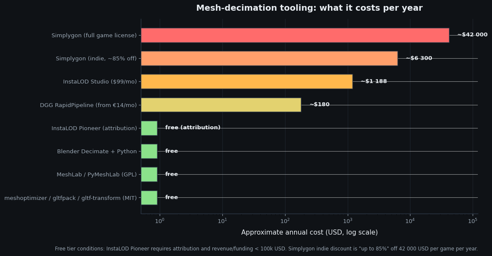
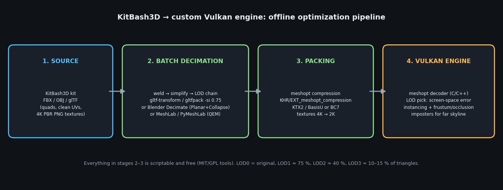

# Making KitBash3D Kits Lighter for a Custom Vulkan Engine — Decimation, Scripts and Industry Tooling

**Research date: 2026-07-20 · Scope: KitBash3D city kits (Every City, Brooklyn/New York-style kits, Neo City), batch decimation workflows, commercial and free tooling, and engine-side delivery for a custom Vulkan renderer.**

---

## TL;DR — the direct answers

1. **No, KitBash3D does not ship a "secret decimation script" for subscribers.** What they *do* give you is **Cargo** (a free asset manager with 1-click import and texture-size selection) and, since July 2025, **Gameplay Ready Kits** — 12 kits rebuilt for real-time performance with up to **89 % fewer triangles**, **84 % less mesh memory** and **82 % fewer draw calls**, free if you already own those kits  [(KitBash3D)](https://kitbash3d.com/a/blog/introducing-gameplay-ready-kits-built-for-real-time-performance-in-unreal-engine?srsltid=AfmBOorxwMIbHh6RuwzOrj1w9K8PcA8-y8Y1oN8RWnZBMJ_YyI-_awcQ) . The catch: they are currently **Unreal Engine 5-focused** (Nanite, Packed Level Instances) and neither *Every City* nor the New York/Brooklyn-style kits are in the converted list yet  [(KitBash3D)](https://kitbash3d.com/a/blog/introducing-gameplay-ready-kits-built-for-real-time-performance-in-unreal-engine?srsltid=AfmBOorxwMIbHh6RuwzOrj1w9K8PcA8-y8Y1oN8RWnZBMJ_YyI-_awcQ) .
2. **Yes, industrial decimation tools exist** — Simplygon (Microsoft, the AAA standard, ~$42 000/game/year with up to 85 % indie discount), InstaLOD (**free Pioneer license** with attribution if your revenue is under $100k), Pixyz (now Unity Asset Transformer), and DGG RapidPipeline (from €14/month)  [(Simplygon)](https://www.simplygon.com/) .
3. **Yes, there is a fully free, scriptable stack** that is genuinely industry-grade: **meshoptimizer / gltfpack** (MIT, used across the industry), **glTF-Transform CLI**, **Blender's Decimate modifier + Python batching**, and **MeshLab/PyMeshLab** quadric edge collapse  [(Github)](https://github.com/zeux/meshoptimizer) .
4. **Your licence is fine.** KitBash3D explicitly allows modifying and optimizing assets and shipping them inside a commercial game — including a custom engine — you just can't redistribute the standalone assets, and subscription assets can only be used in *new* projects while the subscription is active  [(KitBash3D)](https://kitbash3d.com/pages/licenses?srsltid=AfmBOorjUFgeohCv6CWpvPOglTBarn4SJTqFwtVUxNsKX7_885kwLuHC) .
5. **For a 25 % reduction you barely need heavy artillery.** Clean quad-based KitBash3D geometry decimates beautifully at ratio 0.75 with almost invisible quality loss; the bigger wins for your engine are LOD chains, mesh compression, texture downscaling and instancing.

---

## 1. What you actually bought: the anatomy of a KitBash3D kit

Understanding the source material determines which decimation strategy will work. KitBash3D states that kits contain **5–20 million polygons in total**, with an **average structure around 50 000–100 000 polygons**, and that the geometry is built from **quads** (triangles only where the design requires them) with **absolutely no N-gons**  [(kitbash3d.com)](https://help.kitbash3d.com/en/articles/6449661-what-are-the-tech-specs-of-your-kits-polycount-pbr-materials-real-time) . The *Every City* kit specifically is listed at **4 million polygons across 48 models** with 23 PBR materials  [(KitBash3D)](https://kitbash3d.com/products/every-city?srsltid=AfmBOooUkrmlTUdiIqhGSqPfiO_Olj2olO8RY30GYMfr5vbAhQ5Dfp5W) . Materials are tileable, texture-driven PBR (Metal/Roughness), delivered as **8-bit 4K PNGs** with optional 16-bit height maps, and UVs are **non-overlapping** with a **second UV channel reserved for lightmap baking** in real-time engines  [(Unreal Engine)](https://www.unrealengine.com/marketplace/en-US/product/kitbash3d) . Buildings are constructed as **modular, logical parts** with standardized pivots, and kits ship in FBX and OBJ (plus native Blender/Houdini/Maya/Max/C4D/Unity/Unreal formats), so you can feed any offline pipeline  [(Unreal Engine)](https://www.unrealengine.com/marketplace/en-US/product/kitbash3d) .

This anatomy is close to the *ideal input* for automated simplification, and it explains several practical consequences. Clean quad topology without N-gons means quadric-error-metric (QEM) decimators — the algorithm family behind virtually every tool discussed in this report — can collapse edges without fighting degenerate faces. Non-overlapping UVs and hard-surface architecture mean the main quality risk during decimation is **UV seam damage and shading breakage on hard edges**, not organic-surface artifacts. The modular structure means you should **decimate per-piece, not per-merged-building**, so the kit stays customizable after optimization. And the 4K PNG texture set means that for a real-time game, **textures will likely cost you more memory and bandwidth than triangles do** — a point that matters a lot when a single hero building reaches 500k tris, as you observed.

| KitBash3D kit property | Documented value | Consequence for your pipeline |
|---|---|---|
| Total polycount per kit | 5–20 M polys  [(kitbash3d.com)](https://help.kitbash3d.com/en/articles/6449661-what-are-the-tech-specs-of-your-kits-polycount-pbr-materials-real-time)  | You will never ship the whole kit raw; selection + LODs are mandatory |
| Average structure | 50k–100k polys  [(kitbash3d.com)](https://help.kitbash3d.com/en/articles/6449661-what-are-the-tech-specs-of-your-kits-polycount-pbr-materials-real-time)  | A 0.75 ratio gives ~37k–75k — safe; the 500k-tri outliers are exceptions, not the norm |
| *Every City* kit | 4 M polys, 48 models  [(KitBash3D)](https://kitbash3d.com/products/every-city?srsltid=AfmBOooUkrmlTUdiIqhGSqPfiO_Olj2olO8RY30GYMfr5vbAhQ5Dfp5W)  | ~83k polys/model average |
| Topology | Quads, no N-gons, no coplanar faces  [(kitbash3d.com)](https://help.kitbash3d.com/en/articles/6449661-what-are-the-tech-specs-of-your-kits-polycount-pbr-materials-real-time)  | Excellent QEM decimator input; triangulate before or during processing |
| UVs | Non-overlapping, 2nd channel for lightmaps  [(Unreal Engine)](https://www.unrealengine.com/marketplace/en-US/product/kitbash3d)  | Protect UV seams during simplification; keep the 2nd channel if you bake lighting |
| Textures | 4K (or 2K) PNG/JPEG, tileable PBR  [(kitbash3d.com)](https://help.kitbash3d.com/en/articles/6449661-what-are-the-tech-specs-of-your-kits-polycount-pbr-materials-real-time)  | Biggest memory lever: downscale to 2K and/or transcode to GPU-compressed formats |
| Structure | Modular parts, standardized pivots  [(Unreal Engine)](https://www.unrealengine.com/marketplace/en-US/product/kitbash3d)  | Decimate per modular piece to preserve kitbash-ability |

## 2. Does KitBash3D itself give you anything? (the subscriber question)

### 2.1 Cargo — free, but not an optimizer

**Cargo** is KitBash3D's free asset-management application (Windows/macOS), which lets subscribers and kit owners browse the library and **one-click import** assets into Blender, 3ds Max, Maya, Cinema 4D, Houdini, Unity and Unreal, with materials translated into the native format of the target renderer  [(KitBash3D)](https://kitbash3d.com/pages/cargo?srsltid=AfmBOop5SWi7pI9BAs2Sv0ounJeG40Am--df-CVrs0M4bEQOD7-vRCgf) . The one optimization-relevant feature is that Cargo **automatically prepares models and materials for your chosen render engine and lets you pick texture resolution from 1K JPEG up to 4K PNG**  [(KitBash3D)](https://kitbash3d.com/pages/cargo?srsltid=AfmBOop5SWi7pI9BAs2Sv0ounJeG40Am--df-CVrs0M4bEQOD7-vRCgf) . So if you are pulling assets through Cargo into Blender, you can at least start with 1K/2K textures instead of 4K — free memory savings before you touch a single triangle. Cargo 2.0 (September 2025) added Houdini/Solaris USD support and ships over 350 free assets on the Basic account  [(CG Channel)](https://www.cgchannel.com/2025/09/download-350-free-kitbash3d-assets-with-cargo-2-0/) .

What Cargo does **not** do is mesh decimation. There is no LOD slider, no polygon reducer, and no subscriber-only optimization script in the KitBash3D ecosystem. Their help center does maintain official guidance articles on optimizing kits (e.g. a Blender optimization guide and an Unreal LOD-fix article), which confirms that **"optimize it yourself" is the officially expected workflow** outside Unreal  [(kitbash3d.com)](https://help.kitbash3d.com/en/articles/6449661-what-are-the-tech-specs-of-your-kits-polycount-pbr-materials-real-time) .

### 2.2 Gameplay Ready Kits — the closest thing to an official answer

In July 2025 KitBash3D launched **Gameplay Ready Kits**: 12 of their most popular kits "rebuilt from the ground up" for real-time performance — instanced, collision-ready and Nanite-compatible  [(KitBash3D)](https://kitbash3d.com/a/blog/introducing-gameplay-ready-kits-built-for-real-time-performance-in-unreal-engine?srsltid=AfmBOorxwMIbHh6RuwzOrj1w9K8PcA8-y8Y1oN8RWnZBMJ_YyI-_awcQ) . The measured gains are substantial: **up to 89 % fewer triangles**, **84 % less mesh memory** (average kit size dropping from 2.9 GB to 0.39 GB), **up to 82 % fewer draw calls** via Packed Level Instances, and **handcrafted collision meshes under 255 tris** per asset  [(KitBash3D)](https://kitbash3d.com/a/blog/introducing-gameplay-ready-kits-built-for-real-time-performance-in-unreal-engine?srsltid=AfmBOorxwMIbHh6RuwzOrj1w9K8PcA8-y8Y1oN8RWnZBMJ_YyI-_awcQ) . If you previously purchased one of the converted kits, the Gameplay Ready files are **free of charge** from your account page  [(KitBash3D)](https://kitbash3d.com/a/blog/introducing-gameplay-ready-kits-built-for-real-time-performance-in-unreal-engine?srsltid=AfmBOorxwMIbHh6RuwzOrj1w9K8PcA8-y8Y1oN8RWnZBMJ_YyI-_awcQ) . KitBash3D also states that **every future kit will be Gameplay Ready out of the box**  [(KitBash3D)](https://kitbash3d.com/a/blog/introducing-gameplay-ready-kits-built-for-real-time-performance-in-unreal-engine?srsltid=AfmBOorxwMIbHh6RuwzOrj1w9K8PcA8-y8Y1oN8RWnZBMJ_YyI-_awcQ) , and Cargo's search now has a dedicated "Gameplay Ready" filter  [(kitbash3d.com)](https://help.kitbash3d.com/en/articles/7208272-cargo-s-search-and-discovery-engine-finding-the-right-assets) .

Three caveats matter for your specific situation. First, the initial wave covers **sci-fi and fantasy kits** (CyberPunk, Cyber District, Cyber Streets, CyberPunk Interiors/Vehicles, Enchanted, Medieval Siege, Medieval Market, plus two free kits) — **modern American city kits like Every City are not in it yet**  [(KitBash3D)](https://kitbash3d.com/a/blog/introducing-gameplay-ready-kits-built-for-real-time-performance-in-unreal-engine?srsltid=AfmBOorxwMIbHh6RuwzOrj1w9K8PcA8-y8Y1oN8RWnZBMJ_YyI-_awcQ) . Second, the whole system is engineered **for Unreal Engine 5**: the deliverables are Blueprints, Packed Level Actors and Nanite-enabled meshes imported through Cargo's USD-based Unreal importer, deliberately replacing traditional LOD chains with Nanite virtualized geometry  [(kitbash3d.com)](https://help.kitbash3d.com/en/articles/11698511-structural-updates-to-unreal-engine-kits-gameplay-ready) . Third, because you run a **custom Vulkan engine**, you can't consume the UE5 packaging directly — but the underlying re-authored geometry is USD-native in Cargo's pipeline, so it is worth checking in Cargo whether the Gameplay Ready meshes are exposed in a portable form (USD/FBX) for kits you own; the *geometry* (fewer triangles, split translucency, atlased props) is engine-agnostic even if the Blueprint wrapper is not  [(kitbash3d.com)](https://help.kitbash3d.com/en/articles/7833653-using-unreal-engine-with-cargo-3-0-workflows-and-integration) .

### 2.3 Unreal-format kits already contain LODs — and a warning

For completeness: the Unreal versions of KitBash3D kits have historically shipped with **auto-generated LODs** (the Kits 5.0 update in 2022 explicitly changed "the behavior of auto-generated LODs in Unreal")  [(kitbash3d.com)](https://help.kitbash3d.com/en/articles/10628400-cargo-changelog) . However, KitBash3D's own help center documents a known bug where **certain assets got an incorrect LOD3**, causing wrong textures to appear when zooming out, with manual material-per-LOD reassignment as the workaround  [(kitbash3d.com)](https://help.kitbash3d.com/en/articles/6620266-how-to-fix-lods-in-unreal-engine-5-using-kitbash3d-kits) . This is relevant only if you ever round-trip through Unreal to harvest LODs (exporting UE-generated LODs to FBX for your own engine is technically possible, but it is a clunky detour compared to generating LODs yourself with better tools — see sections 4–5).

## 3. The "industry secret" tools — what studios actually pay for

The game industry's dirty secret is that there is no secret: large studios automate LOD generation with a small set of commercial optimizers, all built around the same core ideas (QEM-style edge collapse, remeshing, occlusion-based removal, imposter generation, texture baking). What you pay for is **automation, quality heuristics, screen-size-driven targets, and pipeline integration** — not a fundamentally different algorithm. The chart below puts the price landscape in perspective.



**Simplygon** (Microsoft, acquired 2017, part of Xbox Game Studios) is the long-standing AAA standard for automated LOD/optimization, with reduction, remeshing, aggregation, imposters, a C++/C#/Python SDK, and DCC/engine plugins; the current game licence is listed at **$42 000 per game per year**, with **up to 85 % indie discount**  [(wikipedia.org)](https://en.wikipedia.org/wiki/Simplygon) . It used to ship free with Unreal Engine 4  [(Unreal Engine)](https://www.unrealengine.com/blog/simplygon-introduces-free-indie-license-and-ships-with-ue4-installer) , and a short-lived loophole through the MSFS 2024 SDK licence was closed by Microsoft within days in December 2024 — a useful illustration that there is no legitimate free Simplygon anymore  [(fsdeveloper.com)](https://www.fsdeveloper.com/forum/threads/simplygon-for-blender.459473/) . **InstaLOD** (Abstract) is the other big name, notable here because of its **free Pioneer licence**: full InstaLOD Studio with commercial use rights, requiring only attribution (logo in your splash screen), available to individuals and businesses under **$100k annual revenue/funding**  [(instalod.com)](https://instalod.com/) . Its feature set reads like a checklist of everything this report discusses: mesh optimization, remeshing, occlusion culling ("zero-config interior removal" — very relevant for city buildings), imposter generation, texture baking up to 32K, and a command-line/batch pipeline  [(instalod.com)](https://instalod.com/) . Paid tiers start at $99/month (Studio)  [(instalod.com)](https://instalod.com/) .

The remaining commercial options fill specific niches. **Pixyz**, historically the CAD/industrial decimation leader, has been folded into Unity as **"Unity Asset Transformer"**, with the plugin gated behind Unity Industry subscriptions and the SDK sold per-node — it's enterprise-priced and Unity-centric, so largely irrelevant for a custom Vulkan engine  [(Unity)](https://unity.com/blog/pixyz-whats-new-2024) . **DGG RapidPipeline** is the more interesting mid-price option: fully local processing, decimation/remeshing/occluded-part removal/UV-atlas baking, Blender/Max/Maya plugins, a CLI with JSON presets for batch automation, and pricing **from €14/month** (first 3 months free, online version) up to €230/month for the studio edition; DGG claims over **4.5 million models processed**  [(DIGITAL PRODUCTION)](https://digitalproduction.com/2025/12/01/rapidpipeline-for-3ds-max-and-maya/) . Finally, **Houdini** (which you may already have for Cargo's USD workflow) contains the production-proven **PolyReduce SOP**, and **ZBrush's Decimation Master** remains a solid interactive option for hero assets — but both are DCC licences, not pipeline tools  [(Maxon)](https://www.maxon.net/en/zbrush-for-ipad?srsltid=AfmBOoo5FW_xXMnsF-suA4YtlViBrwS5rH7LZTf43XYigHAX99pIlWJr) .

| Tool | Price | Batch/CLI automation | Engine-agnostic output | Notable for your case |
|---|---|---|---|---|
| **Simplygon** | $42k/game/yr; indie up to −85 %  [(Simplygon)](https://www.simplygon.com/)  | SDK, Grid, batch processor  [(rapidpipeline.com)](https://rapidpipeline.com/en/a/best-3-pixyz-alternatives/)  | FBX, OBJ, glTF, USD  [(Simplygon)](https://www.simplygon.com/)  | The AAA standard; overkill at your scale |
| **InstaLOD Studio** | **Free Pioneer** (attribution, <$100k)  [(InstaLOD)](https://docs.instalod.io/en/Products/InstaLOD_Studio/Licensing/Free_Pioneer_License_And_Attribution) ; $99/mo Studio  [(instalod.com)](https://instalod.com/)  | InstaLOD Pipeline CLI  [(instalod.com)](https://instalod.com/)  | 50+ formats  [(instalod.com)](https://instalod.com/)  | **Best commercial fit for a solo dev** |
| **Pixyz / Unity Asset Transformer** | Enterprise, per-node SDK  [(Unity)](https://unity.com/blog/pixyz-whats-new-2024)  | Python/C# SDK  [(rapidpipeline.com)](https://rapidpipeline.com/en/a/best-3-pixyz-alternatives/)  | Unity-centric  [(Pixyz Software)](https://www.pixyz-software.com/)  | Skip — wrong ecosystem |
| **DGG RapidPipeline** | From €14/mo  [(DIGITAL PRODUCTION)](https://digitalproduction.com/2025/12/01/rapidpipeline-for-3ds-max-and-maya/)  | CLI + JSON presets, REST API  [(rapidpipeline.com)](https://rapidpipeline.com/en/a/best-3-pixyz-alternatives/)  | FBX, glTF, USD, USDZ…  [(DIGITAL PRODUCTION)](https://digitalproduction.com/2025/12/01/rapidpipeline-for-3ds-max-and-maya/)  | Cheap automation with Blender plugin |
| **Houdini PolyReduce / Labs** | Houdini licence | HDA/TOP networks | Any via export | Only if you already own Houdini |

## 4. The free stack that is genuinely industry-grade

### 4.1 meshoptimizer + gltfpack — the backbone

If you take one thing from this report, take this: **meshoptimizer** (by Arseny Kapoulkine, MIT licence) is the de-facto open standard for mesh simplification and compression, "widely used across the industry"  [(meshoptimizer.org)](https://meshoptimizer.org/v1.html) . Its simplifier is **attribute-aware** (positions, normals, UVs with weights), supports a **permissive mode** that can collapse across attribute seams when acceptable, a **prune** option that removes tiny disconnected components, **border locking** for crack-free chunk simplification, and **vertex-lock masks** to protect e.g. UV seams explicitly  [(Github)](https://github.com/zeux/meshoptimizer) . Error is controlled either by target index count or by a normalized geometric error threshold (`1e-2` = 1 % of mesh extents), and LOD chains are best built by **re-simplifying from the previous LOD** for smoother transitions  [(Github)](https://github.com/zeux/meshoptimizer) . It reached stable v1.0 in 2025 with API/ABI stability guarantees  [(meshoptimizer.org)](https://meshoptimizer.org/v1.html) . For a custom Vulkan engine this library is a dream: it also gives you **vertex-cache optimization, overdraw optimization, vertex/index codecs decoding at 3–6 GB/s**, quantization, and — since v1.0 — **clusterlod.h, a single-header Nanite-style clustered continuous-LOD library** you can use as-is or as a reference implementation  [(Github)](https://github.com/zeux/meshoptimizer) .

**gltfpack** is the companion CLI that wraps all of this for glTF files: `gltfpack -i in.glb -o out.glb -si 0.75` simplifies meshes to a **triangle ratio of 0.75** (exactly your "lighter by a quarter"), and `-cc`/`-cz` add meshopt compression on top  [(three.js forum)](https://discourse.threejs.org/t/mesh-simplification-using-meshoptimizer/63002) . Since v1.0, gltfpack uses **attribute-aware simplification with pruning by default** and supports the newer `KHR_meshopt_compression` extension via `-cz`, falling back to the widely-supported `EXT_meshopt_compression` otherwise  [(meshoptimizer.org)](https://meshoptimizer.org/v1.html) . There are also **Python bindings** (`pip install meshoptimizer`) exposing `simplify`, `optimize_vertex_cache`, `optimize_vertex_fetch` and the codecs, which is handy for writing your own batch processor in an afternoon  [(PyPI)](https://pypi.org/project/meshoptimizer/) .

### 4.2 glTF-Transform — the swiss army knife CLI

**glTF-Transform** (MIT, by Don McCurdy) is a Node.js CLI/SDK for inspecting and transforming glTF files, and its `simplify` command is built on the same meshoptimizer core  [(gltf-transform.dev)](https://gltf-transform.dev/cli) . The documented best practice is to **weld before simplifying** (`weld` merges equivalent vertices — split vertices and UV seams otherwise limit the simplifier), then run `simplify` with a `ratio` and an `error` threshold, e.g. ratio 0.75 with error 0.001: it aims for 75 % of the triangles while keeping geometric deviation under the limit, stopping early rather than wrecking the silhouette  [(gltf-transform.dev)](https://gltf-transform.dev/modules/functions/functions/simplify.html) . The same CLI then handles the rest of your pipeline: `quantize`, `meshopt` compression, `reorder` (vertex-cache locality), `prune`, `dedup`, `resize` textures, and — critically for Vulkan — **`etc1s`/`uastc` KTX2/BasisU texture compression**, which converts those 4K PNGs into GPU-native compressed textures your engine can sample directly  [(gltf-transform.dev)](https://gltf-transform.dev/cli) .

### 4.3 Blender Decimate + Python batching — the pragmatic workhorse

Blender's **Decimate modifier** has three modes, and knowing which to use is the difference between a clean result and mush  [(Blender Documentation)](https://docs.blender.org/manual/en/latest/modeling/modifiers/generate/decimate.html) . **Collapse** progressively merges vertices (ratio = fraction of faces to keep; note the ratio is computed against *triangles*, so quad meshes behave slightly differently unless you enable Triangulate)  [(Blender Documentation)](https://docs.blender.org/manual/en/latest/modeling/modifiers/generate/decimate.html) . **Planar** dissolves geometry on nearly-flat surfaces above an angle limit, with delimiters for **material borders, UV seams, and sharp edges** — for KB3D's hard-surface architecture this mode is gold, because most of a facade's polygons sit on planar walls and window grids  [(Blender Documentation)](https://docs.blender.org/manual/en/latest/modeling/modifiers/generate/decimate.html) . **Un-Subdivide** reverses subdivision grids and rarely applies here  [(Blender Documentation)](https://docs.blender.org/manual/en/latest/modeling/modifiers/generate/decimate.html) . A robust recipe for KB3D buildings is *Planar first (small angle, delimit seams+sharp+material), then Collapse to your target ratio* — planar removes the free wins, collapse then works on the genuinely curved detail. Everything is scriptable in headless Blender (`blender -b -P script.py`), and community batch scripts already exist that apply a configurable decimation ratio to every selected mesh while skipping shape-keyed objects  [(Github)](https://github.com/Thesirix/Blender_Decimator) . Section 5 gives you a production-ready version of such a script.

### 4.4 MeshLab / PyMeshLab — the academic QEM reference

**MeshLab** (ISTI-CNR, GPL, Eurographics Software Award winner) implements the reference **quadric-error edge-collapse simplification** with texture-aware variants ("Quadric Edge Collapse Decimation with Texture"), preserving per-vertex UVs far better than naive decimators  [(wikipedia.org)](https://en.wikipedia.org/wiki/MeshLab) . For batch use, **PyMeshLab** exposes the same filters to Python (`ms.meshing_decimation_quadric_edge_collapse(targetfacenum=...)`) so you can point it at a folder of FBX/OBJ exports and process an entire kit unattended  [(Github)](https://github.com/cnr-isti-vclab/meshlab) . Where MeshLab shines versus Blender is raw QEM quality control (target face counts, quality thresholds, boundary preservation flags); where it loses is scene/material handling — it is a mesh processor, not a scene tool  [(SourceForge)](https://sourceforge.net/projects/meshlab/) . For your 500k-tri problem buildings, it is an excellent second opinion: run the same asset through Blender Planar+Collapse and through PyMeshLab QEM and keep whichever looks better at your target ratio.



## 5. Ready-to-use scripts

### 5.1 Blender headless batch decimation (per-object, architecture-tuned)

This script imports every FBX in a folder, applies **Merge by Distance (weld) → Planar Decimate → Collapse Decimate to ratio 0.75 → Triangulate**, and exports a glTF per building. Run it with `blender -b -P kb3d_decimate.py`. Ratio `0.75` keeps three quarters of the triangles — your "lighter by a quarter" target — and is conservative enough that KB3D buildings survive with no visible damage in typical viewing conditions.

```python
# kb3d_decimate.py — run:  blender -b -P kb3d_decimate.py
import bpy, os, glob

SRC = r"C:/kb3d/every_city_fbx"     # folder with kit FBX files
DST = r"C:/kb3d/every_city_glb"     # output folder
RATIO = 0.75                        # keep 75% of triangles ("lighter by a quarter")
PLANAR_ANGLE = 0.087                # ~5 degrees, in radians

os.makedirs(DST, exist_ok=True)

for fbx in glob.glob(os.path.join(SRC, "*.fbx")):
    bpy.ops.wm.read_factory_settings(use_empty=True)
    bpy.ops.import_scene.fbx(filepath=fbx)

    for ob in [o for o in bpy.context.scene.objects if o.type == 'MESH']:
        if ob.data.shape_keys:        # never decimate shape-keyed meshes
            continue
        bpy.context.view_layer.objects.active = ob
        # 1) weld duplicates (split verts block decimation)
        bpy.ops.object.mode_set(mode='EDIT')
        bpy.ops.mesh.select_all(action='SELECT')
        bpy.ops.mesh.remove_doubles(threshold=0.0001)
        bpy.ops.object.mode_set(mode='OBJECT')
        # 2) planar pass: free wins on facades, protect seams/sharp/material
        m = ob.modifiers.new("planar", 'DECIMATE')
        m.decimate_type = 'DISSOLVE'
        m.angle_limit = PLANAR_ANGLE
        m.delimit = {'NORMAL', 'MATERIAL', 'SEAM', 'SHARP'}
        bpy.ops.object.modifier_apply(modifier=m.name)
        # 3) collapse pass to target ratio
        m = ob.modifiers.new("collapse", 'DECIMATE')
        m.ratio = RATIO
        m.use_collapse_triangulate = True
        bpy.ops.object.modifier_apply(modifier=m.name)

    name = os.path.splitext(os.path.basename(fbx))[0]
    bpy.ops.export_scene.gltf(
        filepath=os.path.join(DST, name + ".glb"),
        export_format='GLB', export_yup=True,
        export_image_format='AUTO', export_apply=True)
    print("done:", name)
```

Two operational notes. First, if you downloaded the kit's **native Blender files** instead of FBX, swap the import line for `bpy.ops.wm.open_mainfile` per scene or import the kit once and process in place; KB3D ships standardized pivots and modular parts, so keep objects separate exactly as the script does — do not join the building before decimating  [(Unreal Engine)](https://www.unrealengine.com/marketplace/en-US/product/kitbash3d) . Second, objects with **mirrored (negative-scale) instances** or custom split normals can occasionally produce flipped normals after collapse; the script's `export_apply=True` and a post-export visual check in a glTF viewer catch this cheaply  [(glTF Viewer)](https://gltf-viewer.donmccurdy.com/) .

### 5.2 glTF-Transform one-liner chain (fastest possible pipeline)

If your kit pieces are already glTF/GLB (e.g. exported once from Blender or downloaded as such), the entire decimation+packing step collapses into three commands per asset — trivially wrappable in a shell loop over a folder. The `weld` step matters: glTF-Transform's own documentation warns that split vertices limit the simplifier, so weld first  [(gltf-transform.dev)](https://gltf-transform.dev/modules/functions/functions/simplify.html) .

```bash
npm install --global @gltf-transform/cli          # one-time install  [(gltf-transform.dev)](https://gltf-transform.dev/cli) 

# inspect what you're dealing with
gltf-transform inspect building_01.glb

# weld -> simplify to 75% with tight error bound -> meshopt compress -> 2K KTX2 textures
gltf-transform weld building_01.glb tmp.glb
gltf-transform simplify tmp.glb tmp2.glb --ratio 0.75 --error 0.001
gltf-transform optimize tmp2.glb building_01_opt.glb \
    --compress meshopt --texture-compress uastc --texture-size 2048
```

### 5.3 gltfpack one-liner (the 10-second option)

```bash
gltfpack -i building_01.glb -o building_01_opt.glb -si 0.75 -cc -tc
```

`-si 0.75` targets 75 % of the triangles, `-cc` applies `EXT_meshopt_compression` (your engine decodes it with the meshoptimizer C library at GB/s speeds), and `-tc` transcodes textures to KTX2/BasisU  [(three.js forum)](https://discourse.threejs.org/t/mesh-simplification-using-meshoptimizer/63002) . Note that `-si` is a *target ratio* — the simplifier can stop earlier if the error budget runs out, which is the behavior you want  [(Github)](https://github.com/zeux/meshoptimizer) .

### 5.4 PyMeshLab QEM batch (quality-focused alternative)

```python
# pip install pymeshlab
import pymeshlab, glob, os

SRC, DST = "C:/kb3d/obj", "C:/kb3d/decimated"
KEEP = 0.75

os.makedirs(DST, exist_ok=True)
for path in glob.glob(os.path.join(SRC, "*.obj")):
    ms = pymeshlab.MeshSet()
    ms.load_new_mesh(path)
    n0 = ms.current_mesh().face_number()
    ms.meshing_decimation_quadric_edge_collapse(
        targetfacenum=int(n0 * KEEP),
        preserveboundary=True,        # protect open borders
        preservenormal=True,          # protect hard edges
        preservetopology=True,
        optimalplacement=True,        # better vertex positions
        planarquadric=True)           # better on flat architecture
    out = os.path.join(DST, os.path.basename(path))
    ms.save_current_mesh(out)
    print(path, "->", ms.current_mesh().face_number(), "faces")
```

PyMeshLab's `preservenormal` and `planarquadric` flags make it unusually good on KB3D-style hard-surface meshes, and `targetfacenum` gives you exact triangle budgets per building — useful when you want the 500k-tri hero tower at exactly 375k, not "somewhere near 0.75"  [(Github)](https://github.com/cnr-isti-vclab/meshlab) .

## 6. Feeding a custom Vulkan engine

The engine-side story is where your custom renderer actually pays off, because you control the whole decode path. The natural endgame is: **offline** you produce GLB files that are welded, simplified into LOD chains, meshopt-compressed, with KTX2 textures; **at runtime** you decode meshopt buffers straight into Vulkan vertex/index buffers using the meshoptimizer C library (its decoders run at 3–6 GB/s and can write directly into mapped, write-combined memory)  [(Github)](https://github.com/zeux/meshoptimizer) . If you don't want to write a glTF loader from scratch, decode once at level-load into your own binary format — meshopt works fine as an offline-only tool too. Either way, run `meshopt_optimizeVertexCache`/`optimizeVertexFetch` (or let gltfpack do it) before shipping buffers: vertex-cache reordering alone measurably improves vertex-stage throughput, and it's free  [(Github)](https://github.com/zeux/meshoptimizer) .

For LOD selection you have three escalating options. The simple one is a **discrete LOD chain per building** (LOD0 = original, LOD1 ≈ 75 %, LOD2 ≈ 40 %, LOD3 ≈ 10–15 %) switched on screen-space error — the meshoptimizer simplifier even returns a normalized `lod_error` you can convert directly into a switch distance  [(Github)](https://github.com/zeux/meshoptimizer) . The medium option adds **imposters** for the far skyline (InstaLOD generates them in one click, including hybrid billboard clouds  [(instalod.com)](https://instalod.com/) ; or bake your own octahedral imposters in Blender), which is how open-world games keep a Manhattan-scale horizon alive for a handful of vertices per building. The ambitious option is **clusterlod.h**, the single-header clustered continuous-LOD library that shipped with meshoptimizer v1.0, implementing Nanite-style progressive cluster hierarchies "similarly to Nanite" and explicitly intended as a starting point for custom implementations  [(meshoptimizer.org)](https://meshoptimizer.org/v1.html) . For a solo Vulkan engine, start discrete — cluster LOD is a multi-month rendering feature, not an afternoon one.

Don't neglect the non-triangle costs, because in a KB3D city they dominate. **Textures**: KB3D's own Unreal pipeline now defaults 4K kits to 2K with a LOD bias for exactly this reason  [(kitbash3d.com)](https://help.kitbash3d.com/en/articles/11698511-structural-updates-to-unreal-engine-kits-gameplay-ready) ; do the same (Cargo can hand you 1K–4K variants directly  [(KitBash3D)](https://kitbash3d.com/pages/cargo?srsltid=AfmBOop5SWi7pI9BAs2Sv0ounJeG40Am--df-CVrs0M4bEQOD7-vRCgf) ) and transcode to BC7/BC5 or KTX2 so VRAM drops 4–8× versus uncompressed. **Draw calls**: a city of modular pieces explodes into thousands of draws; use instancing for repeated modular parts (KB3D standardized pivots make transforms trivial  [(Unreal Engine)](https://www.unrealengine.com/marketplace/en-US/product/kitbash3d) ) and merge static per-block geometry — KB3D measured up to 82 % draw-call reduction from instancing alone in their Gameplay Ready rebuild  [(KitBash3D)](https://kitbash3d.com/a/blog/introducing-gameplay-ready-kits-built-for-real-time-performance-in-unreal-engine?srsltid=AfmBOorxwMIbHh6RuwzOrj1w9K8PcA8-y8Y1oN8RWnZBMJ_YyI-_awcQ) . **Culling**: buildings occlude each other massively; even a coarse cell-based occlusion or simple portal logic will beat any decimation ratio. And keep the **second UV channel** if you plan baked lightmaps — it's already there in the assets  [(Unreal Engine)](https://www.unrealengine.com/marketplace/en-US/product/kitbash3d) .

## 7. Reality check: is 500k triangles actually a problem?

Worth stating plainly, because it reframes the whole effort: **on any discrete GPU from the last decade, a single 500k-tri building drawn a few times is nothing** — modern hardware pushes hundreds of millions of triangles per frame. The reason your scenes die is almost never raw triangle count; it's the **combination** of hundreds of unique buildings (VRAM for geometry + 4K textures), thousands of draw calls from modular sub-objects, and zero LODs so the far skyline costs as much as the building in front of you  [(KitBash3D)](https://kitbash3d.com/a/blog/introducing-gameplay-ready-kits-built-for-real-time-performance-in-unreal-engine?srsltid=AfmBOorxwMIbHh6RuwzOrj1w9K8PcA8-y8Y1oN8RWnZBMJ_YyI-_awcQ) . That's why KB3D's own Gameplay Ready rebuild focused on instancing and memory (84 % mesh-memory cut) at least as much as on triangles (up to 89 % cut)  [(KitBash3D)](https://kitbash3d.com/a/blog/introducing-gameplay-ready-kits-built-for-real-time-performance-in-unreal-engine?srsltid=AfmBOorxwMIbHh6RuwzOrj1w9K8PcA8-y8Y1oN8RWnZBMJ_YyI-_awcQ) .

So the correct mental budget for your engine is roughly: LOD0 for the handful of buildings nearest the camera (your decimated 75 % versions are perfect here), LOD1–2 for the mid-field bulk of the city, LOD3 + imposters beyond a few hundred meters, 2K GPU-compressed textures everywhere except hero shots, and instanced draws for all repeated modular pieces. Under that regime, even the full 4M-poly *Every City* kit spread across a borough becomes tractable, and the 500k-tri monsters stop mattering because you only ever pay full price for one or two of them at a time  [(KitBash3D)](https://kitbash3d.com/products/every-city?srsltid=AfmBOooUkrmlTUdiIqhGSqPfiO_Olj2olO8RY30GYMfr5vbAhQ5Dfp5W) . Decimation is the entry ticket to this system, not the system itself.

## 8. Recommended setup for your exact case

Given: solo dev, custom Vulkan engine, ~3000 CZK already spent on city kits, target "lighter by a quarter, not brutal", no UE5 in the loop. The pragmatic recommendation, in order of implementation effort:

| Priority | Action | Tool | Cost | Expected gain |
|---|---|---|---|---|
| 1 | Batch-decimate all kit pieces to ratio **0.75** (weld → planar → collapse) | Blender headless script (5.1) or gltfpack (5.3) | free | −25 % tris, invisible quality loss |
| 2 | Extend to LOD chains (0.75 / 0.4 / 0.12) + screen-error switching | meshoptimizer `meshopt_simplify` chain | free | biggest FPS win for city scale  [(Github)](https://github.com/zeux/meshoptimizer)  |
| 3 | Textures 4K→2K, transcode to KTX2/BC7 | Cargo texture setting + gltf-transform `uastc`/`etc1s` | free | 4–8× texture VRAM cut  [(KitBash3D)](https://kitbash3d.com/pages/cargo?srsltid=AfmBOop5SWi7pI9BAs2Sv0ounJeG40Am--df-CVrs0M4bEQOD7-vRCgf)  |
| 4 | meshopt-compress geometry, decode with meshoptimizer C lib | gltfpack `-cc` + meshopt decoder | free | ~2–4× smaller geometry, GB/s decode  [(Github)](https://github.com/zeux/meshoptimizer)  |
| 5 | Instancing for modular parts, merge static blocks | your engine | free | up to −82 % draw calls (KB3D's own figure)  [(KitBash3D)](https://kitbash3d.com/a/blog/introducing-gameplay-ready-kits-built-for-real-time-performance-in-unreal-engine?srsltid=AfmBOorxwMIbHh6RuwzOrj1w9K8PcA8-y8Y1oN8RWnZBMJ_YyI-_awcQ)  |
| 6 | (Optional) GUI-driven cleanup of hero buildings + imposters | **InstaLOD Pioneer** | free w/ attribution  [(InstaLOD)](https://docs.instalod.io/en/Products/InstaLOD_Studio/Licensing/Free_Pioneer_License_And_Attribution)  | occlusion culling, one-click imposters  [(instalod.com)](https://instalod.com/)  |
| 7 | (Later) Nanite-style continuous LOD | meshoptimizer `clusterlod.h` | free | research-grade, only if bored/brave  [(meshoptimizer.org)](https://meshoptimizer.org/v1.html)  |

If you want a single commercial tool instead of scripts, **InstaLOD Pioneer is the obvious pick**: genuinely free for you, commercial use allowed, and its occlusion-culling and imposter features target exactly the city-building problem  [(instalod.com)](https://instalod.com/) . Skip Simplygon (priced for studios at $42k/game/year  [(Simplygon)](https://www.simplygon.com/) ) and skip Pixyz/Unity Asset Transformer (wrong ecosystem, enterprise pricing  [(Unity)](https://unity.com/blog/pixyz-whats-new-2024) ). RapidPipeline at €14/month is a fair middle ground if you want polished batch presets with a Blender plugin and zero scripting  [(DIGITAL PRODUCTION)](https://digitalproduction.com/2025/12/01/rapidpipeline-for-3ds-max-and-maya/) . And keep an eye on Cargo: every kit KitBash3D releases from now on ships Gameplay Ready, so the *next* city kit you buy may already arrive pre-optimized  [(KitBash3D)](https://kitbash3d.com/a/blog/introducing-gameplay-ready-kits-built-for-real-time-performance-in-unreal-engine?srsltid=AfmBOorxwMIbHh6RuwzOrj1w9K8PcA8-y8Y1oN8RWnZBMJ_YyI-_awcQ) .

## 9. Licensing notes (short but important)

Your usage is squarely legal. KitBash3D explicitly permits using assets in **commercial projects including games**, **modifying and customizing them** (decimation is just modification), and **publishing and monetizing** the finished game  [(KitBash3D)](https://kitbash3d.com/pages/licenses?srsltid=AfmBOorjUFgeohCv6CWpvPOglTBarn4SJTqFwtVUxNsKX7_885kwLuHC) . Two restrictions to remember: you may **not redistribute the standalone assets** (raw or decimated — i.e., no uploading the optimized GLBs anywhere people can extract them; a packaged game build is fine), and if your assets came via a **subscription**, you may use them in new projects only while the subscription is active — though works *created* during the subscription (like your game) remain valid after it ends  [(kitbash3d.com)](https://help.kitbash3d.com/en/articles/7053973-end-user-license-agreement-restrictions) . If you're a solo self-employed dev, the Individual tier is the correct licence; organizations of 2+ people need a Teams licence  [(kitbash3d.com)](https://help.kitbash3d.com/en/articles/7939191-subscription-faqs) . One nuance: assets purchased as **perpetual kit licences** (your 3000 CZK purchases) are not affected by subscription state at all — own it forever, reuse across projects  [(KitBash3D)](https://kitbash3d.com/pages/licenses?srsltid=AfmBOorjUFgeohCv6CWpvPOglTBarn4SJTqFwtVUxNsKX7_885kwLuHC) .

---

*Prepared from KitBash3D official documentation and changelog, vendor pricing pages, and open-source project documentation current as of July 2026. Prices and licence terms change — verify on the vendors' sites before committing budget.*
