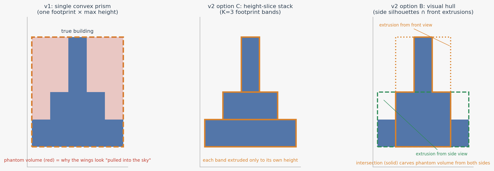
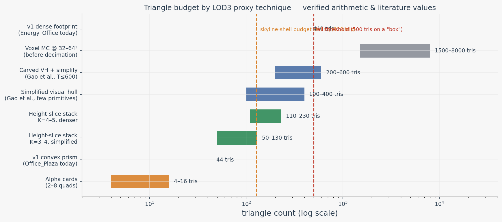
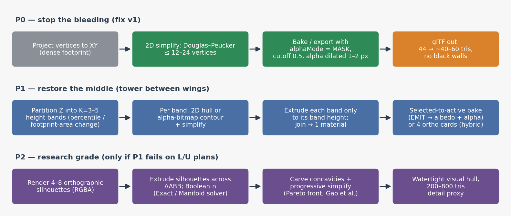

# Deep Research Report — LOD3 Silhouette & Proxy Mathematics for Building LOD Generation

**Date:** 2026-07-20
**Context:** v1 (`lod3.glb` = single extruded convex-hull XY prism + Cycles OPAQUE bake) fails on three axes: the middle tower section is missing, the background is black instead of transparent, and dense footprints waste triangles on a "box". This report researches the mathematical families of solutions, validates the numbers, and derives a prioritized v2 roadmap.

---

## Executive Summary

The v1 pipeline produces a **zeroth-order silhouette**: one convex footprint extruded to one height (`max Z`). That construction is mathematically incapable of representing stepped massing (low wings + central tower), because the convex hull of a plan-view projection is a filled outline and the extrusion operator assigns a single Z extent to every point of it. The two other v1 defects have equally mechanical causes: the material is forced to `alphaMode = OPAQUE`, and Cycles selected-to-active bake writes the miss-ray color (black) wherever the proxy shell sticks out beyond the real building — which, for an over-tall hull, is everywhere above the wings. Meanwhile the triangle waste comes from extruding a raw dense point projection without 2D simplification: **Energy_Office's 440 triangles correspond to a ~111-vertex footprint polygon**, where a Douglas–Peucker pass at 12–24 vertices would yield roughly **40–90 triangles** for a visually equivalent skyline shell.

Three solution families address the missing middle: **alpha cards** (2–16 triangles, silhouette carried in the texture's alpha channel, correct only from the rendered directions), **height-slice footprint stacks** (K=3–5 horizontal bands, each with its own 2D hull and height — the recommended v2, ~50–200 tris), and the **visual hull** (Boolean intersection of silhouette extrusions from 4–8 orthographic views — the research-grade, silhouette-exact option, validated for buildings by Gao et al. at SIGGRAPH 2022  [(ACM Digital Library)](https://dl.acm.org/doi/10.1145/3528233.3530716) ). The alpha problem is solved independently of geometry by the glTF **MASK contract** (`alphaCutoff ≈ 0.5`, RGBA bake or ortho renders with transparent film), which unlike BLEND requires no mesh sorting and writes depth  [(kcoley.github.io)](https://kcoley.github.io/glTF/specification/2.0/) . The recommended sequence is: **P0** — Douglas–Peucker the footprint and switch bake/export to MASK alpha (one evening); **P1** — height-slice stack, which restores the tower-in-the-middle at 50–130 tris; **P2** — visual hull with carve + Pareto simplification, only if P1 fails on concave L/U plans.

---

## 1. Problem Analysis: Why v1 Fails on All Three Axes

### 1.1 The single-height convex prism is a mathematical limit, not a bake bug

The v1 generator computes `convex_hull_2d(XY)` of all mesh vertices projected to the ground plane, extrudes the resulting polygon along Z from `z_min` to `z_max`, and caps top and bottom. Two independent approximations are stacked here. The convex hull fills in every concavity of the plan — courtyards, L-shaped notches, setbacks between wings all disappear into the filled outline. The single extrusion interval then assigns the global maximum height to every point of that outline. For an Art-Deco massing of the "low wings + central tower" type, the wings are therefore extruded to the tower's height, and the characteristic stepped profile — the "middle" the reviewer is missing — ceases to exist in the proxy. This is not an artifact of the bake, the UVs, or the renderer: it is the expressivity ceiling of a **0-order silhouette model** (one outline × one height). No amount of texture work on that box can reintroduce the step, because the silhouette of the proxy from any horizontal viewpoint is a rectangle, while the silhouette of the real building is a step function.

The quantitative signature of the approach confirms this reading. An n-vertex convex prism costs `2n` side triangles plus `2(n−2)` cap triangles, i.e. `4n−4` in total. **Office_Plaza's 44 triangles therefore decode to exactly n=12 footprint vertices** — a reasonable hull, correctly priced. **Energy_Office's 440 triangles decode to n≈111 footprint vertices**, which is the raw dense point cloud's unique XY projections poured into an n-gon without any 2D decimation. Visually both are "boxes"; topologically the second pays ten times the price for zero silhouette benefit, because at skyline distances a 111-gon and a 12-gon extrusion are pixel-identical. The fix is a textbook polyline simplification step before extrusion, covered in Section 6.

### 1.2 Black instead of alpha: two stacked causes

The black background in the baked texture has a pipeline cause and a geometric cause that multiply. The pipeline cause is that the material is exported with `alphaMode = OPAQUE`, which per the glTF 2.0 specification instructs the renderer to ignore the alpha channel entirely  [(kcoley.github.io)](https://kcoley.github.io/glTF/specification/2.0/) . The geometric cause is that Cycles selected-to-active baking casts rays inward from the low-poly shell toward the high-poly source  [(Blender Documentation)](https://docs.blender.org/manual/en/latest/render/cycles/baking.html) ; wherever the shell protrudes beyond the real building — padding around the footprint, and in v1 the entire wing volume above the wings' true roofline — the ray misses and the bake writes the miss color, which is black. The result reads as "a photograph of a building pasted on a black box". Because the OPAQUE flag discards whatever coverage information the bake could have produced, the engine cannot even discard the miss pixels. Section 5 details the correct alpha contract; the essential point is that MASK alpha converts the miss region from a rendering artifact into free silhouette detail, but only if the bake or render path actually writes an alpha channel.

### 1.3 Why this matters at the LOD3 tier specifically

LOD3 in this project's terminology is the far/skyline tier — the last geometric representation before impostors. Its budget is measured in tens of triangles, and its job is purely silhouette- and color-faithfulness at distances where interior concavities subtend sub-pixel angles. This is a different regime from mesh simplification for near LODs: aggressive edge-collapse remeshing (QEM and derivatives) is known to produce salient artifacts at such extreme reduction ratios, and commercial tools show the same failure mode — Gao et al. demonstrate QEM and Simplygon breaking a 39,620-triangle building at a 1,000-triangle target while their silhouette-first method holds the overall structure at 128 triangles  [(lowpoly-modeling.github.io)](https://lowpoly-modeling.github.io/paper.pdf) . The lesson generalizes: at the coarsest LOD, **silhouette preservation beats surface preservation**, and silhouette-first constructions (cards, slice stacks, visual hulls) dominate surface-first constructions (decimation of the original mesh). The CityGML LOD taxonomy tells the same story from the GIS side: LOD1 is defined as the block model obtained by extruding a footprint to a uniform height, while LOD2 and above exist precisely because prismatic blocks misrepresent real roofscape massing  [(3D geoinformation at TU Delft)](https://3d.bk.tudelft.nl/projects/geobim-benchmark/citygml.html) .

---

## 2. Solution Family A — Alpha Cards (Billboards, Cross-Planes, N-Planes)

### 2.1 Construction and mathematics

The cheapest silhouette-correct proxy is not geometry at all: place 2–8 quads inside the building's axis-aligned bounding box, render the high-poly building orthographically from the corresponding directions with a transparent background, and map the RGBA result onto the quads with `UV ∈ [0,1]²`. Two crossed quads (an "X" through the AABB) plus optionally a top card cost **4–6 triangles**; a full ±X/±Y four-card set costs 8. The silhouette lives entirely in the texture's alpha channel, tested per-pixel in the shader (`discard` when `a < cutoff`), so the plan shape can be arbitrarily concave at zero vertex cost. This is the extreme-simplification end of the impostor spectrum formalized by Décoret et al.'s **billboard clouds**, which replace face clusters with textured, transparency-mapped planes chosen by a density optimization in plane space  [(utah.edu)](https://my.eng.utah.edu/~cs5610/handouts/billboard-clouds.pdf) ; the volumetric-billboards line of work later extended the idea to thick, layered shells for fuzzy geometry  [(Inria)](https://inria.hal.science/inria-00402067/file/VolumetricBillboards_CGF09.pdf) . For vegetation and thin-framework architecture, commercial pipelines reach for the same tool: Simplygon's documentation recommends Billboard Cloud proxies for thin-geometry man-made assets precisely where triangle reduction and remeshing fail  [(Microsoft Developer)](https://developer.microsoft.com/en-us/games/articles/2026/05/optimize-3d-models-for-strategy-games-with-simplygon/) .

### 2.2 Failure modes and verdict

Cards have two well-known failure modes. At 45° viewing angles between rendered directions, the viewer sees the cards edge-on and the building "opens up" into visibly intersecting planes; mitigation is either more cards (8 directions), view-dependent card sets per view-cell (already proposed as future work in the original billboard-clouds paper  [(utah.edu)](https://my.eng.utah.edu/~cs5610/handouts/billboard-clouds.pdf) ), or blending between adjacent views, which reintroduces sorting problems. The second failure is parallax: the tower appears painted at the wings' depth, so close-range orbiting reveals the flatness. Both failure modes fade with distance, which is why cards are the correct answer for the **far** tier and the wrong answer as the only 3D shell. Verdict for this project: keep cards as the LOD4/impostor tier and as a hybrid complement to P1 geometry (cards on the flat end walls of a slice stack); do not attempt to solve the "missing middle" with cards alone, because the brief explicitly wants a 3D silhouette that survives an orbit.

---

## 3. Solution Family B — The Visual Hull (Silhouette Intersection)

### 3.1 Theory

The visual hull, introduced by Laurentini in 1994, is the maximal volume consistent with a set of observed silhouettes: formally `VH(R) = ⋂_{r∈R} Cone(r, S_r)`, where `S_r` is the 2D silhouette from viewpoint r and `Cone(r, S_r)` its extrusion into 3D along the viewing direction  [(Springer)](https://link.springer.com/chapter/10.1007/978-3-7091-6242-2_11) . Two properties make it the canonical answer to the missing-middle problem. First, **the object is always contained in its visual hull** — intersection can only carve away space that at least one view proves empty, so the construction never amputates real geometry. Second, and decisive for Art-Deco massing, the intersection of a *side* silhouette (which shows the step between wing height and tower height) with a *front* extrusion **cuts the phantom volume above the wings** that v1's single-height prism invents. Matusik et al.'s image-based visual hull made the construction real-time and exact at image resolution via epipolar interval intersection rather than volumetric enumeration  [(DASH)](https://dash.harvard.edu/bitstreams/7312037c-4e75-6bd4-e053-0100007fdf3b/download) , and the polyhedral follow-up made it a mesh suitable for real-time rendering  [(Springer)](https://link.springer.com/chapter/10.1007/978-3-7091-6242-2_11) . Space carving (Kutulakos & Seitz) is the voxel-grid cousin of the same idea, converging to the photo hull — the maximal photo-consistent shape  [(Department of Computer Science, University of Toronto)](https://www.cs.toronto.edu/~kyros/) .

### 3.2 Practical construction for buildings: Gao et al. 2022

The directly applicable, peer-reviewed reference implementation for exactly this use case is **Gao, Wu & Pan, "Low-poly Mesh Generation for Building Models" (SIGGRAPH 2022)**  [(ACM Digital Library)](https://dl.acm.org/doi/10.1145/3528233.3530716) . Their pipeline mirrors what this project needs in three stages. Stage one computes silhouettes of the input from candidate view directions, simplifies each silhouette (they use ε ≈ 1% of the silhouette bounding-box diagonal — the same Douglas–Peucker-scale tolerance recommended in Section 6), extrudes a greedily selected small set of them across the AABB, and Boolean-intersects the extrusions into a watertight, self-intersection-free visual hull; their figure shows a naive 13-view exact visual hull producing **277k faces** versus their greedy 3-primitive hull at **368 faces**  [(lowpoly-modeling.github.io)](https://lowpoly-modeling.github.io/paper.pdf) . Stage two carves notable concavities back in by Boolean-subtracting primitives derived from input parts, recovering courtyards and re-entrant corners that any hull flattens. Stage three progressively simplifies with edge-collapse/edge-flip operators and extracts a **Pareto front** over (triangle count, visual difference), exposing only the maximum triangle budget T to the user (default 600)  [(lowpoly-modeling.github.io)](https://lowpoly-modeling.github.io/paper.pdf) . On a 100-building dataset of real game assets, the method beat KSR, PolyFit, SPRED and Blender's decimate on both element count and visual similarity, and — critically for Kitbash-style "dirty" inputs — it is robust to non-manifold, self-intersecting, non-watertight source meshes because all Booleans operate on watertight extrusions with exact arithmetic  [(ACM Digital Library)](https://dl.acm.org/doi/10.1145/3528233.3530716) .

### 3.3 Robustness and tooling risk

The visual hull's practical risk is Boolean reliability on production meshes, and this is where tooling choices matter. Blender's Boolean modifier offers three solvers: Float (fast, no overlapping-geometry support), Exact (handles overlap and, with the Self-Intersection option, self-intersecting operands, at a performance cost), and Manifold (fastest, but only for manifold inputs)  [(Blender Documentation)](https://docs.blender.org/manual/en/latest/modeling/modifiers/generate/booleans.html) . Two disciplines make the building case safe: extrusions of simplified 2D polygons are trivially manifold, so every operand fed to the intersection is watertight by construction; and normals must be consistently outward, since the Exact solver uses face orientation to decide inside/outside  [(Blender Stack Exchange)](https://blender.stackexchange.com/questions/305296/boolean-difference-modifier-exact-solver-self-intersection-not-working) . The Gao et al. pipeline sidesteps Blender entirely by using exact-arithmetic CSG  [(lowpoly-modeling.github.io)](https://lowpoly-modeling.github.io/paper.pdf) . Verdict: visual hull is the **P2 research-grade option** — silhouette-exact including concavities after carving, at 100–800 triangles, but heavier to implement and debug than the slice stack. One caveat from the source audit: the project brief cites a "Visual Hull Series (CGF 2025)" for urban buildings; this could not be independently verified during research and should be treated as a placeholder citation until located.

---

## 4. Solution Family C — Height-Slice Footprint Stack (Recommended v2)

### 4.1 Construction and mathematics

The height-slice stack is the building-specific midpoint between v1's single prism and the full visual hull: partition the Z range into K bands (K=3–5, by height percentiles or — better — by detecting Z values where the horizontal cross-section area changes significantly), compute a 2D footprint per band from the vertices whose z falls inside the band, simplify each footprint, extrude it only across its band's height, and join the prisms. Mathematically this replaces the single interval extrusion with a **step-function approximation of the building's cross-section area profile A(z)**: each band is the (possibly concave) plan outline at that elevation, so the tower occupies only the top band(s) and the wings terminate at their true rooflines. From the street and from skyline distance, the proxy's silhouette is now a step function matching the real one — the "missing middle" returns. Concave per-band outlines are available essentially free by extracting contours from a rasterized orthographic top view per band instead of a convex hull, which also solves courtyard notches that even P2's hull needs carving to recover.

### 4.2 Cost accounting (verified arithmetic)

Using the `4n−4` prism identity per band with simplified footprints, a K=3 stack at [16, 12, 8] vertices costs **~112–132 triangles**; K=4 at [16, 14, 10, 6] costs **~128–168**; K=5 at [20, 16, 12, 8, 6] costs **~168–228** (lower figures assume shared internal caps are merged; upper figures count every band as an independent capped prism). This lands squarely in the 32–128 skyline-shell budget for K=3–4 with aggressive simplification, and stays under the 500-triangle failure threshold even unmerged. The stack is also bake-friendly: each prism is convex or near-convex, so selected-to-active rays hit the high-poly source almost everywhere, and the few remaining miss regions are handled by the MASK contract of Section 5. Compared with the visual hull, the stack never invokes CSG, so it inherits none of the Boolean fragility discussed in Section 3.3 — its only geometric operations are 2D hull/contour extraction and prism extrusion, both trivially robust.

### 4.3 Verdict and integration path

The height-slice stack is the recommended **P1** implementation. It fixes the exact complaint (stepped massing) with the least new machinery: the existing v1 code already computes XY projections and extrudes prisms, so P1 is a loop over Z bands around existing code plus the simplification pass. A hybrid worth noting: the flat end walls of each slice can alternatively receive orthographic facade cards (Family A), trading bake complexity for texture memory. Expected result on Office_Plaza-type inputs: low wings, mid terrace, and central tower legible in silhouette from any horizontal orbit angle at roughly **3× the v1 triangle cost of Office_Plaza but ~¼ the current cost of Energy_Office**.

---

## 5. The Alpha Contract (Geometry-Independent)

### 5.1 glTF semantics: MASK, not BLEND, never OPAQUE for shells

Any proxy that has "air" around the building — cards, or hulls whose texture includes miss regions — must carry a binary coverage channel and declare it correctly. The glTF 2.0 specification defines three `alphaMode` values: `OPAQUE` (alpha ignored — v1's bug), `MASK` (per-pixel binary test against `alphaCutoff`, default 0.5), and `BLEND` (Porter–Duff over compositing)  [(Khronos Registry)](https://registry.khronos.org/glTF/specs/2.0/glTF-2.0.html) . The spec's implementation note for rasterizers is the deciding argument for skyline work: **MASK requires no mesh sorting and writes depth for all non-discarded pixels**, while BLEND has "no perfect and fast solution", needs sorting, and causes exactly the skyline ordering artifacts the brief fears  [(Khronos Registry)](https://registry.khronos.org/glTF/specs/2.0/glTF-2.0.html) . The contract for this pipeline is therefore: RGB = facade albedo, A = 1 on building / 0 on air with a **1–2 px dilation** of the opaque region so mipmap filtering never samples pure-zero alpha at the edge, `alphaMode = MASK`, `alphaCutoff = 0.5`. Alpha channel provenance differs by family: cards get it free from orthographic RGBA renders with transparent film; slice stacks and visual hulls should either bake coverage into alpha during the selected-to-active pass or — preferably — fit the geometry tightly enough that alpha becomes nearly unnecessary (option (2) in the brief, and the better long-term answer).

### 5.2 The mipmap coverage problem and its standard cures

MASK has one notorious distance artifact: naive box-filter mipmapping averages alpha toward the region mean, so coverage shrinks with each mip level and alpha-tested silhouettes thin out and vanish at distance — the same phenomenon documented for foliage, fences, and here applicable to tower tops and antennae  [(ludicon.com)](http://www.ludicon.com/castano/blog/articles/computing-alpha-mipmaps/) . The canonical cure is Castaño's **coverage-preserving alpha rescale**: per mip level, binary-search a new reference value that keeps the fraction of passing texels equal to the base level's coverage, then rescale alpha so the cutoff stays at 0.5; it is implemented in NVTT (`scaleAlphaToCoverage`) and shipped as Unity's "Mip Maps Preserve Coverage" option  [(ludicon.com)](http://www.ludicon.com/castano/blog/articles/computing-alpha-mipmaps/) . Shader-side approximations (`alpha *= 1 + mipLevel·0.25`) cost one multiply and work when textures cannot be re-authored  [(medium.com)](https://bgolus.medium.com/anti-aliased-alpha-test-the-esoteric-alpha-to-coverage-8b177335ae4f) . For MSAA pipelines, alpha-to-coverage with an `fwidth`-sharpened alpha gives anti-aliased silhouette edges without BLEND's sorting cost  [(medium.com)](https://bgolus.medium.com/anti-aliased-alpha-test-the-esoteric-alpha-to-coverage-8b177335ae4f) ; research-grade alternatives (alpha distribution pyramids, hashed alpha testing) exist but are overkill for opaque-facade buildings  [(Cem Yuksel)](https://www.cemyuksel.com/research/alphadistribution/alpha_distribution.pdf) . RGB bleeding from transparent pixels into the facade edge is prevented by the same dilation/solidify step or by premultiplied-alpha mipmap generation  [(lisyarus.github.io)](https://lisyarus.github.io/blog/posts/exploring-ways-to-mipmap-alpha-tested-textures.html) . Net: the black-background defect is fully solvable in the texture pipeline, and the cures are all offline, zero-cost at runtime.

---

## 6. Triangle Budget, 2D Simplification, and the Boolean Toolbox

### 6.1 Mandatory pre-extrusion step: polyline simplification

Every geometric family above multiplies its cost by the vertex count of a 2D outline, so the single highest-leverage fix in the whole pipeline is simplifying that outline before extrusion. The standard tool is the **Ramer–Douglas–Peucker algorithm** (Ramer 1972; Douglas & Peucker 1973): recursive endpoint-fit decimation that discards every vertex within perpendicular distance ε of the simplified polyline, preserving overall shape with a fraction of the points  [(Cartography Playground)](https://cartography-playground.gitlab.io/playgrounds/douglas-peucker-algorithm/) . It is O(n log n) in expectation, available off the shelf (OpenCV `approxPolyDP`, Shapely `simplify`, trivially hand-rolled), and — importantly for matching reality to budget — Gao et al. use exactly this scale of tolerance, ε ≈ 1% of the silhouette bounding-box diagonal, before their extrusions  [(lowpoly-modeling.github.io)](https://lowpoly-modeling.github.io/paper.pdf) . Applied to Energy_Office's ~111-vertex footprint, ε at 0.5–1% of the plan diagonal should yield 12–24 vertices: **440 → 40–90 triangles**, a ~5–10× saving with no visible change at LOD3 distances. A complementary Blender-side pass (`dissolve_degenerate`, merge-by-distance) cleans near-duplicate projection points before DP runs.

### 6.2 Budget table and verified figures

The table below consolidates the verified arithmetic of Section 1 and 4 with literature values. Gao et al.'s greedy visual hull (368 faces for a 3-primitive hull) and their Pareto-front outputs at T≤600 bracket the "detail proxy" tier  [(lowpoly-modeling.github.io)](https://lowpoly-modeling.github.io/paper.pdf) ; billboard clouds demonstrate complex trees in the tens of planes  [(utah.edu)](https://my.eng.utah.edu/~cs5610/handouts/billboard-clouds.pdf) ; marching-cubes extraction on a 32–64³ occupancy grid produces hundreds to thousands of triangles before decimation, with characteristic staircase artifacts on axis-aligned facades — which is why the voxel/MC family (Lorensen & Cline 1987  [(ACM Digital Library)](https://dl.acm.org/doi/10.1145/37402.37422) , or dual contouring for sharp features) is ranked "do not use as default" for rectilinear architecture.

| Technique | Tris (verified) | Middle/stepped massing | Concave plan | Alpha needed | Robustness risk |
|---|---|---|---|---|---|
| Alpha cards (2–8 quads) | 4–16 | texture-correct from rendered views only | yes (in texture) | MASK, essential | none; 45° card show-through  [(utah.edu)](https://my.eng.utah.edu/~cs5610/handouts/billboard-clouds.pdf)  |
| v1 convex prism (today) | 44 / 440 | no (single height) | no | MASK for padding misses | none; wrong silhouette |
| **Height-slice stack K=3–5 (P1)** | **50–230** | **yes (step function)** | yes (per-band contours) | MASK for misses | low; 2D ops only |
| Visual hull 4–8 views ∩ (P2) | 100–400 | yes (side silhouettes) | partial (carve restores) | MASK or tight fit | Boolean CSG  [(Blender Documentation)](https://docs.blender.org/manual/en/latest/modeling/modifiers/generate/booleans.html)  |
| Carved VH + Pareto simplify | 200–800 | yes | yes | optional | Boolean CSG  [(ACM Digital Library)](https://dl.acm.org/doi/10.1145/3528233.3530716)  |
| Voxel MC / dual contouring | 1.5k–8k pre-decimate | yes | yes | no | staircase artifacts  [(ACM Digital Library)](https://dl.acm.org/doi/10.1145/37402.37422)  |
| Octahedral/flipbook impostor | 2 | as 2D image only | in atlas | MASK in atlas | engine shader dependency  [(wikipedia.org)](https://en.wikipedia.org/wiki/Simplygon)  |

### 6.3 Impostors and industry context

Above LOD3 sits the impostor tier: flipbook/octahedral impostors render the building from an atlas of viewpoints onto 2 triangles, with per-pixel depth reprojection faking parallax. This is standard industry machinery — Simplygon's impostor process "maps all geometric details as textures" for distant single-direction viewing  [(wikipedia.org)](https://en.wikipedia.org/wiki/Simplygon) , and its strategy-game guidance recommends remeshed proxy shells for very-low-poly buildings and billboard clouds for thin-geometry architecture  [(Microsoft Developer)](https://developer.microsoft.com/en-us/games/articles/2026/05/optimize-3d-models-for-strategy-games-with-simplygon/) . The brief correctly classifies the octahedral impostor as a separate milestone, not a substitute for the 3D shell: its Vulkan shader does not exist yet, and even when it does, the shell remains the fallback for mid-range orbits where impostor parallax breaks down. The coherent tiering is therefore: LOD0–2 real geometry → **LOD3 slice-stack shell with MASK bake (P1)** → LOD4 cards/impostor.

---

## 7. Recommended v2 Roadmap and Validation Plan

### 7.1 Prioritized implementation sequence

The roadmap below restates the brief's P0–P2 ordering with the research findings folded in; the sequencing is unchanged because the research corroborates it, but each step now carries a concrete acceptance metric.

| Priority | Action | Fixes | Expected result | Acceptance metric |
|---|---|---|---|---|
| P0.1 | Douglas–Peucker footprint to ≤12–24 verts (ε ≈ 1% of plan diagonal)  [(Cartography Playground)](https://cartography-playground.gitlab.io/playgrounds/douglas-peucker-algorithm/)  | 440-tris box | Energy_Office 440 → 40–90 tris | tris ≤ 100, silhouette IoU vs dense ≥ 0.95 |
| P0.2 | Export/bake MASK + cutoff 0.5 + 1–2 px alpha dilation  [(Khronos Registry)](https://registry.khronos.org/glTF/specs/2.0/glTF-2.0.html)  | black walls | transparent air around building | no black texels in UV padding; engine alphaMode = MASK |
| P0.3 | Coverage-preserving alpha mips (Castaño rescale)  [(ludicon.com)](http://www.ludicon.com/castano/blog/articles/computing-alpha-mipmaps/)  | distance thinning | stable skyline coverage | coverage per mip within ±5% of base level |
| P1 | Height-slice stack K=3–5, per-band hull/contour + simplify, join, bake | missing middle | stepped silhouette, 50–230 tris | side-view silhouette matches source step profile |
| P2 | Visual hull 4–8 ortho views, Exact/Manifold Boolean ∩, carve, Pareto pick  [(ACM Digital Library)](https://dl.acm.org/doi/10.1145/3528233.3530716)  | L/U plans, courtyards | watertight VH, 200–800 tris | watertight; visual-diff metric τₙ vs P1  [(lowpoly-modeling.github.io)](https://lowpoly-modeling.github.io/paper.pdf)  |

### 7.2 Process notes and pitfalls

Several implementation details decide whether P0–P2 feel solid or fragile, and each is grounded in the documented behavior of the tools. For the bake, selected-to-active casts rays inward from the low-poly shell and needs either a cage or a max ray distance when the shell does not fully enclose the source; Blender also generates a margin around UV islands specifically to avoid mip/seam discontinuities, which complements the alpha dilation step  [(Blender Documentation)](https://docs.blender.org/manual/en/latest/render/cycles/baking.html) . For Booleans in P2, keep every operand manifold (simplified-polygon extrusions qualify), keep normals consistently outward, and prefer the Exact solver with Self-Intersection enabled when operands touch coplanarly; the Float solver silently mishandles overlapping geometry  [(Blender Documentation)](https://docs.blender.org/manual/en/latest/modeling/modifiers/generate/booleans.html) . For slice-band selection, splitting at Z values where the cross-section area changes most (rather than uniform percentiles) puts band boundaries exactly at rooflines, which is where silhouettes are most sensitive. For evaluation, adopt Gao et al.'s image-space visual-difference metric — average pixel-wise difference of normal renders over a sampled direction sphere — so that P1 vs P2 vs v1 are compared on silhouette fidelity rather than intuition  [(lowpoly-modeling.github.io)](https://lowpoly-modeling.github.io/paper.pdf) .

### 7.3 What not to do

The research also converges on a negative list, and stating it explicitly saves future detours. Do not invest in voxel marching-cubes as the default path: at 32–64³ grids it produces staircase artifacts on exactly the axis-aligned facades buildings are made of, and hundreds-to-thousands of triangles that must then be decimated back down  [(ACM Digital Library)](https://dl.acm.org/doi/10.1145/37402.37422) . Do not chase BLEND transparency for skyline shells: the glTF spec itself warns there is no perfect fast solution for blended depth ordering, while MASK needs no sorting  [(Khronos Registry)](https://registry.khronos.org/glTF/specs/2.0/glTF-2.0.html) . Do not try to fix the missing middle with better UVs or better bake settings on the single prism — the defect is geometric, not textural. Do not treat the octahedral impostor as a LOD3 replacement before its engine shader exists  [(wikipedia.org)](https://en.wikipedia.org/wiki/Simplygon) . And do not simplify the source mesh by aggressive QEM-style collapse to hit the LOD3 budget: at extreme reduction ratios this produces the salient artifacts documented by Gao et al., because surface-faithful remeshing optimizes the wrong objective for a silhouette-tier asset  [(lowpoly-modeling.github.io)](https://lowpoly-modeling.github.io/paper.pdf) .

---

## 8. Conclusion

The three v1 complaints decompose cleanly and each has a matched, literature-backed fix. The missing middle is a consequence of extruding one convex footprint to one height; restoring it requires a representation with **multiple height-aware outlines** — the height-slice stack (K=3–5 bands, 50–230 verified triangles, no CSG) as the practical v2, and the visual-hull intersection of Gao et al. (watertight, carveable, Pareto-simplified, validated on 100 game buildings) as the research-grade fallback  [(ACM Digital Library)](https://dl.acm.org/doi/10.1145/3528233.3530716) . The black background is the conjunction of `alphaMode = OPAQUE` (which the glTF spec defines as alpha-ignoring  [(Khronos Registry)](https://registry.khronos.org/glTF/specs/2.0/glTF-2.0.html) ) and bake miss-rays; the MASK contract with cutoff 0.5, dilated coverage alpha, and coverage-preserving mipmaps resolves it entirely offline  [(ludicon.com)](http://www.ludicon.com/castano/blog/articles/computing-alpha-mipmaps/) . The triangle waste is a missing Douglas–Peucker pass, a fifty-year-old algorithm that takes the 111-vertex Energy_Office footprint down to 12–24 vertices and 440 triangles to under 100  [(Cartography Playground)](https://cartography-playground.gitlab.io/playgrounds/douglas-peucker-algorithm/) . In one sentence: **v1 is a convex prism with the wrong height and no alpha; v2 is a stack of simplified height-aware footprints (or an intersected set of silhouette extrusions) behind a MASK alpha contract** — and the mathematics needed for the tower in the middle is the intersection of silhouettes, not a better texture on a box.

---

 [(ACM Digital Library)](https://dl.acm.org/doi/10.1145/3528233.3530716) : https://dl.acm.org/doi/10.1145/3528233.3530716
 [(lowpoly-modeling.github.io)](https://lowpoly-modeling.github.io/) : https://lowpoly-modeling.github.io/
 [(lowpoly-modeling.github.io)](https://lowpoly-modeling.github.io/paper.pdf) : https://lowpoly-modeling.github.io/paper.pdf
 [(Department of Computer Science, Columbia University)](http://www.cs.columbia.edu/~allen/PHOTOPAPERS/opacity.hulls.pdf) : http://www.cs.columbia.edu/~allen/PHOTOPAPERS/opacity.hulls.pdf
 [(DASH)](https://dash.harvard.edu/bitstreams/7312037c-4e75-6bd4-e053-0100007fdf3b/download) : https://dash.harvard.edu/bitstreams/7312037c-4e75-6bd4-e053-0100007fdf3b/download
 [(Springer)](https://link.springer.com/chapter/10.1007/978-3-7091-6242-2_11) : https://link.springer.com/chapter/10.1007/978-3-7091-6242-2_11
 [(Semantic Scholar)](https://www.semanticscholar.org/paper/Image-based-visual-hulls-Matusik-Buehler/4e06cc46270fbec7e72da356884f000c39e290a2) : https://www.semanticscholar.org/paper/Image-based-visual-hulls-Matusik-Buehler/4e06cc46270fbec7e72da356884f000c39e290a2
 [(utah.edu)](https://my.eng.utah.edu/~cs5610/handouts/billboard-clouds.pdf) : https://my.eng.utah.edu/~cs5610/handouts/billboard-clouds.pdf
 [(Inria)](https://inria.hal.science/inria-00402067/file/VolumetricBillboards_CGF09.pdf) : https://inria.hal.science/inria-00402067/file/VolumetricBillboards_CGF09.pdf
 [(Computer Graphics Group)](https://graphics.cs.yale.edu/publications/billboard-clouds-extreme-model-simplification) : https://graphics.cs.yale.edu/publications/billboard-clouds-extreme-model-simplification
 [(Cartography Playground)](https://cartography-playground.gitlab.io/playgrounds/douglas-peucker-algorithm/) : https://cartography-playground.gitlab.io/playgrounds/douglas-peucker-algorithm/
 [(kcoley.github.io)](https://kcoley.github.io/glTF/specification/2.0/) : https://kcoley.github.io/glTF/specification/2.0/
 [(The Comprehensive R Archive Network)](https://cran.r-project.org/web/packages/RDP/RDP.pdf) : https://cran.r-project.org/web/packages/RDP/RDP.pdf
 [(Khronos Registry)](https://registry.khronos.org/glTF/specs/2.0/glTF-2.0.html) : https://registry.khronos.org/glTF/specs/2.0/glTF-2.0.html
 [(Blender Documentation)](https://docs.blender.org/manual/en/latest/modeling/modifiers/generate/booleans.html) : https://docs.blender.org/manual/en/latest/modeling/modifiers/generate/booleans.html
 [(Blender Documentation)](https://docs.blender.org/manual/ar/3.6/modeling/modifiers/generate/booleans.html) : https://docs.blender.org/manual/ar/3.6/modeling/modifiers/generate/booleans.html
 [(Blender Stack Exchange)](https://blender.stackexchange.com/questions/305296/boolean-difference-modifier-exact-solver-self-intersection-not-working) : https://blender.stackexchange.com/questions/305296/boolean-difference-modifier-exact-solver-self-intersection-not-working
 [(3D geoinformation at TU Delft)](https://3d.bk.tudelft.nl/projects/geobim-benchmark/citygml.html) : https://3d.bk.tudelft.nl/projects/geobim-benchmark/citygml.html
 [(wikipedia.org)](https://en.wikipedia.org/wiki/CityGML) : https://en.wikipedia.org/wiki/CityGML
 [(ethz.ch)](https://cgl.ethz.ch/teaching/scivis_common/Literature/Newman06.pdf) : https://cgl.ethz.ch/teaching/scivis_common/Literature/Newman06.pdf
 [(ACM Digital Library)](https://dl.acm.org/doi/10.1145/37402.37422) : https://dl.acm.org/doi/10.1145/37402.37422
 [(lisyarus.github.io)](https://lisyarus.github.io/blog/posts/exploring-ways-to-mipmap-alpha-tested-textures.html) : https://lisyarus.github.io/blog/posts/exploring-ways-to-mipmap-alpha-tested-textures.html
 [(ludicon.com)](http://www.ludicon.com/castano/blog/articles/computing-alpha-mipmaps/) : http://www.ludicon.com/castano/blog/articles/computing-alpha-mipmaps/
 [(STEP Modifications)](https://stepmodifications.org/forum/topic/19077-optimizing-texture-alpha-threshold/) : https://stepmodifications.org/forum/topic/19077-optimizing-texture-alpha-threshold/
 [(medium.com)](https://bgolus.medium.com/anti-aliased-alpha-test-the-esoteric-alpha-to-coverage-8b177335ae4f) : https://bgolus.medium.com/anti-aliased-alpha-test-the-esoteric-alpha-to-coverage-8b177335ae4f
 [(irrlicht3d.org)](https://www.irrlicht3d.org/index.php?t=1526) : https://www.irrlicht3d.org/index.php?t=1526
 [(Cem Yuksel)](https://www.cemyuksel.com/research/alphadistribution/alpha_distribution.pdf) : https://www.cemyuksel.com/research/alphadistribution/alpha_distribution.pdf
 [(Department of Computer Science, University of Toronto)](https://www.cs.toronto.edu/~kyros/) : https://www.cs.toronto.edu/~kyros/
 [(Microsoft Developer)](https://developer.microsoft.com/en-us/games/articles/2026/05/optimize-3d-models-for-strategy-games-with-simplygon/) : https://developer.microsoft.com/en-us/games/articles/2026/05/optimize-3d-models-for-strategy-games-with-simplygon/
 [(wikipedia.org)](https://en.wikipedia.org/wiki/Simplygon) : https://en.wikipedia.org/wiki/Simplygon
 [(Blender Documentation)](https://docs.blender.org/manual/en/latest/render/cycles/baking.html) : https://docs.blender.org/manual/en/latest/render/cycles/baking.html
