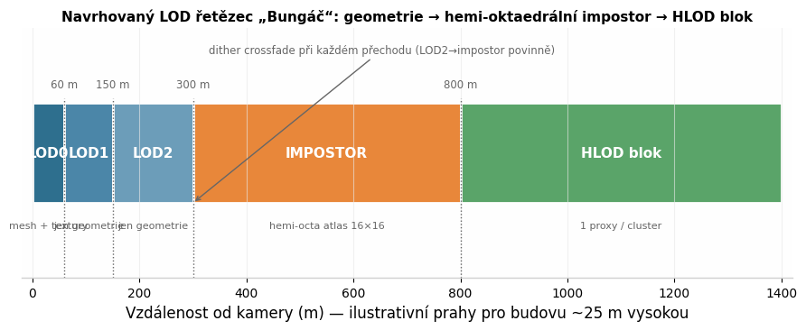
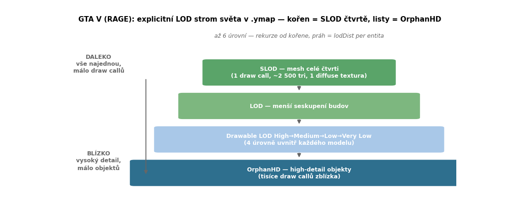
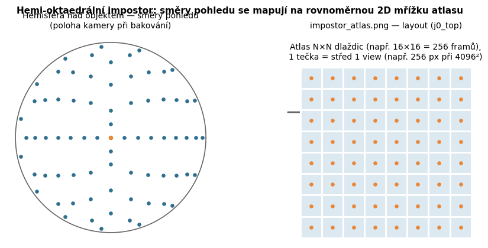
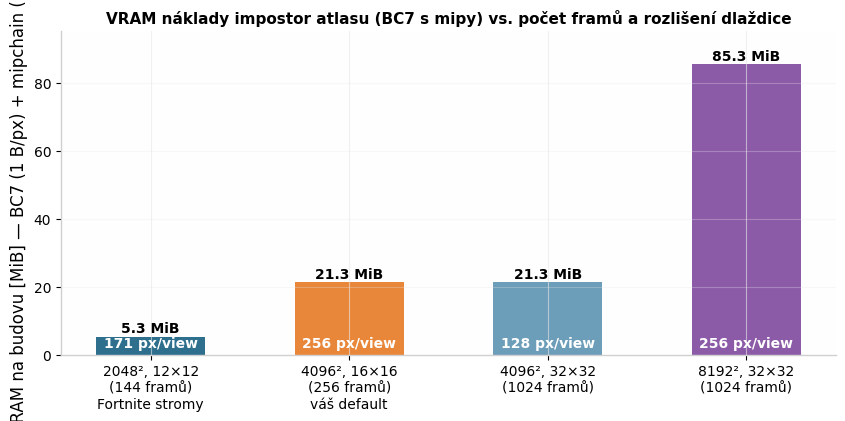
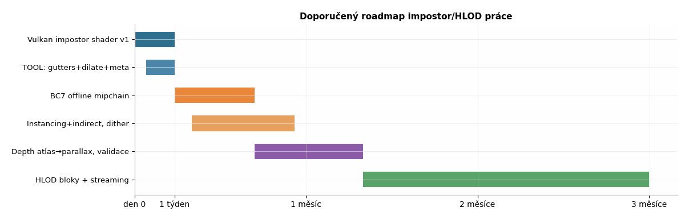

# Impostory a HLOD pro moderní Vulkan city engine — research report

**Předmět:** produkční impostor / HLOD systémy pro Vulkan renderer „Bungáč" (město GTA-škály, KitBash budovy, TOOL „LOD Messiah" už offline peče hemi-oktaedrální atlasy). **Důraz:** praktické příklady z produkce — co se skutečně používá, s citacemi primárních zdrojů (GDC/SIGGRAPH, engine dokumentace, open-source referenční kód). **Datum zpracování:** 2026-07-20. U každé sekce uvádím míru jistoty; co není veřejně zdokumentováno, explicitně označuji jako neznámé.

---

## 1. Exekutivní doporučení (≤ 15 řádků)

1. **Zůstaňte u hemi-oktaedrálních impostorů per budova** — vaše cesta je průmyslově validní: stejný princip (oktaedrální view grid + 3-frame blend) používá Epic ve Fortnite pro všechny stromy, s dokumentovanou produkční konfigurací 12×12 framů v atlasu 2048² [(Epic Dev)](https://dev.epicgames.com/documentation/unreal-engine/impostor-baker-plugin-in-unreal-engine) .
2. **Nedílná součást v1 je Vulkan runtime shader + úpravy TOOL exportu** (gutters/border dilate, premultiplied alpha, mip policy, meta pole) — bez toho engine „bojuje" s atlasem.
3. **Nedoporučuji drop impostorů ve prospěch „LOD2 + cull"**: na 200–800 m se impostor (2–8 tri, 1–2 draw/instance) tváří lépe než agresivně zjednodušená geometrie a drží silhouette detail, který geometrický LOD2 ztrácí.
4. **Nanite není drop-in**: je to celý virtuální geometrický subsystém (cluster DAG, software raster, streaming stránek) [(Advances in Real-Time Rendering in Games)](https://advances.realtimerendering.com/s2021/Karis_Nanite_SIGGRAPH_Advances_2021_final.pdf) ; jeho principy (screen-space error metrika, GPU-driven culling, monotónní error) ale převezměte do LOD selektoru.
5. **HLOD bloky plánujte jako fázi 2** — slučovat tisíce budov do clusterů po blocích a péct 1 impostor/proxy na blok je produkčně ověřený vzor (UE World Partition HLOD + City Sample) [(Epic Dev)](https://dev.epicgames.com/documentation/unreal-engine/world-partition---hierarchical-level-of-detail-in-unreal-engine) ; nejprve ale doražte per-asset impostory.
6. **Přechod LOD2→impostor řešte dither crossfadem**, ne hard cutem — oba přístupy jsou v UE standardem od 4.11/4.16 [(Couch Learn)](https://couchlearn.com/fading-between-lods-in-unreal-engine-4/) .
7. **Impostory nechte stíny nevrhat** (nebo jen cheap proxy), ale vrhejte je do GPU-driven instanced pipeline: AC Unity dokumentuje, že tisíce instancí s indirect draw a GPU cullingem stojí ~2,3 ms GPU na slabším hardwaru [(Advances in Real-Time Rendering in Games)](https://advances.realtimerendering.com/s2015/aaltonenhaar_siggraph2015_combined_final_footer_220dpi.pdf) .
8. **První týden:** Vulkan shader v1 + TOOL gutters/premultiply/meta. **První měsíc:** BC7 mip chain offline, instancing + indirect, hysterese, dither. **Později:** depth atlas → parallax, HLOD bloky, streaming.

---

## 2. Co máte vs. industry gap

| Oblast | Stav „Bungáč" + TOOL dnes | Průmyslový standard (zdroj) | Gap |
|---|---|---|---|
| Typ impostoru | hemi-okta, Brucks-style ✓ | Fortnite: hemi-okta pro všechny stromy při vypnutém Nanite [(Epic Dev)](https://dev.epicgames.com/documentation/unreal-engine/impostor-baker-plugin-in-unreal-engine)  | žádný — cesta validní |
| Počet framů / atlas | 16×16 = 256 @ 4096² | Fortnite 12×12 = 144 @ 2048² [(Epic Dev)](https://dev.epicgames.com/documentation/unreal-engine/impostor-baker-plugin-in-unreal-engine)  | máte rezervu kvality, ale 4× VRAM na asset |
| Bake pipeline | headless Chromium/Three.js, unlit albedo fix | UE Impostor Baker: GBuffer capture, channel-packed masky, 2× supersample [(Epic Dev)](https://dev.epicgames.com/documentation/unreal-engine/impostor-baker-plugin-in-unreal-engine)  | funkcionálně ekvivalentní; chybí depth/parallax kanály |
| Runtime shader Vulkan | **neexistuje** | UE material (3-frame blend, mobile 1-frame) [(Epic Dev)](https://dev.epicgames.com/documentation/unreal-engine/impostor-baker-plugin-in-unreal-engine) ; Amplify Impostors v Unity [(Unity Asset Store)](https://assetstore.unity.com/packages/tools/utilities/amplify-impostors-beta-119877)  | **hlavní gap — kritická cesta** |
| Gutter / border dilate | ne | UE HLOD „Gutter Size", UV border smear při bakování [(Epic Dev)](https://dev.epicgames.com/documentation/unreal-engine/hierarchical-level-of-detail-outliner-in-unreal-engine)  | nutno doplnit v TOOL |
| Alpha handling | PNG→BC7 | premultiplied alpha kvůli správné filtraci [(Stack Overflow)](https://stackoverflow.com/questions/32889512/explain-how-premultiplied-alpha-works)  | nutno definovat kontrakt |
| LOD selektor | vzdálenost + hysterese | screen-size metrika (UE) [(Epic Dev)](https://dev.epicgames.com/documentation/unreal-engine/optimizing-lod-screen-size-per-platform-in-unreal-engine) , projektovaný screen-space error (Nanite) [(Advances in Real-Time Rendering in Games)](https://advances.realtimerendering.com/s2021/Karis_Nanite_SIGGRAPH_Advances_2021_final.pdf)  | doporučeno přejít na screen-size |
| Přechody | plánováno | dithered LOD transition (UE 4.11+) [(Couch Learn)](https://couchlearn.com/fading-between-lods-in-unreal-engine-4/)  | malý gap |
| Instancing / indirect | ? | GPU-driven cluster pipeline (AC Unity, SIGGRAPH 2015) [(Advances in Real-Time Rendering in Games)](https://advances.realtimerendering.com/s2015/aaltonenhaar_siggraph2015_combined_final_footer_220dpi.pdf)  | k doplnění pro 5–20k instancí |
| HLOD clustery | ne | UE World Partition HLOD layers, City Sample [(Epic Dev)](https://dev.epicgames.com/documentation/unreal-engine/world-partition---hierarchical-level-of-detail-in-unreal-engine)  | fáze 2 |
| Stíny/GI z impostorů | nerozhodnuto | impostor shadow toggle v Impostor Bakeru; praxe = vypnout / proxy [(Epic Dev)](https://dev.epicgames.com/documentation/unreal-engine/impostor-baker-plugin-in-unreal-engine)  | rozhodnout v1: vypnuto |

---

## 3. Sekce A — Taxonomie: co „impostor" znamená v produkci

### 3.1 Klasické billboardy a kamerové sprity

Klasický billboard je jedna (případně křížená) texturovaná karta natočená ke kameře; v moderní podobě se používá jako poslední LOD vegetace a jednoduchých propsů. Jeho produkční slabinou je, že pevná perspektiva karty je z některých úhlů viditelně špatně — Epic v dokumentaci Impostor Bakeru uvádí přímé srovnání: billboardy používají 8 karet (72 trianglů, 81 vertexů) a karty se podle úhlu pohledu dither-překrývají, zatímco oktaedrální impostor stačí na 8 trianglů a 9 vertexů, tedy zhruba osminu vertex/triangle rozpočtu [(Epic Dev)](https://dev.epicgames.com/documentation/unreal-engine/impostor-baker-plugin-in-unreal-engine) . Klasický billboard má jedinou reálnou výhodu, a tou je texturová rozlišovací schopnost: do atlasu 3×3 se vejde jen 9 pohledů, takže každý pohled dostane výrazně víc texelů než u 256-framového oktaedrálního atlasu — proto se billboardy stále používají tam, kde jde o málo pohledů a hodně detailu (typicky strom shora + 8 stran) [(Epic Dev)](https://dev.epicgames.com/documentation/unreal-engine/impostor-baker-plugin-in-unreal-engine) . Akademicky je zobecněním tento přístup „billboard clouds" (Decoret et al., SIGGRAPH 2003) — objekt nahrazený sadou libovolně orientovaných karet s texturou, což je předchůdce všech dnešních impostor systémů a dodnes reference, na kterou navazuje i současná výzkumná literatura o reshadable impostorech [(cuteloong.github.io)](https://cuteloong.github.io/assets/files/rilod25.pdf) .

Prakticky pro váš případ: billboardy jako primární reprezentace budov nedávají smysl, protože budovy se sledují z ulice i z výšky (střechy, helikoptéra-style pohledy v GTA-škále hře) a křížené karty produkují parallax artefakty na rozích. Billboard model ale zůstává relevantní jako **fallback pro mobilní/low-tier cestu** (1 frame sample místo 3-frame blendu, přesně jak dělá UE pro mobily) [(Epic Dev)](https://dev.epicgames.com/documentation/unreal-engine/impostor-baker-plugin-in-unreal-engine) , a jako referenční baseline při validaci — když váš oktaedrální impostor nevypadá měřitelně lépe než 9-view billboard, je něco špatně v bake pipeline. Z taxonomického hlediska je důležité si uvědomit, že „impostor" v produkční mluvě znamená „offline předrenderovaná reprezentace posledního LODu", a to bez ohledu na konkrétní mapování — Simplygon definuje impostor proces právě takto obecně (mapování veškerého geometrického detailu do textur pro pohled z dálky a určitého směru) [(wikipedia.org)](https://en.wikipedia.org/wiki/Simplygon) .

### 3.2 Oktaedrální a hemi-oktaedrální impostory

Oktaedrální impostor (Ryan Brucks, 2018, původně pro Fortnite stromy) ukládá pohledy napříč sférou rozložené pomocí oktaedrální projekce — stejné mapování, které se používá pro kompresi normál, protože má malou distorzi a trivialní GPU kód bez trigonometrie [(shaderbits.com)](https://shaderbits.com/blog/octahedral-impostors) . Runtime shader spočítá view vektor, zakóduje ho do 2D mřížky, najde tři nejbližší framy a lineárně je blendí; výsledek je hladká rotace bez dither-překryvů karet [(Epic Dev)](https://dev.epicgames.com/documentation/unreal-engine/impostor-baker-plugin-in-unreal-engine) . Hemi-okta varianta mapuje jen horní polokouli a podle Bruckse dává významně víc rozlišení tam, kde ho je potřeba — pro objekty stojící na terénu, které nikdy neuvidíte zespoda, a s příjemným vedlejším efektem jemného oversamplingu horizontu, odkud se na objekty díváte nejčastěji [(Medium · Madara PremawardhanaMedium · Madara Premawardhana)](https://madarapremawardana.medium.com/the-only-imposter-who-come-in-handy-octahedral-imposters-e2b002379a98) . Cigolle et al. (JCGT 2014) dodávají formální podklad: hemi-oct encoding má na polosféře menší střední i maximální chybu než plný oct i než xy-only kódování, a encode/decode jsou pár aritmetických operací bez tabulek [(Journal of Computer Graphics Techniques)](https://jcgt.org/published/0003/02/01/paper.pdf) .

Pro město je hemi-okta jasná volba — budovy se zespoda nefotí, a vy už tak bake řešíte stylem „j0_top" s hemisférou. **Jistota: vysoká.** Je ale potřeba zdůraznit jednu produkční podmínku, kterou Brucks sám zmiňuje: oktaedrální mapování není dokonale rovnoměrné (plný oktahedron je rovnoměrnější než hemi, který má u pólu jemnou asymetrii; Brucks ve svém shaderu korekci flipu hran u pólů vynechal, protože stála pár instrukcí navíc) [(Medium · Madara PremawardhanaMedium · Madara Premawardhana)](https://madarapremawardana.medium.com/the-only-imposter-who-come-in-handy-octahedral-imposters-e2b002379a98) . Pro stromy je to neviditelné, pro velké rovné fasády budov s tvrdými hranami se asymetrie může projevit jako drobný „swim" při rotaci kamery kolem zenitu — proto doporučuji v sekci D zahrnout do validační sady právě scrub test přes pól. Současný výzkum (RiLoD, EGSR 2025) navíc ukazuje, kam se obor posouvá: místo blendění pečlivě ukládat kompaktní G-buffer (normály oktahedrálně, depth, alpha, material ID + UV) a cílový pohled skládat forward mappingem s hole-fillingem, což odstraňuje ghosting klasické interpolace [(cuteloong.github.io)](https://cuteloong.github.io/assets/files/rilod25.pdf)  — pro vás je to roadmapový materiál, ne v1 scope.

### 3.3 Duální paraboloidní a sférické impostory

Duální paraboloidní mapování (dvě paraboloidní polokoule, historicky známé z environment mappingu) je alternativa s ještě jednodušším shaderem, ale výrazně horší rovnoměrností vzorkování u okrajů disku; v praxi se pro nové systémy nepoužívá a ve veřejných produkčních materiálech jsem nenašel aktuální AAA nasazení pro architekturu — označuji jako historickou/akademickou větev s nízkou jistotou produkční relevance. Amplify Impostors (de facto standard v Unity ekosystému, 201 MB balíček, aktivně udržovaný i v roce 2026, kompatibilní Built-in/URP/HDRP) nabízí vedle oktaedrálního typu i „spherical" typ, který je právě touto rodinou jednodušších mapování [(Unity Asset Store)](https://assetstore.unity.com/packages/tools/utilities/amplify-impostors-beta-119877) . To je praktický signál: i komerční nástroj, jehož byznys je prodávat impostory masám, drží oktaedrální variantu jako hlavní a sférickou jako levnější alternativu pro jednoduché objekty.

Poznámka k důkazní síle: Unity asset store nástroje samy o sobě nejsou „AAA pravda" (jak správně požaduje zadání), ale slouží jako **referenční implementace a sanity check API** — Amplify i Brucksův ImpostorBaker mají otevřené shadery, takže lze přímo porovnat frame indexing a blend váhy s vaší implementací. Původní Brucksův plugin žije na GitHubu (ictusbrucks/ImpostorBaker) a existují jeho porty a C++ přepisy pro UE4/UE5, včetně variant, které umí exportovat impostor objekty jako LOD sub-levely pro World Composition, tedy přesně vzor „offline bake → engine jen načítá", který máte v kontraktu [(recourse.nz)](https://recourse.nz/index.php/rdlodtools-tutorial-9/) . **Jistota: vysoká u oktaedrální dominance; duální paraboloidní větev považujte za uzavřenou.**

### 3.4 Nanite-style hierarchické clustery vs. tradiční impostory

Nanite není „lepší impostor", je to jiná kategorie: virtualizovaná geometrie s cluster DAG, kde se LOD volí jako řez grafem podle projektované screen-space chyby, malé clustery se rasterizují softwarově do visibility bufferu a celá scéna se kreslí GPU-driven s minimem draw callů [(Advances in Real-Time Rendering in Games)](https://advances.realtimerendering.com/s2021/Karis_Nanite_SIGGRAPH_Advances_2021_final.pdf) . Z hlediska vašeho rozhodnutí jsou klíčové dvě věci, které Karis explicitně říká: (1) Nanite **neruší problém vzdálených agregátů** — instance memory neroste lineárně s rozlišením, ale s počtem instancí, a Epic sám píše, že „merged unique proxies must replace instances at extreme distances", tedy že i v Nanite světě potřebujete HLOD/proxy vrstvu pro extrémní dálky [(Advances in Real-Time Rendering in Games)](https://advances.realtimerendering.com/s2021/Karis_Nanite_SIGGRAPH_Advances_2021_final.pdf) ; (2) Nanite build je masivní subsystém (METIS partitioning, monotónní error forcing, stránkování s parent-reference dekódováním ~30 % vertexů), který se do existujícího Vulkan rendereru „nepřikáže" přes víkend [(Advances in Real-Time Rendering in Games)](https://advances.realtimerendering.com/s2021/Karis_Nanite_SIGGRAPH_Advances_2021_final.pdf) . Převzít ale můžete a měli byste: screen-space error jako metriku přepínání, monotónnost erroru v hierarchii (rodič ≥ dítě), GPU-driven selekci a dvoufázový occlusion culling proti HZB minulého framu — to vše jsou principy popsané veřejně a implementovatelné nezávisle na Nanite [(Advances in Real-Time Rendering in Games)](https://advances.realtimerendering.com/s2021/Karis_Nanite_SIGGRAPH_Advances_2021_final.pdf) .

Kde se Nanite a impostory v produkci potkávají, je právě UE ekosystém: dokumentace Impostor Bakeru říká, že Fortnite používá hemi-okta impostory pro stromy **„když je Nanite vypnutý"** — tedy i Epic považuje impostory za komplement, ne konkurenci virtuální geometrie, a drží obě cesty vedle sebe podle platformy [(Epic Dev)](https://dev.epicgames.com/documentation/unreal-engine/impostor-baker-plugin-in-unreal-engine) . City Sample (Matrix Awakens) pak demonstruje druhý konec osy: celé město z Nanite meshe + World Partition + generované HLOD clustery pro dálku [(Epic Dev)](https://dev.epicgames.com/documentation/unreal-engine/city-sample-project-unreal-engine-demonstration) . **Jistota: vysoká. Závěr pro vás: Nanite jako cíl ne; jeho LOD/culling principy ano; impostor jako poslední per-asset stupeň ano; HLOD proxy pro kilometry ano.**

### 3.5 HLOD merged meshe, Simplygon a automatické proxy

HLOD v průmyslovém smyslu = offline zclusterovat mnoho actorů a pro každý cluster vyrobit jeden proxy mesh s jedním zapečeným materiálem (atlasy textur), čímž se draw cally redukují z desítek na jeden; UE toto popisuje jako primární motivaci systému pro velké otevřené světy [(Epic Dev)](https://dev.epicgames.com/documentation/unreal-engine/hierarchical-level-of-detail-in-unreal-engine) . UE5 nabízí čtyři typy HLOD layerů — **Instancing** (nahrazení nejnižším LODem, doporučeno pro impostor meshe jako stromy/foliage), **Merged Mesh** (merge bez simplifikace), **Simplified Mesh** (merge + simplifikace, lze podpult Simplygonem) a **Approximated Mesh** [(Epic Dev)](https://dev.epicgames.com/documentation/unreal-engine/world-partition---hierarchical-level-of-detail-in-unreal-engine) . Důležitý produkční detail pro vaši TOOL stranu: UE dokumentace explicitně definuje **Gutter Size** jako prostor v pixelech mezi UV ostrovy v pečeném atlasu, aby se při mipmap downsampleu barvy nepřelévaly přes ostrovy — přesně ten problém, který budete řešit s bleeding mezi impostor dlaždicemi [(Epic Dev)](https://dev.epicgames.com/documentation/unreal-engine/hierarchical-level-of-detail-outliner-in-unreal-engine) .

Simplygon (Microsoft/Xbox) pokrývá celé spektrum: reduction, remeshing (proxy objekt za skupinu objektů), aggregation (celá scéna → 1 objekt), impostor (detail do textur pro vzdálený/direkční pohled) a occlusion mesh (silhouette geometrie) [(wikipedia.org)](https://en.wikipedia.org/wiki/Simplygon) , a do UE se integruje pod „Simplified Mesh" HLOD layer s Remeshing pipeline, ideálně distribuovaně [(Simplygon)](https://documentation.simplygon.com/SimplygonSDK_10.2.8400.0/ue5/concepts/hlod.html) . InstaLOD nabízí obdobné portfolio včetně „one-click impostor generation" a hybridních billboard clouds s depthem, plus JSON/CLI profily pro batch/CI automatizaci — což je duchovně blízko vašemu TOOLu [(instalod.com)](https://instalod.com/) . **Praktický závěr:** váš TOOL pokrývá z Simplygon portfolia části „reduction" (LOD0–2) a „impostor" (hemi-okta bake); chybí vám „aggregation/remeshing pro bloky" — a to je přesně HLOD fáze 2. **Jistota: vysoká.**

### 3.6 Voxely / SDF / radiance proxy pro vzdálené budovy

Veřejně zdokumentované AAA použití voxel/SDF reprezentace **jako primární vzdálené reprezentace architektury** jsem nenašel — SDF se v produkci používají pro okluzi (UE „Dynamic Occlusion with Signed Distance Fields", SIGGRAPH 2015 course) a pro GI (surfely ve Frostbite GIBS) [(Advances in Real-Time Rendering in Games)](http://advances.realtimerendering.com/s2021/index.html) , ne jako náhrada vzdálených budov. Karisův „Journey to Nanite" navíc dokumentuje, že Epic voxel/point reprezentace pro geometrii aktivně zkoušel a zavrhl ve prospěch cluster rasterizace (overdraw, hole filling, kvalita) [(High Performance Graphics)](https://www.highperformancegraphics.org/slides22/Journey_to_Nanite.pdf) . **Jistota: střední až vysoká — označuji jako nevhodné pro váš use case a nebudu dál rozvádět.**

### 3.7 Co veřejně popisují konkrétní studia (budovy / hustá města na dálku)

| Studio / engine | Co je veřejné | Praktický příklad |
|---|---|---|
| **Epic / UE (Fortnite, City Sample)** | Kompletní: hemi-okta impostory pro stromy (12×12, 2048², GBuffer capture, channel-packed masky, parallax módy) [(Epic Dev)](https://dev.epicgames.com/documentation/unreal-engine/impostor-baker-plugin-in-unreal-engine) ; HLOD systém a World Partition HLOD layers vč. gutterů, screen-size přepínání a commandlet buildů [(Epic Dev)](https://dev.epicgames.com/documentation/unreal-engine/world-partition---hierarchical-level-of-detail-in-unreal-engine) ; City Sample generuje HLOD pro celé město [(Epic Dev)](https://dev.epicgames.com/documentation/unreal-engine/city-sample-quick-start-for-generating-a-city-and-freeway-in-unreal-engine-5)  | přímý template pro váš runtime i TOOL meta |
| **Ubisoft (AC Unity / Anvil)** | GPU-driven pipeline pro husté modulární město: per-material instance batching, mesh cluster culling, 2-fázový occlusion culling, ~10× instancí oproti předchozímu AC, 1–2 řády méně draw callů [(Advances in Real-Time Rendering in Games)](https://advances.realtimerendering.com/s2015/)  | vzor pro vaši instanced/indirect cestu (sekce D) |
| **CDPR (REDengine, Witcher 3)** | Pouze visibility/streaming (Umbra 3, GDC 2014); impostor/HLOD detaily veřejné nejsou | označit jako neznámé |
| **Avalanche (Apex, Just Cause 3)** | Deferred + clustered shading, agresivní instancing a ruční instancing pro vegetaci, LOD grid meshe pro lesy s alpha texturou, screen-space LOD ladění [(英特尔)](https://www.intel.cn/content/dam/develop/external/us/en/documents/optimizations-enhance-just-cause3-on-systems-with-intel-iris-graphics-684945.pdf)  | praktický důkaz, že „LOD + instancing + alpha karty" škáluje na 1000 km² |
| **Guerrilla (Decima, Horizon)** | Veřejné jsou vegetační shadery/optimalizace (GDC 2018) [(GDC Vault)](https://www.gdcvault.com/play/1025530/Between-Tech-and-Art-The) ; city HLOD/impostor pipeline veřejná není | označit jako neznámé |
| **Frostbite (EA DICE)** | GPU-driven culling tradice („Culling the Battlefield" GDC 2011 je referencovaná; Wihlidal GDC 2016) [(Cinevva Games)](https://app.cinevva.com/blog/2026-05-11-foliage-overdraw) ; GIBS surfely pro GI [(Advances in Real-Time Rendering in Games)](http://advances.realtimerendering.com/s2021/index.html)  | principy přenositelné, konkrétní building-HLOD neveřejné |
| **Rockstar (RAGE, GTA V)** | Frame-level reverzní analýza + komunitní dekompilace formátů — detailně v nové sekci 3.8: hierarchické merge meshe per čtvrť, alpha stipple přechody, instanced light quads | **pozor: GTA NEPOUŽÍVÁ oktaedrální impostory — používá ručně mergované low-poly meshe čtvrtí (fakticky HLOD)** |
| **Insomniac, idTech, RE Engine** | Nic veřejného k building impostorům (idTech je veřejný jen k MegaTexture/virtual texturingu [(Cinevva Games)](https://app.cinevva.com/blog/2026-05-03-aaa-rendering-techniques) ) | **neznámé — neodhadujte interní praxi** |

Celkový obraz je konzistentní napříč tím, co je veřejné: **per-asset obrazová reprezentace (impostor) pro poslední LOD + merged/proxy HLOD pro clustery + GPU-driven instanced submission** je průmyslová norma, a váš design do ní zapadá. Rozdíly mezi studii jsou v dopravě (jak agresivně cullují a batchují), ne v tom, jestli impostory používají. **Jistota: vysoká u popsaného patternu; nízká u detailů neveřejných studií.**



### 3.8 GTA / Rockstar (RAGE) deep dive — jak to skutečně dělá nejrelevantnější městská hra

Rockstar nikdy nepublikoval žádný GDC/SIGGRAPH rendering talk o RAGE (jediný oficiální GDC talk od Rockstar North je o audiu [(youtube.com)](https://www.youtube.com/watch?v=EUN1j-3IPW0) ), takže **oficiální studio dokumentace neexistuje**. Existují ale dva nezávislé, vzájemně se doplňující zdroje s vysokou důvěryhodností: (1) **frame-level reverzní analýza PC verze** Adriana Courrègese (2015, DX11 capture + decompilace shader bytecode — faktická měření, ne dohady) [(adriancourreges.com)](http://www.adriancourreges.com/blog/2015/11/02/gta-v-graphics-study/)  a (2) **dekompilace herních formátů modding komunitou** (CodeWalker, Sollumz — open-source nástroje, které čtou a zapisují přímo herní .ymap/.ytyp/.ydr soubory, takže popisují skutečnou datovou strukturu) [(Github)](https://github.com/dexyfex/CodeWalker) . Kde se zdroje liší od oficiálních faktů, uvádím to explicitně. **Zásadní zjištění předem: GTA V žádné oktaedrální ani jiné obrazové impostory pro budovy nepoužívá** — používá hierarchii ručně mergovaných low-poly meshů, což je z hlediska vaší taxonomie **HLOD merged meshes** doplněné o chytré přechody a samostatný systém vzdálených světel.

#### 3.8.1 Datová struktura: explicitní LOD hierarchie až 6 úrovní (zdokumentováno v herních souborech)

Modding komunita dekódovala skutečnou strukturu světa GTA V a ta je přímočaře čitelná: svět je poskládán z `.ytyp` souborů (archetypy = definice objektů), `.ymap` souborů (placement entit) a `.ybn` (kolize), přičemž **EntityData v .ymap tvoří explicitní LOD strom** — v jeho kořenu je malý počet velkých modelů, které se všechny renderují současně pro pohled z velké dálky, a každá větev se dělí na menší objekty s vyšším detailem; tento vzor pokračuje **až do 6 úrovní detailu** [(Github)](https://github.com/dexyfex/CodeWalker) . Renderer strom rekurzivně prochází od kořenů a pro každý uzel porovnává vzdálenost od kamery s `lodDist` uloženým u entity — pod ním se použije aktuální úroveň, jinak se přejde hlouběji [(Github)](https://github.com/dexyfex/CodeWalker) . Toto je **dokumentovaná matematika selekce: holá vzdálenost per entity s per-entity prahem**, ne screen-size metrika — historicky pochopitelné (pevné FOV, konzole), ale pro vás důvod držet se screen-size varianty, jak doporučuje sekce D.



Nad tím stojí druhá, nezávislá úroveň granularity: **každý drawable model (.ydr) má uvnitř sebe 4 mesh LOD úrovně — High, Medium, Low, Very Low** (Very High existuje jen pro vozidla ve .yft) [(sollumz.org)](https://docs.sollumz.org/documentation/drawables.ydr/level-of-detail-lods-editing) . Celý systém je tedy dvouúrovňový: *mesh LOD uvnitř assetu* (High→Very Low) × *světový LOD strom napříč assety* (kořen = SLOD meshe celých čtvrtí, listy = OrphanHD high-detail objekty) [(GTA Wiki)](https://gta.fandom.com/wiki/CodeWalker) . V terminologii CodeWalkeru se úrovně jmenují **HD / OrphanHD / LOD / SLOD (Super LOD)**, kde SLOD jsou právě kořenové meshe čtvrtí [(GTA Wiki)](https://gta.fandom.com/wiki/CodeWalker) . Přímá analogie k vám: vaše lod0/lod1/lod2 = jejich drawable High/Medium/Low; jejich SLOD = vaše plánovaná HLOD fáze 2; a jejich `lodDist` per entity = váš plánovaný `transitionScreenSize` per asset v `impostor.json`. **Jistota: vysoká** — jde o čtení skutečných herních dat, reprodukovatelné v open-source nástrojích.

#### 3.8.2 Vzdálené město = jeden draw call na čtvrť, ne impostor atlas

Z frame analýzy je kvantitativně změřeno, jak vypadá nejvzdálenější úroveň města: **Vinewood Hills** — oblast několika km² s desítkami domů, observatoří Galileo i divadlem Sisyphus, která se zblízka renderuje tisíci draw callů — je z dálky **jediný draw call s ~2 500 triangly, jeden mesh s jedinou diffuse texturou** [(adriancourreges.com)](https://www.adriancourreges.com/blog/2015/11/02/gta-v-graphics-study-part-2/) . Totéž pro **Little Seoul** (několik bloků města) — opět jeden draw call [(adriancourreges.com)](https://www.adriancourreges.com/blog/2015/11/02/gta-v-graphics-study-part-2/) . Courrèges explicitně poznamenává, že automatické decimation nástroje nestačí a že meshe byly s největší pravděpodobností **ručně doladěné artousty** [(adriancourreges.com)](https://www.adriancourreges.com/blog/2015/11/02/gta-v-graphics-study-part-2/) . To je zásadní rozdíl proti vaší cestě: Rockstar zvolil *manuálně autorované merge proxy meshe* tam, kde vy chcete *automaticky pečené impostor atlasy*. Obě cesty konvergují ve stejném cíli (1 draw + 1 textura na čtvrť), ale liší se náklady: Rockstar platí lidskou prací per čtvrť, vy platíte VRAM per budova. Pro GTA-škálu s tisíci budov je váš automatizovaný přístup jediný realistický — ruční přístup Rockstaru je produkčně možný jen s army artistů a jedním fixním městem.

Bonus, který z této reprezentace Rockstar získává: protože celý svět existuje jako ultra-levný low-poly model, **každý frame se z něj renderuje environment cubemap** (6× po 30 draw callech) pro odlesky vozů — hra s jedinou LOD úrovní by si real-time cubemapu nemohla dovolit [(adriancourreges.com)](https://www.adriancourreges.com/blog/2015/11/02/gta-v-graphics-study-part-2/) . To je přímý argument i pro vaši HLOD vrstvu: pokud budete někdy chtít real-time env capture pro mokré silnice/odlesky, HLOD cluster meshe jsou přesně ten obsah, který do capture patří.

#### 3.8.3 Přechody LOD: alpha stippling s dokumentovaným shaderem

GTA V řeší LOD popping **alpha stipplingem** — a tady máme doslova decompilovaný bytecode. Z diffuse bufferu Courrèges vytáhl fragment shader, který v LOD přechodu zahazuje každý druhý pixel v šachovnicovém vzoru [(adriancourreges.com)](http://www.adriancourreges.com/blog/2015/11/02/gta-v-graphics-study/) :

```
dp2 r1.y, v0.xyxx, l(0.5, 0.5, 0.0, 0.0)  // (x+y)*0.5
frc r1.y, r1.y                            // frac → 0.0 nebo 0.5
lt  r1.y, r1.y, l(0.5)                    // discard poloviny pixelů
// ekvivalent: (x + y) % 2 == 0, plus cutoff alpha < 0.75
```

Mesh v přechodu tedy vypadá „napůl průhledně" a informace o ditherovaných pixelech se uloží do **alfa kanálu diffuse bufferu**; na konci framu běží dedikovaný post-process **„dithering smoothing"**, který pro označené pixely nasampluje až 2 sousedy a obraz „zahojí" jedním pass s konstantní cenou nezávislou na množství geometrie [(adriancourreges.com)](http://www.adriancourreges.com/blog/2015/11/02/gta-v-graphics-study/) . Přeloženo do GLSL pro váš Vulkan shader je stipple ekvivalentní s dither crossfadem doporučeným v sekci 6.3 — s jedním praktickým rozdílem: GTA používá nejjednodušší možný 2×2 checkerboard + samostatný healing pass zapisovaný přes alfa kanál G-bufferu, zatímco UE používá screen-door dither bez healing passu [(Couch Learn)](https://couchlearn.com/fading-between-lods-in-unreal-engine-4/) . Pro váš TAA renderer doporučuji zůstat u bayer ditheru bez healing passu (TAA ho vyhladí temporálně), ale GTA pattern je legitimní levnější varianta pro non-TAA cestu. Další dokumentovaná matematika z téže analýzy: **logaritmický reversed Z-buffer** kvůli z-fightingu na dlouhé draw distance [(adriancourreges.com)](http://www.adriancourreges.com/blog/2015/11/02/gta-v-graphics-study/)  — pro vaše město s impostory na 1+ km stejně relevantní; a **CSM 4 kaskády v jedné 1024×4096 textuře** s dithered samplingem pro měkké okraje [(adriancourreges.com)](http://www.adriancourreges.com/blog/2015/11/02/gta-v-graphics-study/) .

#### 3.8.4 Vzdálená světla: instanced quads 32×32 — odpověď pro vaše noční město

Nejpřekvapivější dokumentované číslo: **každý světelný bod v dálce (pouliční lampy, okna, reflektory aut) je instancovaný quad s texturou 32×32 px**, desetitisíce takových polygonů batchovaných do instanced geometrie [(adriancourreges.com)](https://www.adriancourreges.com/blog/2015/11/02/gta-v-graphics-study-part-2/) . Vzdálená auta se v noci nerenderují vůbec — jen **2 quady reflektorů** pohybující se po silnicích, a plný model se dostreamuje až při přiblížení [(adriancourreges.com)](https://www.adriancourreges.com/blog/2015/11/02/gta-v-graphics-study-part-2/) . Prohlášení art directora Aarona Garbuta „všechna světla v dálce jsou reálná, můžete k nim dojet" tak technicky znamená: reálné *pozice* světel jako data, ne reálná geometrie [(adriancourreges.com)](https://www.adriancourreges.com/blog/2015/11/02/gta-v-graphics-study-part-2/) . CodeWalker tento systém potvrzuje jako samostatnou datovou vrstvu „LOD lights" (vzdálené corony pro pouliční lampy a budovy) [(GTA Wiki)](https://gta.fandom.com/wiki/CodeWalker) . **Praktický závěr pro vás:** emissive v impostor atlase (sekce 4.2) řeší svítící okna staticky, ale GTA vzor ukazuje, že pro noční město se vyplatí **oddělit světla od impostoru** — light quady/corony jako vlastní instanced systém (32×32 textura stačí) vám umožní blikající, dynamicky řízená a den/noc spínaná světla bez rebake atlasů. Tohle je z celé GTA sekce nejlevnější okopírovatelná věc s největším vizuálním efektem.

#### 3.8.5 Rozlišení — v jakém rozlišení GTA své LOD/SLOD assety má

Přímá odpověď na vaši otázku, seřazená podle spolehlivosti zdroje:

| Asset | Rozlišení | Zdroj / jistota |
|---|---|---|
| Textura světelného quadu (lampy, okna, reflektory) | **32×32 px** | frame analýza [(adriancourreges.com)](https://www.adriancourreges.com/blog/2015/11/02/gta-v-graphics-study-part-2/)  — vysoká |
| Environment cubemap (za frame, pro odlesky) | **128×128 px na face**, HDR | frame analýza [(adriancourreges.com)](http://www.adriancourreges.com/blog/2015/11/02/gta-v-graphics-study/)  — vysoká |
| Dual-paraboloid map (z cubemapy) | 2 hemisféry po **128×128 px** | frame analýza [(adriancourreges.com)](http://www.adriancourreges.com/blog/2015/11/02/gta-v-graphics-study/)  — vysoká |
| Planar reflection map (voda/zrcadla) | **240×120 px** | frame analýza [(adriancourreges.com)](http://www.adriancourreges.com/blog/2015/11/02/gta-v-graphics-study/)  — vysoká |
| Shadow mapy (CSM, 4 kaskády) | **1024×4096 px** celkem | frame analýza [(adriancourreges.com)](http://www.adriancourreges.com/blog/2015/11/02/gta-v-graphics-study/)  — vysoká |
| Clouds (density + normal) | **2048×512 px**, seamless | frame analýza [(adriancourreges.com)](http://www.adriancourreges.com/blog/2015/11/02/gta-v-graphics-study/)  — vysoká |
| Diffuse textura SLOD meshe čtvrtě (Vinewood Hills aj.) | **neveřejné — nikde zdokumentováno** | frame analýza potvrzuje jen „jedna diffuse textura" [(adriancourreges.com)](https://www.adriancourreges.com/blog/2015/11/02/gta-v-graphics-study-part-2/) ; velikost lze změřit jen extrakcí z herních souborů, žádný citovatelný zdroj číslo neuvádí |
| Cílové rozlišení hry | 720p (PS3/360), 1080p (PS4/X1), 4K/RT (PS5, Enhanced PC 2025 s RT GI/AO [(wikipedia.org)](https://en.wikipedia.org/wiki/Rockstar_Advanced_Game_Engine) ) | oficiální [(wikipedia.org)](https://en.wikipedia.org/wiki/Rockstar_Advanced_Game_Engine)  — vysoká |

Závěr z tabulky je důležitější než samotná čísla: **GTA na vzdálené město alokuje řádově méně pixelů, než by čekal intuitivní odhad** — 128² cubemap stačí na odlesky celého města, 32² na světla, 240×120 na vodní hladinu. Princip je „rozlišení tam, kde to oko pozná" — a je to nepřímá validace vašeho 256 px/view: na dlaždici impostoru, která na obrazovce zabere max ~100–300 px, je 256 px **více než dostatečné**, spíše na horní hraně; VRAM tlak neřešte snížením pod 256 px tile, ale počtem atlasů (sdílení v kitu) a streamingem, jak navrhuje sekce 4.6.

#### 3.8.6 Co si z GTA odnést (a co ne) pro „Bungáč"

| GTA vzor | Přenositelnost k vám |
|---|---|
| SLOD = 1 mesh + 1 textura na čtvrť, 1 draw call | **ano — to je vaše HLOD fáze 2**; ale generovat automaticky (aggregation), ne ručně |
| Ruční retuše SLOD meshů army artistů | ne — nemáte army; impostor atlasy jsou vaše „automatická ruční práce" |
| Explicitní LOD strom až 6 úrovní s per-entity `lodDist` | ano — váš `transitionScreenSize` per asset v JSON je totéž, jen v lepší metrice |
| Alpha stipple + dither smoothing pass | ano jako varianta; s TAA stačí bayer dither (sekce 6.3) |
| Light quads 32×32 jako oddělený systém | **ano — doporučuji přidat do roadmapy** (noční město) |
| Logaritmický reversed Z | ano, pokud ho ještě nemáte — impostory na 1+ km ho vyžadují |
| Env cubemap z low-poly světa | později — až budete řešit odlesky/mokré silnice, HLOD meshe jsou zdroj pro capture |
| Streaming jako hlavní hrdina (žádné loading screens) | ano — vaše texcache/atlas streaming policy z 4.6 je stejný problém |

Pro úplnost evoluce: Red Dead Redemption 2 (2018) ukazuje, kam se RAGE posunul — podle komunitní frame analýzy přešel na nativní Vulkan/D3D12 renderer s depth-bound testovanými světelnými volumes a „top-down world lightmapou" pro baked osvětlení světa, zatímco envmapy zůstávají hlavním zdrojem odlesků [(GitHub)](https://imgeself.github.io/posts/2020-06-19-graphics-study-rdr2/) ; oficiálně RDR2 přinesl PBR, volumetriku a precomputed GI [(wikipedia.org)](https://en.wikipedia.org/wiki/Rockstar_Advanced_Game_Engine) . Princip „low-poly svět + baked světlo + levná proxy pro odlesky" tedy Rockstar drží napříč generacemi.

Celkově GTA potvrzuje **hybridní architekturu**: žádná hra v této škáli nejede čistě impostory ani čistě geometrií — GTA je důkaz, že „LOD mesh chain + merged far proxies + oddělená světla + dither přechody" postačuje na celé město bez jediného obrazového impostoru. Vaše výhoda oproti GTA 2013: impostor atlas drží materiálový detail (okna, fasády), který SLOD mesh se single diffuse ztrácí — a proto váš plán „impostor per budova → HLOD per blok" je kvalitativně nad GTA V vzorem, jen nákladově nutí pečlivou VRAM politiku. **Jistota sekce: vysoká u všech čísel z frame analýzy a formátů; SLOD texturová rozlišení označena jako neznámá.**

---

## 4. Sekce B — Oktaedrální deep dive (vaše současná cesta)

### 4.1 Přesná matematika: encode/decode, hemi vs. full, frame indexing

Oktaedrální mapování promítá jednotkovou sféru na oktahedron přes L1 normu a ten rozloží do čtverce; encode i decode jsou pár aritmetických operací bez trigonometrie, což je důvod, proč se používá i pro G-buffer normály [(Journal of Computer Graphics Techniques)](https://jcgt.org/published/0003/02/01/paper.pdf) . Referenční GLSL (Cigolle et al. 2014 / Narkowicz 2014, obojí veřejné a do Vulkan GLSL přenositelné 1:1):

```glsl
// encode: direction -> [0,1]^2 (full octahedron)
vec2 octWrap(vec2 v){ return (1.0 - abs(v.yx)) * (v.x >= 0.0 ? vec2(1.0) : vec2(-1.0)); }
vec2 octEncode(vec3 n){
    n /= (abs(n.x) + abs(n.y) + abs(n.z));
    n.xy = n.z >= 0.0 ? n.xy : octWrap(n.xy);
    return n.xy * 0.5 + 0.5;
}
// decode: [0,1]^2 -> direction
vec3 octDecode(vec2 f){
    f = f * 2.0 - 1.0;
    vec3 n = vec3(f.x, f.y, 1.0 - abs(f.x) - abs(f.y));
    float t = max(-n.z, 0.0);
    n.xy += (n.x >= 0.0 ? vec2(-t) : vec2(t));
    return normalize(n);
}
// hemi varianta (horní polokoule pokrývá celý čtverec; Brucks layout)
vec2 hemiOctEncode(vec3 v){               // v.z >= 0
    vec2 p = v.xy * (1.0 / (abs(v.x) + abs(v.y) + v.z));
    return vec2(p.x + p.y, p.x - p.y);    // [-1,1]^2
}
vec3 hemiOctDecode(vec2 e){
    vec2 t = vec2(e.x + e.y, e.x - e.y) * 0.5;
    vec3 v = vec3(t, 1.0 - abs(t.x) - abs(t.y));
    return normalize(v);
}
```

Tento encode/decode pár je formálně ověřený: hemi-oct má na polosféře výrazně menší střední i maximální úhlovou chybu než plný oct i xy-only kódování při stejném bitovém rozpočtu [(Journal of Computer Graphics Techniques)](https://jcgt.org/published/0003/02/01/paper.pdf) . Frame indexing je pak jen lineární: `uv_oct = hemiOctEncode(viewDir)`, `grid = uv_oct * frames`, `cell = floor(grid)`, `f = fract(grid)`; tři nejbližší framy jsou vrcholy trojúhelníku mřížky (cell + diagonála podle `f.x + f.y ≷ 1`) a blend váhy jsou barycentrické souřadnice v tom trojúhelníku. **Praktická produkční poznámka:** Brucksův původní blog ukazuje, že vertexy virtuální mřížky leží ve **středech dlaždic atlasu**, ne na jejich rozích — při indexaci tedy samplujete `(cell + 0.5) / frames` a blendíte mezi středy, jinak dostanete půldlaždicový posun a „dvojitý obraz" [(Medium · Madara PremawardhanaMedium · Madara Premawardhana)](https://madarapremawardana.medium.com/the-only-imposter-who-come-in-handy-octahedral-imposters-e2b002379a98) . Váš layout note `j0_top` (nultý řádek j nahoře v atlasu) si hlídejte konzistentně mezi TOOL exportem a Vulkan `VK_IMAGE` ori­entací — Vulkan nemá glTF-style automatický flip, takže doporučuji v JSON explicitně zapsat `atlasOrigin: "top-left"` a v pipeline exportovat PNG v přesně této orientaci.

Bilineární sampling napříč hranami dlaždic je druhá matematická past: hardwarový bilinear na hraně dvou framů táhne texely z cizího pohledu (jiný úhel → ghosting). Produkční řešení jsou dvě: (a) **point-sample triplet + manuální blend ve shaderu** (samplujete 3× point nebo 3× bilinear uvnitř dlaždice s clampovaným UV do vnitřku dlaždice), což dělá UE impostor materiál; (b) **gutters** — každá dlaždice má k-pixelový okraj naplněný dilate z vnitřku, takže i bilinear přes hranu bere konzistentní barvu. Prakticky se kombinuje: clamp UV do `[tileMin + 0.5px, tileMax - 0.5px]` pro bilinear + gutter ≥ 2 px pro mipy (viz 4.7).

### 4.2 Jaké kanály ukládat nad rámec albedo RGBA

| Kanál | Produkční praxe | Doporučení pro v1 |
|---|---|---|
| Albedo + alpha (coverage) | povinné všude; Fortnite peče BaseColor s distance-field alpha v opacitě [(Epic Dev)](https://dev.epicgames.com/documentation/unreal-engine/impostor-baker-plugin-in-unreal-engine)  | **ano** — albedo BC7 sRGB, alpha = coverage |
| Normály | UE peče Normal jako volitelnou color mapu; RiLoD ukládá normály oktahedrálně [(Epic Dev)](https://dev.epicgames.com/documentation/unreal-engine/impostor-baker-plugin-in-unreal-engine)  | ano (2. atlas nebo pack) — bez normál budovy na slunci plochají |
| Depth / parallax | Impostor Baker: depth v channel-packed maskách, 3 parallax módy vč. iterativního s „Depth Derived Weights" [(Epic Dev)](https://dev.epicgames.com/documentation/unreal-engine/impostor-baker-plugin-in-unreal-engine)  | **v2** — v1 billboard depth write, v2 depth atlas → single-step parallax |
| Roughness/Metallic/Specular | UE: channel-packed scalars v libovolné kombinaci, nebo konstanty [(Epic Dev)](https://dev.epicgames.com/documentation/unreal-engine/impostor-baker-plugin-in-unreal-engine)  | v1: konstanty per kit; v1.5: packed RMA |
| Emissive | UE volitelná color mapa [(Epic Dev)](https://dev.epicgames.com/documentation/unreal-engine/impostor-baker-plugin-in-unreal-engine)  | ano pro noční město — okna! (malý atlas nebo 3. kanál) |
| Bent normal / AO | Simplygon/InstaLOD pečou AO [(instalod.com)](https://instalod.com/)  | volitelné; levné zlepšení kontaktu se zemí |
| Material ID + UV místo G-bufferu | RiLoD 2025 — kompaktní reshading [(cuteloong.github.io)](https://cuteloong.github.io/assets/files/rilod25.pdf)  | ne v1; roadmap |

Klíčový produkční princip, který dokumentace Epic ukazuje nepřímo: **pečte jen to, co se ve vzdálenosti pozná.** Fortnite kombinuje „color maps dle potřeby + scalar konstanty tam, kde mapa nemá smysl", a opomenutelné je, že když v channel-packed masce chybí alpha kanál, použije se levnější DXT1 místo DXT5 — tedy formát se volí podle skutečně použitých kanálů [(Epic Dev)](https://dev.epicgames.com/documentation/unreal-engine/impostor-baker-plugin-in-unreal-engine) . Pro vás: v1 = atlas A (albedo+coverage, BC7 sRGB) + atlas B (normál XY v RG, roughness v B, metallic/coverage-mask v A — BC7 linear). Emissive buď do alpha albeda jako maska + barva per kit, nebo samostatný malý atlas pro noční scény. Depth atlas (linear R16 nebo pack do B atlasu) až v2, protože kvalitní parallax vyžaduje i depth-aware blend vah (Depth Derived Weights), což je podle Epic dokumentace nejdražší, ale vizuálně nejčistší mód [(Epic Dev)](https://dev.epicgames.com/documentation/unreal-engine/impostor-baker-plugin-in-unreal-engine) .

### 4.3 Jeden atlas vs. více atlasů vs. packing (limity BC7)

BC7 dává 8 bitů na kanál včetně plné alfa za 1 B/pixel — pro albedo+coverage a pro pack RG=normál XY je to ideální; pro depth je 8 bitů málo (banding parallaxe), proto depth v2 buď R16_FLOAT, nebo 16 bitů rozložených do RG. Z hlediska paměti je **jeden atlas na budovu** správný default: 4096² BC7 s mipchainem je 21,3 MiB, což při tisících unikátních budov dává desítky GiB — tedy atlasová strategie se musí kombinovat se sdílením (identické KitBash moduly sdílejí impostor atlas napříč instancemi!) a se streamingem mipů. Vaše poznámka „multi-material tiling nad mega-atlasem" sedí i na impostory: sdílený atlas **per kit** (více variant jednoho modulu v jednom 4096² atlasu = více objektů ve „virtuálním gridu") je legitimní a zjednodušuje bindless/streaming.

### 4.4 Ortografický vs. perspektivní bake

Epic dokumentace je jednoznačná: **orthographic capture je default a „téměř nikdy" se nemění**, protože perspektivu runtime reprodukuje parallax mód; perspektivní bake má smysl jen pro materiálové efekty, které ortho nezachytí (typicky fresnel) [(Epic Dev)](https://dev.epicgames.com/documentation/unreal-engine/impostor-baker-plugin-in-unreal-engine) . Pro budovy: ortografický bake kolem bounding sphere, kamera vždy tak, aby bounding koule objektu právě vyplnila dlaždici (FOV ortho frustum = 2·radius), se supersamplingem 2× — Epic peče každý sub-frame ve dvojnásobném rozlišení (Scene Capture 512 pro 256 px tile, „200% screen percentage") a downsample dělá anti-aliasing [(Epic Dev)](https://dev.epicgames.com/documentation/unreal-engine/impostor-baker-plugin-in-unreal-engine) , přesně jak už váš TOOL dělá. Bounding sphere vs. AABB: sphere je robustní pro rotující pohledy (žádná rotace nezmění fit), AABB fit by při orbitu „dýchal"; siluetová chyba = nevyužité pixely v rozích dlaždice, které u sphere-fit budov s výškou ≫ šířkou znamenají plýtvání ~30–40 % dlaždice — akceptovatelné, řeší se případně elipsoid fitem v TOOL, ale pak musí shader znát elipsoid transformaci (meta pole, v2).

### 4.5 Kolik pohledů stačí pro budovy

| Grid | Framy | Tile @4096² | Kde je produkční reference |
|---|---|---|---|
| 8×8 | 64 | 512 px | mobile fallback; Amplify „spherical" low [(Unity Asset Store)](https://assetstore.unity.com/packages/tools/utilities/amplify-impostors-beta-119877)  |
| 12×12 | 144 | 341 px | **Fortnite: všechny stromy, atlas 2048²** [(Epic Dev)](https://dev.epicgames.com/documentation/unreal-engine/impostor-baker-plugin-in-unreal-engine)  |
| 16×16 | 256 | 256 px | váš default; rozumný strop pro budovy |
| 32×32 | 1024 | 128 px | diminishing returns — tile už je pod aliasing prahem |

Úhlový krok při 16×16 hemi gridu je řádově 5–8° mezi středy framů; blend tří framů to pokryje hladce, a tak hlavní limitace přestává být úhlová hustota a stává se **rozlišení dlaždice v pixelech na obrazovce**: dlaždice 256 px stačí, dokud budova na obrazovce nepřesáhne ~250–400 px výšky, což přesně sedí na přepínací práh impostoru (pod ~30 % výšky obrazovky 1080p). Fortnite produkčně ukazuje, že 144 framů na vegetaci stačí; budovy mají tvrdší hrany, ale zato pravidelnější geometrii — **16×16 je dobře zvolený default, 12×12 zvažte pro filler budovy (úspora VRAM ≈ 44 %), 32×32 nedává smysl**, protože při 128 px tile už BC7 + mipy zabírají víc, než detail obsahuje. **Jistota: vysoká, opřená o Fortnite čísla a Nyquist argument z RiLoD (LoD volba dle l/r) [(Epic Dev)](https://dev.epicgames.com/documentation/unreal-engine/impostor-baker-plugin-in-unreal-engine) .**

### 4.6 Atlas size strategie pro město a streaming

Per-budova 4096² je VRAM nákladné (21,3 MiB s mipy); produkčně udržitelná strategie je **4096² jen pro hero/landmark budovy, 2048² (5,3 MiB) pro běžné filler budovy a sdílení atlasů mezi instancemi identických modulů**. Fortnite drží rozlišení 2048 pro své projekty [(Epic Dev)](https://dev.epicgames.com/documentation/unreal-engine/impostor-baker-plugin-in-unreal-engine) . Streaming: mip řetězec atlase se dobře streamuje (nejprve mip 3–4 jako placeholder, finální mipy po přiblížení); v1 doporučuji residency policy „atlas celý nebo nic" s LRU nad třídami budov, protože částečné mip residency per-textura komplikuje descriptor management bez VT. V2 kandidát: virtual texturing / sparse textures (`VK_KHR_sparse_image`) pro HLOD atlas pages — RedLynx/Ubisoft ukázali, že VT page cache je legitimní cesta pro „všechny textury najednou v jednom bindingu" [(Advances in Real-Time Rendering in Games)](https://advances.realtimerendering.com/s2015/aaltonenhaar_siggraph2015_combined_final_footer_220dpi.pdf) .



### 4.7 Známé quality killery a studiové mitigace

| Killer | Mechanismus | Mitigace (praxe) |
|---|---|---|
| Metallic bez IBL | metal × černé prostředí → černá silueta (váš KitBash GlassBlack) | unlit albedo flatten při bake (máte ✓); v engine IBL/stažený metallic na impostoru |
| Dark glass | sklo čte env, ne forward lighting | sky-tinted glass v bakeru (máte ✓) |
| Alpha fringes | bilinear/mip míchá RGB s pozadím dlaždice | **premultiplied alpha v bake + premult blend**; premultiply dává korektní filtraci [(Stack Overflow)](https://stackoverflow.com/questions/32889512/explain-how-premultiplied-alpha-works)  |
| Mip bleeding mezi dlaždicemi | downsample bere sousední frame | **gutters ≥ 2 px + border dilate** (UE „Gutter Size", UV border smear při material bakingu [(Epic Dev)](https://dev.epicgames.com/documentation/unreal-engine/hierarchical-level-of-detail-outliner-in-unreal-engine) ) |
| ACES crush | bake v HDR → tonemap 2× (v bake i ve hře) | bake v lineárním HDR, tonemapovat až engine; TOOL nesmí aplikovat display transform |
| Ghosting blendu | blend 3 pohledů ignoruje self-occlusion | Depth Derived Weights / iterativní parallax (Epic: „téměř k nerozeznání od originálu") [(Epic Dev)](https://dev.epicgames.com/documentation/unreal-engine/impostor-baker-plugin-in-unreal-engine) ; v2: forward mapping dle RiLoD [(cuteloong.github.io)](https://cuteloong.github.io/assets/files/rilod25.pdf)  |
| Pivot/bounds offset | střed bounds ≠ pivot → dvojitá silueta při orbitu | „Center XY On Mesh Pivot" fix z Impostor Bakeru [(Epic Dev)](https://dev.epicgames.com/documentation/unreal-engine/impostor-baker-plugin-in-unreal-engine)  — v TOOL: center ze sphere, ne AABB mid |
| Coverage ztráta v mipech | alpha < cutoff mizí se vzdáleností | alpha v mipu škálovat (alpha-to-coverage styl) nebo cutoff dle mip levelu |

Váš „bake fix" (flatten na unlit albedo + sky-tinted glass) je přesně studiová praxe, jen ji Epic řeší na úrovni „Capture Using GBuffer" — GBuffer capture peče materiálové atributy (base color, normal, roughness...) místo finálního osvětlení, takže impostor se v engine doosvětlí stejným IBL jako geometrie a metallic problém mizí strukturálně [(Epic Dev)](https://dev.epicgames.com/documentation/unreal-engine/impostor-baker-plugin-in-unreal-engine) . **Doporučení:** v TOOL v2 přejděte z „unlit albedo flatten" na „GBuffer-style bake" (albedo + normály + RMA pack), protože flatten fixuje symptom v jednom denním světle, ale impostor pak nezareaguje na noc/svítilny — pro město s denním cyklem je to rozhodující.



---

## 5. Sekce C — Studiové pipelines (authoring → runtime)

### 5.1 Offline bake nástroje

Produkčně se používají čtyři reálné cesty a váš TOOL je fakticky pátá, vlastní: **(1) UE Impostor Baker** — open-source (začal jako Brucksův plugin, dnes vestavěný/rozšiřovaný; v UE 5.5+ umí GBuffer capture bez materiálových switchů, channel-pack skalárů v libovolné kombinaci, batch render přes Preset data assets, parallax módy a automatické uložení do zdrojového assetu) [(Epic Dev)](https://dev.epicgames.com/documentation/unreal-engine/impostor-baker-plugin-in-unreal-engine) . **(2) Simplygon** — remeshing/aggregation/impostor procesy s C++/C#/Python API, DCC pluginy (Max/Maya/Blender/Houdini) a engine integrace do UE HLOD; Simplygon sám poznamenává, že jeho HLOD integrace je „under-the-hood" a limitovaná tím, co UI UE vystavuje [(Simplygon)](https://documentation.simplygon.com/SimplygonSDK_10.2.8400.0/ue5/quickstarts/hlod/hlodlayer.html) . **(3) InstaLOD** — one-click impostory včetně hybridních billboard clouds s depthem, JSON profily pro batch/CI, což je nejbližší váš TOOL konceptu [(instalod.com)](https://instalod.com/) . **(4) custom GPU bake** — přesně vaše kategorie (headless renderer); akademická state-of-art reference je RiLoD s forward mappingem [(cuteloong.github.io)](https://cuteloong.github.io/assets/files/rilod25.pdf) . Praktické srovnání: Impostor Baker je nejlepší **referenční specifikace runtime shaderu** (máte-li UE zdrojáky, čtěte `M_Imposter` materiál — blend váhy, distance-field alpha, parallax), Simplygon/InstaLOD jsou **komerční pojištění** pro případ, že by TOOL narazil na kvalitativní strop (typicky aggregation pro HLOD bloky), a váš TOOL má výhodu, že peče přímo váš kontrakt bez překladu.

Vzorový produkční workflow, který stojí za zkopírování, je **Preset/batch model UE 5.5+**: pečení se neřídí per-asset klikáním, ale sdíleným Preset data assetem (frames, rozlišení, mapy, parallax), který se aplikuje batch-renderem na frontu meshe [(Epic Dev)](https://dev.epicgames.com/documentation/unreal-engine/impostor-baker-plugin-in-unreal-engine) . Přeloženo do TOOL: `impostor preset` by měl být versionovaný JSON per kit (frames, atlas size, map set, gutter, alpha mode), aby rebake celého kitu byl jeden deterministický příkaz — to je zároveň předpoklad pro automatizovanou validaci v sekci F. **Jistota: vysoká.**

### 5.2 Runtime selekce: distance vs. screen-error, hysterese, pop prevention

Průmyslový standard je **screen-size metrika, ne holá vzdálenost**: UE přepíná LODy podle aktuální projektované velikosti bounds v screen space a stejnou metriku používá i pro HLOD clustery (Transition Screen Size s fixním FOV/16:9, nebo Override draw distance) [(Epic Dev)](https://dev.epicgames.com/documentation/unreal-engine/optimizing-lod-screen-size-per-platform-in-unreal-engine) . Nanite to zobecňuje na projektovanou screen-space chybu v pixelech s vynucenou monotónností (parent error ≥ child error), takže LOD rozhodnutí lze vyhodnotit paralelně pro všechny clustery najednou [(Advances in Real-Time Rendering in Games)](https://advances.realtimerendering.com/s2021/Karis_Nanite_SIGGRAPH_Advances_2021_final.pdf) . Pro vás: LOD selektor už máte — vyměňte pouze metriku za `screenHeight = boundsRadius * projFactor / distance` (ve výškových pixelech nebo zlomku výšky), protože vzdálenost+pevné prahy se rozbíjí při změně FOV (ultra-wide, foto-režim, cutscény) a rozlišení. Hysterese (dvě prahové hranice místo jedné) zůstává nutná i se screen-size metrikou, protože pop je způsoben oscilací kolem prahu; UE to řeší kombinací screen-size + dither přechodu [(Couch Learn)](https://couchlearn.com/fading-between-lods-in-unreal-engine-4/) .

Praktický produkční doplněk: Auto Compute LOD Distances v UE odvozuje screen size z kumulované vizuální chyby edge-collapsů simplifieru — tedy práh je odvozen od **měřené chyby**, ne z rukou trefeného čísla [(Epic Dev)](https://dev.epicgames.com/documentation/unreal-engine/static-mesh-automatic-lod-generation-in-unreal-engine) . Váš TOOL zná chybu LOD1/LOD2 generace, takže může do `impostor.json` exportovat doporučený `transitionScreenSize` per asset (v1: konstanta per kit; v2: odvozené z chyby). Tím se engine implementace zjednoduší na „porovnej projektovanou výšku s exportovaným prahem".

### 5.3 Přechod LOD2 → impostor

Tři reálné varianty: **hard cut** (nejlevnější, akceptovatelný jen při malé screen size ~<32 px), **dither crossfade** (standard od UE 4.11/4.16: oba LODy se kreslí po dobu přechodu, screen-door dither na pixel maskování; pozor, znamená to dočasně 2× draw a zvláštní chování na foliage, kde Epic přidal cvar `foliage.ditheredLOD` kvůli výkonu/artefaktům) [(Couch Learn)](https://couchlearn.com/fading-between-lods-in-unreal-engine-4/) , a **temporal blend** (dražší, v TAA rendereru fakticky dither vyhlazený TAA). Pro impostor specificky: LOD2 mesh i impostor musí v přechodu **souhlasit v barvě i siluetě**, jinak dither jen zdvojnásobí viditelnost rozdílu — proto TOOL validace (sekce F) musí měřit právě v přepínací vzdálenosti. Doporučení: dither crossfade ~0,15–0,3 s (nebo vzdálenostní pásmo 10–15 m) pouze pro LOD2→impostor; LOD0→1→2 může zůstat na vašem současném řešení. **Jistota: vysoká u existence patternu; konkrétní délky jsou engineering estimate, ne citovaný fakt.**

### 5.4 Stíny, GI, odlesky

Impostor Baker má explicitní „Impostor Casts Shadows" toggle — což implikuje, že produkční default je zvážitelný per-asset a pro dálnici typicky vypnutý [(Epic Dev)](https://dev.epicgames.com/documentation/unreal-engine/impostor-baker-plugin-in-unreal-engine) . Praxe v hustém městě: impostory **nevrhají stíny** (stín budovy ve 400 m nese skoro žádnou vizuální informaci a shadow pass by zdvojnásobil jejich cenu), přijímají stíny jen okrajově (billboard + shadow map sampling dává rušivé proužky — vypnout), a do GI/reflections vstupují nepřímo: vzdálené budovy se obvykle přenášejí do cubemap/radiance proxy vrstvy. Jestliže budete chtít stíny vzdálených budov, levná varianta je **shadow proxy** (LOD2 mesh bez textur, depth-only, rasterizace jen do shadow mapy) — geometry-only LOD1/2 už máte, takže je to konfigurační otázka, ne nový systém. Capsule shadows apod. jsou pro postavy, pro budovy se nepoužívají. **Jistota: střední — veřejné zdroje potvrzují toggle a obecnou praxi, konkrétní čísla studií nejsou veřejná.**

### 5.5 Animace / destrukce

Váš případ (statický KitBash) je ideální — impostor systémy předpokládají statiku: atlas peče jeden stav objektu. Pro úplnost: animované impostory existují jako flipbook v čase (používá se pro dav, exploze), ale zvyšují atlas lineárně s počtem časových framů; pro budovy irelevantní. UE dokumentace a Fortnite použití předpokládají statické meshe [(Epic Dev)](https://dev.epicgames.com/documentation/unreal-engine/impostor-baker-plugin-in-unreal-engine) . **Jistota: vysoká — celý design stojí na static-only, což splňujete.**

### 5.6 Clustering: kdy merge do HLOD vs. per-asset impostor

UE praxe dává jasnou vodní hladinu: HLOD layer **Instancing** se doporučuje pro impostor-like obsah (stromy/foliage — tedy per-asset reprezentace se drží co nejdéle), zatímco **Merged/Simplified Mesh** pro skutečné bloky geometrie; parented HLOD layery pak tvoří sekvenční LOD chain, kde každá vrstva má vlastní přepínací vzdálenost [(Epic Dev)](https://dev.epicgames.com/documentation/unreal-engine/world-partition---hierarchical-level-of-detail-in-unreal-engine) . City Sample (Matrix Awakens) ukazuje produkční konec osy: celé procedurální město se generuje z point cloudu a HLOD clustery se buildují přes commandlet jako součást world generace [(Epic Dev)](https://dev.epicgames.com/documentation/unreal-engine/city-sample-project-unreal-engine-demonstration) . Překlad do vašeho světa: **per-asset impostor dokud je budova samostatně viditelný prvek siluety (do ~800–1500 m), HLOD blok (1 proxy mesh nebo 1 impostor na městský blok/čtvrť) nad tím** — a HLOD cluster by neměl dělit budovy uprostřed bloku, ale respektovat urbanistické celky (bloky mezi ulicemi), protože merge distance u proxy generace „zavírá" mezery jako dveře a okna vzdálené geometrie [(Epic Dev)](https://dev.epicgames.com/documentation/unreal-engine/hierarchical-level-of-detail-outliner-in-unreal-engine) . **Jistota: střední až vysoká; granularity doporučení (bloky) je inference z nástrojů, ne citované studio číslo.**

---

## 6. Sekce D — Vulkan engine implementation (akčné pro vás)

### 6.1 Data / asset contract — finální on-disk + GPU layout

Z `impostor.json` ponechejte: `type`, `hemi`, `frames`, `atlasSize`, `center`, `radius`, `size`, `j0_top`. Doplňte povinná pole v1: `gutterPx`, `mipPolicy: "offline-full-chain"`, `alphaMode: "premultiplied" | "straight"`, `colorSpace: "srgb" | "linear"` per atlas, `atlasOrigin: "top-left"`, `transitionScreenSize` (zlomek výšky obrazovky), `alphaCutoff`, `channelMap` (co je v jakém kanálu), `kitId` + `atlasId` (sdílení mezi instancemi). Doporučený on-disk layout zůstává `output/<Kit>/<Asset>/`, ale engine by neměl číst PNG v runtime: TOOL/texcache z něj vyrobí BC7 s plným mip chainem (`.bimp` = vlastní kontejner nebo KTX2, až vypnete `--no-ktx2`) a JSON slouží jen engine-side loaderu pro CPU strukturu `ImpostorAsset`:

```c
struct ImpostorInstanceGPU {   // 48 B, SSBO, one per placed building
    vec4 center_radius;        // world center + bounding sphere radius
    vec4 atlasInfo;            // xy = atlasId (uint), z = frames, w = alphaCutoff
    vec4 lodInfo;              // x = transitionScreenSize, y = ditherStart, zw = reserved
};
```

GPU layout: quad mesh (4 vertexy, 6 indexů) sdílený všemi instancemi — oktaedrální „8 tri / 9 vert" mesh z UE nepotřebujete, protože vaše parallax je v2 a billboard quad s clampovaným UV stačí; instance data v SSBO (ne UBO — 20k instancí × 48 B = 960 kB, přes limit UBO); atlas v bindless descriptor array (VK_EXT_descriptor_indexing, `descriptorBindingPartiallyBound` + `runtimeDescriptorArray`) nebo descriptor per atlas page, pokud bindless nechcete v1.

### 6.2 Descriptor / pipeline model

Jedna grafická pipeline pro všechny impostory: `VK_PRIMITIVE_TOPOLOGY_TRIANGLE_LIST`, depth test ON, depth write ON (viz 6.3), blend OFF (alpha test), Cull OFF. Set 0: frame data (kamera, sun) — UBO per frame. Set 1: bindless texture array (albedo atlasy + normal atlasy). Set 2: SSBO instance buffer. Per-draw data (base instance offset, atlas offset) v **push constants** (≤ 128 B); `frames`/`hemi` nedávejte do specialization constants — frames je runtime hodnota z atlasInfo (specialization by vás připravila o sdílení pipeliny mezi assety s různým gridem); specialization constant použijte leda pro feature toggles (PARALLAX on/off, DITHER on/off). Pro GPU-driven cestu: `vkCmdDrawIndexedIndirectCount` s compute pass, který culluje frustum + screen-size LOD + (v2) occlusion proti HZB — přesně pipeline AC Unity z roku 2015 (2,3 ms pro 250k objektů na Xbox One éře; RTX 4070 to zvládne s rezervou) [(Advances in Real-Time Rendering in Games)](https://advances.realtimerendering.com/s2015/aaltonenhaar_siggraph2015_combined_final_footer_220dpi.pdf) .

### 6.3 Shader — pseudokód (GLSL, Vulkan-flavored)

```glsl
// VERTEX
layout(push_constant) uniform PC { uint baseInstance; } pc;
layout(set=2, binding=0) readonly buffer Instances { ImpostorInstanceGPU inst[]; };
void main() {
    ImpostorInstanceGPU I = inst[gl_InstanceIndex + pc.baseInstance];
    vec2 corner = vec2((gl_VertexIndex>>1)&1, gl_VertexIndex&1) * 2.0 - 1.0; // -1..1
    vec3 toCam  = normalize(camPos - I.center_radius.xyz);
    vec3 up     = vec3(0,1,0);
    vec3 right  = normalize(cross(up, toCam));
    vec3 up2    = cross(toCam, right);
    float r = I.center_radius.w;
    vec3 worldPos = I.center_radius.xyz + (right * corner.x + up2 * corner.y) * r;
    vLocal = corner;                       // -1..1 quad space
    vInst  = gl_InstanceIndex + pc.baseInstance;
    gl_Position = viewProj * vec4(worldPos, 1.0);
}

// FRAGMENT
layout(set=1, binding=0) uniform sampler2D albedoAtlases[];   // bindless
vec3 getViewDirLocal(vec3 center) { /* view dir v prostoru objektu (pro rotaci instancí: world->local) */ }

void main() {
    ImpostorInstanceGPU I = inst[vInst];
    vec3 vdir = getViewDirLocal(I.center_radius.xyz);      // směr objekt->kamera
    vec2 e = hemiOctEncode(vdir) * 0.5 + 0.5;              // [0,1]^2
    if (!I.isHemi) e = octEncode(vdir);
    vec2 g = e * I.atlasInfo.z;                            // grid prostor
    ivec2 c = ivec2(floor(g)); vec2 f = fract(g);
    // tri vrcholy trojúhelníku + barycentrické váhy
    ivec2 c1 = c, c2, c3; vec3 w;
    if (f.x + f.y < 1.0) { c2 = c+ivec2(1,0); c3 = c+ivec2(0,1);
        w = vec3(1.0-f.x-f.y, f.x, f.y); }
    else                 { c2 = c+ivec2(1,1); c3 = c+ivec2(1,0); c2= c+ivec2(0,1); /* viz níže */
        w = vec3(f.x+f.y-1.0, 1.0-f.x, 1.0-f.y); }
    // sample 3 framů, UV clamp do vnitřku dlaždice (gutter safe)
    vec4 col = w.x * sampleTile(albedo, c1, vLocal) +
               w.y * sampleTile(albedo, c2, vLocal) +
               w.z * sampleTile(albedo, c3, vLocal);
    // alpha: atlas je premultiplied → clip dle coverage
    if (col.a < I.atlasInfo.w) discard;
    outColor = col;   // blend OFF, depth write ON
}
```

Klíčové implementační body: `sampleTile` počítá UV jako `tileOrigin + (vLocal*0.5+0.5) * tileSize`, clampované o půl texelu (resp. o `gutterPx`) dovnitř dlaždice — tím se bilinear nikdy nedotkne sousedního framu. Depth write strategy v1: **billboard depth write ON** (quad z 6.3 VS) — impostor pak korektně okluduje geometrii za sebou a je okludován LOD2 meshe při crossfadu; slabina je depth diskrétnosti quadu (impostor je „tenký papír" — objekty prolétající skrz budovu se okludují špatně, ale ve 300+ m je to neviditelné). v2: depth z depth atlasu → `gl_FragDepth` z parallax hledání (ray-slab v tile prostoru), což je levnější varianta Epicova iterativního parallaxu s Depth Derived Weights [(Epic Dev)](https://dev.epicgames.com/documentation/unreal-engine/impostor-baker-plugin-in-unreal-engine) . Dither transition: v přechodovém pásmu shader aplikuje screen-door (bayer 4×4) threshold na `discard` řízený `lodInfo.y` — identický princip jako UE dithered LOD transition [(Couch Learn)](https://couchlearn.com/fading-between-lods-in-unreal-engine-4/) .

### 6.4 Culling & LOD — integrace se stávajícím selektorem

Impostor se stává **LOD3** vašeho řetězce: selektor počítá `screenH = radius * (0.5*viewportH / tan(fovY*0.5)) / distance` a porovnává s exportovanými prahy; hysterese ±10 % kolem prahu; impostor pásma: `screenH < lod2Threshold && screenH > hlodThreshold`. Indikativní prahy pro budovu ~25 m (radius ~15 m): impostor od ~250–350 m (screenH ~90–130 px při 1080p), HLOD/cull nad ~1200–2000 m; v pixelech obrazovky jsou prahy rozlišení-invariantní, takže 1080p/1440p/4K sdílí stejné čísla — v číslech: přepínejte na impostor, když budova klesne pod ~6–8 % výšky obrazovky (≈65–85 px @1080p, ≈85–115 px @1440p, ≈130–170 px @4K). To je konzistentní s UE praxí screen-size přepínání včetně per-platform override možnosti [(Epic Dev)](https://dev.epicgames.com/documentation/unreal-engine/optimizing-lod-screen-size-per-platform-in-unreal-engine)  — a s RiLoD Nyquist formulí L = log2(l/r) pro volbu impostor úrovně [(cuteloong.github.io)](https://cuteloong.github.io/assets/files/rilod25.pdf) . **Tato čísla jsou engineering estimate odvozená z metriky, ne citovaný fakt — odladit na reálném obsahu přes validační sadu (sekce F).**

### 6.5 Performance budget (RTX 4070 třída, 1440p)

Engineering odhady: 5–20k impostor instancí = 5–20k × 2 trianglů = 10–40k trianglů (zanedbatelné); draw calls: CPU-submitted instanced 1 draw per atlas group (≤ 20–50), GPU-driven 1–3 indirect draws celkem; fill: při 100 px průměrné výšce budovy a 5k viditelných instancí ~50–100 Mpx... reálně po frustum+distance cullu ~2–10 Mpix s alpha-test (cheap shader ~15–25 ALU + 3–4 bilinear sample) → **~0,3–0,8 ms GPU**; bandwidth: BC7 1 B/px, 3 samplované framy ~3 B/px → desítky MB/frame, neproblém. Bottleneck nebude GPU, ale CPU submit při 20k individuálních draws — proto indirect path; AC Unity data ukazují, že cluster/GPU culling na této škáli je zanedbatelný [(Advances in Real-Time Rendering in Games)](https://advances.realtimerendering.com/s2015/aaltonenhaar_siggraph2015_combined_final_footer_220dpi.pdf) . Overdraw: billboard quady se na horizontu překrývají (město za městem); alpha-test s depth write ON dává early-Z, takže overdraw cena je 1× sample za pixel; dither přechod dočasně 2× — akceptovatelné.

### 6.6 BC7 / mipy

Mip chain generujte **offline v TOOL/texcache** (ne v engine): (1) mips vytvářejte z premultiplied-alpha lineárních dat, box/Lanczos filtr per dlaždici zvlášť — nikdy přes hranice dlaždic, jinak vysoké mipy míchají pohledy; (2) gutter ≥ 2 px při 256 px tile; při tile ≤ 128 px gutter 4 px, protože mip 3 už je tile 16 px; (3) BC7 kvalita: použijte kvalitní enkodér (bc7enc/ispc_texcomp), alpha coverage držte v samostatném režimu (BC7 mode s plným alfa kanálem); (4) normálový atlas v **lineárním** color space (nesmí projít sRGB konverzí); (5) engine mips nikdy negeneruje z PNG — PNG v texcache je jen zdroj. UE pro stejný problém používá UV border smear při material bakingu a konfigurovatelný gutter [(Epic Developer Community Forums)](https://forums.unrealengine.com/t/simplify-mesh-very-slow-in-hlod-but-fast-in-merge-actors-dialog-why/118995)  — váš TOOL má výhodu, že dilate může dělat přímo při skládání atlasu.

### 6.7 Co NEportovat z WebGL preview

OrbitControls preview je validační galerie, ne engine proxy: (a) close-up měkkost je očekávaná (256 px tile na 1000 px obrazovce) — engine impostor hodnoťte vždy v cílové vzdálenosti 200–800 m; (b) Three.js Y-flip, color management (`renderer.outputColorSpace`) a PNG straight-alpha handling **nesmí** leaknout do Vulkan kontraktu — proto v1 meta pole `atlasOrigin`, `colorSpace`, `alphaMode`; (c) WebGL preview blenduje 1 nejbližší frame nebo 3 podle materiálu — ujistěte se, že engine blend váhy odpovídají bake layoutu (j0_top), jinak dostanete systematicky „mírně špatné" úhly, které se v galerii nenajdou.

---

## 7. Sekce E — Alternativy, seřazené pro váš KitBash city case

| # | Varianta | Pro | Proti | Verdikt |
|---|---|---|---|---|
| 1 | **Hemi-okta per budova (vylepšit TOOL + Vulkan shader)** | bake existuje; Fortnite-validovaný pattern; skvělý silhouette/VRAM poměr; static-only OK | runtime shader se musí napsat; parallax až v2 | **DĚLAT — jádro plánu** |
| 2 | Drop impostorů, jen LOD2 + agresivní cull | nulová nová práce | LOD2 buď drahý (pořád tisíce tri × tisíce budov), nebo ošklivý; silueta se rozpadá dřív, než cull pomůže | zamítnout jako hlavní cestu |
| 3 | HLOD bloky (1 proxy/impostor na blok) | řeší kilometry; UE-validované (World Partition HLOD, City Sample) [(Epic Dev)](https://dev.epicgames.com/documentation/unreal-engine/world-partition---hierarchical-level-of-detail-in-unreal-engine)  | potřebuje clustering + aggregation v TOOL; „zavírání" detailů merge distancí [(Epic Dev)](https://dev.epicgames.com/documentation/unreal-engine/hierarchical-level-of-detail-outliner-in-unreal-engine)  | **fáze 2, ne náhrada** |
| 4 | Hybrid: okta pro hero, levné karty pro filler | VRAM úspora na filleru | dvě reprezentace = 2× validace; karty zlobí z výšky | zvážit až podle měření VRAM |

**Doporučený roadmap** (viz obrázek níže): **Týden 1** — Vulkan impostor shader v1 (billboard quad, 3-frame blend, alpha test, billboard depth) + TOOL: gutters, border dilate, premultiplied alpha, meta pole; výstup = impostor renderující vedle LOD2 na 300–800 m. **Měsíc 1** — offline BC7 mip chain per-tile, instancing + `vkCmdDrawIndexedIndirectCount` GPU-driven cestu, hysterese + dither crossfade LOD2→impostor, screen-size metrika místo vzdálenosti, sdílení atlasů v rámci kitu. **Později** — depth atlas + single-step parallax (případně Depth Derived Weights), GBuffer-style bake místo unlit flatten (reakce na noc), HLOD bloky s 1 impostorem/proxy na blok, atlas streaming, případně VT/sparse pages. Milníkové kritérium pro fázi 2: impostor VRAM nad rozpočtem nebo draw distance požadavek > 1,5 km.



---

## 8. Sekce F — Quality bar & validace

### 8.1 Jak studie validují impostory

Nejlepší veřejná reference je zase Epic: Impostor Editor má **side-by-side viewport zdrojový mesh vs. impostor**, automatický swap podle konfigurovatelné vzdálenosti, view módy pro porovnání jednotlivých kanálů (normály vedle sebe) a debug overlay mřížky framů s vyznačením aktivního trojúhelníku a blend vah — tedy validace je primárně vizuální scrub přes úhly a vzdálenosti, podpořený per-kanál diffy [(Epic Dev)](https://dev.epicgames.com/documentation/unreal-engine/impostor-baker-plugin-in-unreal-engine) . Akademická strana (RiLoD, EGSR 2025) používá kvantitativní metriky **MSE a LPIPS** proti ground-truth renderu a flipbook srovnání metod na stejných scénách [(cuteloong.github.io)](https://cuteloong.github.io/assets/files/rilod25.pdf) . Doplněk z obecné LOD praxe: UE viewport zobrazuje aktuální screen size a LOD coloration, takže přepínací prahy se ladí vizuálně proti reálnému obsahu [(Epic Dev)](https://dev.epicgames.com/documentation/unreal-engine/optimizing-lod-screen-size-per-platform-in-unreal-engine) .

### 8.2 Automatizovatelné acceptance metriky v TOOL

| Test | Metrika | Práh (návrh) |
|---|---|---|
| Flipbook scrub | max per-frame luminance delta mezi sousedními framy | < 8 % (větší skok = málo framů / bake bug) |
| Silhouette IoU | IoU alfa masky impostoru vs. re-render LOD0 ze stejného směru | > 0,92 ve 300 m simulaci |
| Tile seam | rozdíl barvy napříč hranou dlaždice v mip 1–3 | < 1/255 po gutter+dilate |
| Luminance floor | střední jas p90 framů (detekce „černá silueta" — váš GlassBlack regresní test) | > 0,04 lineární |
| Alpha coverage | pokrytí dlaždice alfou | < 85 % (víc = špatný fit bounds) |
| Blend continuity | MSE mezi frame a průměrem sousedů | hlídá outlier framy |
| Crossfade match | LPIPS/ΔE impostor vs. LOD2 v přepínací vzdálenosti | report, ne gate (ladí se) |

První tři testy běží čistě nad atlasem (žádný engine), poslední dva potřebují re-render z TOOL — což umíte, TOOL je renderer. Tím se „impostor looks bad in gallery" přemění z dojmu na čísla.

### 8.3 Checklist: „měkké v galerii" vs. „rozbité pro engine"

**Očekávané / OK:** měkkost na close-up v preview.html (256 px tile nafouknutý přes celou obrazovku); drobný swim při průchodu pólem (hemi-okta bez pole-flip korekce [(Medium · Madara PremawardhanaMedium · Madara Premawardhana)](https://madarapremawardana.medium.com/the-only-imposter-who-come-in-handy-octahedral-imposters-e2b002379a98) ); ztráta fresnelu a IBL-only efektů (orto bake [(Epic Dev)](https://dev.epicgames.com/documentation/unreal-engine/impostor-baker-plugin-in-unreal-engine) ); absence parallaxe v1 (budova je „placka" při pohledu podél fasády z 45°+). **Rozbité / fixovat:** ghosting/dvojitá silueta při pomalé orbitě (špatný frame indexing — střed vs. roh dlaždice); tmavé okraje střech (premultiplied alpha chybí); barevné pruhy mezi dlaždicemi ve vzdálenějších mipech (gutter/dilate chybí); celá budova černá (metallic bez IBL — regrese bake flatten); systémový posun úhlů (j0_top vs. engine flip); impostor neokluduje / je neokludován (depth write strategie). Rozdíl mezi skupinami: první skupina je vidět **i v produkčních impostorech** (Fortnite stromy se zblízka taky rozpadnou), druhá skupina se v 200–800 m projeví jako vizuální chyba konzistentní napříč assety.

---

## 9. TOOL change list (minimální změny, aby engine nebojoval s atlasem)

1. **Gutters + border dilate:** při skládání atlasu každá dlaždice dilatuje obsah o `gutterPx` (default 2 px; 4 px při tile ≤ 128 px); dilate v lineárním prostoru před premultiply. Odůvodnění: mip bleeding mezi framy [(Epic Dev)](https://dev.epicgames.com/documentation/unreal-engine/hierarchical-level-of-detail-outliner-in-unreal-engine) .
2. **Premultiplied alpha export:** albedo RGB premultiplikovat alfou před BC7; do JSON `alphaMode: "premultiplied"`; mip chain generovat z premultiplikovaných lineárních dat per-tile. Odůvodnění: korektní filtrace, žádné fringes [(Stack Overflow)](https://stackoverflow.com/questions/32889512/explain-how-premultiplied-alpha-works) .
3. **Meta pole v impostor.json:** `gutterPx`, `mipPolicy: "offline-full-chain"`, `alphaMode`, `colorSpace` per atlas, `atlasOrigin: "top-left"`, `transitionScreenSize`, `alphaCutoff`, `kitId`, `atlasId`, `version`.
4. **BC7 enkodér v texcache:** kvalitní offline enkódér; normálový atlas striktně lineární; albedo sRGB. `--no-ktx2` ponechat, ale kontejner musí nést plný mip chain.
5. **Bake center z bounding sphere** (ne AABB mid) — fix dvojité siluety při orbitu, ekvivalent „Center XY On Mesh Pivot" [(Epic Dev)](https://dev.epicgames.com/documentation/unreal-engine/impostor-baker-plugin-in-unreal-engine) .
6. **GBuffer-style bake (v2):** vedle unlit flatten albeda péct normal + RMA pack; flatten ponechat jako fallback per-kit flag.
7. **Validační suite (sekce 8.2):** seam test, luminance floor, silhouette IoU, blend continuity jako `--validate` režim s JSON reportem do CI.
8. **Depth atlas (v2, opt-in):** R16F depth per frame, stejný grid/gutter; potřeba pro parallax a Depth Derived Weights [(Epic Dev)](https://dev.epicgames.com/documentation/unreal-engine/impostor-baker-plugin-in-unreal-engine) .

---

## 10. Open questions / unknowns (explicitně neveřejné)

- **Rockstar (RAGE):** oficiální studio materiál neexistuje (žádný GDC rendering talk), ale frame-level analýza + komunitní dekompilace formátů pokrývají LOD systém GTA V překvapivě detailně — viz nová sekce 3.8. **Neznámé zůstávají:** rozlišení SLOD diffuse textur, přesná `lodDist` čísla vanilla mapy (jsou v herních souborech, ale žádný zdroj je systematicky nepublikoval), a kompletně neznámé je **GTA VI** (vývojářský leak 2022 není citovatelný technický zdroj; hra vychází listopad 2026 [(wikipedia.org)](https://en.wikipedia.org/wiki/Grand_Theft_Auto) ).
- **CDPR (REDengine, Cyberpunk 2077):** veřejný je jen visibility/streaming materiál z éry Witcher 3 (Umbra 3, GDC 2014) [(diva-portal.org)](https://www.diva-portal.org/smash/get/diva2:934562/FULLTEXT02.pdf) ; city HLOD/impostor pipeline neveřejná.
- **Guerrilla (Decima):** veřejná vegetace/tech-art [(GDC Vault)](https://www.gdcvault.com/play/1025530/Between-Tech-and-Art-The) , městská LOD/HLOD reprezentace neveřejná.
- **Insomniac (Spider-Man):** veřejné jsou level-design a rigging talky [(youtube.com)](https://www.youtube.com/watch?v=Bix1nLgneR4) ; RT reflection proxy/impostor technika pro město není formálně zdokumentována — pouze nepřímé analýzy.
- **idTech / RE Engine / Frostbite building-HLOD:** idTech veřejný jen k virtual texturingu [(Cinevva Games)](https://app.cinevva.com/blog/2026-05-03-aaa-rendering-techniques) ; Frostbite k cullingu/GI [(Cinevva Games)](https://app.cinevva.com/blog/2026-05-11-foliage-overdraw) ; RE Engine nic relevantního.
- **Přesná screen-size prahová čísla a dither délky:** studie nezveřejňují; hodnoty v sekci 6.4 jsou odvozené odhady k odladění na vašem obsahu.
- **Simplygon impostor detailní parametry:** veřejná dokumentace popisuje portfolio procesorů [(wikipedia.org)](https://en.wikipedia.org/wiki/Simplygon) , ale detailní nastavení (view counts, gutter defaults) jsem z veřejných zdrojů neověřil — případný due diligence přes trial SDK.

---

## Příloha: Vulkan impostor v1 spec (shrnutí pro engine implementéra)

- **Soubory:** `impostor.json` (meta výše) + `impostor_albedo.bimp` (BC7 sRGB, premult alpha, full mips, per-tile mipgen, gutter 2 px) + volitelně `impostor_nrm.bimp` (BC7 linear: RG=oct normál XY, B=roughness, A=metallic).
- **Geometrie:** sdílený quad (4 V / 6 I); per-instance 48 B SSBO; push constants ≤ 128 B; jedna pipeline, bindless atlas array; `frames` runtime (ne specialization).
- **Shader:** hemiOctEncode → 3 nejbližší framy (barycentrické váhy) → 3× bilinear sample s UV clamp o 0,5 texelu dovnitř dlaždice → blend OFF, `discard` pod cutoff, depth write ON (billboard), dither transition v přechodovém pásmu.
- **LOD:** impostor = LOD3; přepínání screen-size metrikou (`screenH` px), hysterese ±10 %, práh z `transitionScreenSize`; startovní odhad: impostor pod ~7 % výšky obrazovky.
- **Submission:** v1 instanced draw per atlas; v1.1 compute cull (frustum + LOD) → `vkCmdDrawIndexedIndirectCount`.
- **Zakázáno v1:** runtime mesh decimace, engine-side mipgen z PNG, Three.js color/flip assumptions, perspektivní bake, parallax.
- **BC7 pravidla:** mips offline, per-tile, premult; normály linear; albedo sRGB; žádný shared mega-atlas přes kity v1.

---

 [(cuteloong.github.io)](https://cuteloong.github.io/assets/files/rilod25.pdf) : https://cuteloong.github.io/assets/files/rilod25.pdf
 [(shaderbits.com)](https://shaderbits.com/blog/octahedral-impostors) : https://shaderbits.com/blog/octahedral-impostors
 [(Epic Dev)](https://dev.epicgames.com/documentation/unreal-engine/world-partition---hierarchical-level-of-detail-in-unreal-engine) : https://dev.epicgames.com/documentation/unreal-engine/world-partition---hierarchical-level-of-detail-in-unreal-engine
 [(Epic Developer Community Forums)](https://forums.unrealengine.com/t/simplify-mesh-very-slow-in-hlod-but-fast-in-merge-actors-dialog-why/118995) : https://forums.unrealengine.com/t/simplify-mesh-very-slow-in-hlod-but-fast-in-merge-actors-dialog-why/118995
 [(Simplygon)](https://documentation.simplygon.com/SimplygonSDK_10.2.8400.0/ue5/concepts/hlod.html) : https://documentation.simplygon.com/SimplygonSDK_10.2.8400.0/ue5/concepts/hlod.html
 [(Epic Dev)](https://dev.epicgames.com/documentation/unreal-engine/hierarchical-level-of-detail-outliner-in-unreal-engine) : https://dev.epicgames.com/documentation/unreal-engine/hierarchical-level-of-detail-outliner-in-unreal-engine
 [(Simplygon)](https://documentation.simplygon.com/SimplygonSDK_10.2.8400.0/ue5/quickstarts/hlod/hlodlayer.html) : https://documentation.simplygon.com/SimplygonSDK_10.2.8400.0/ue5/quickstarts/hlod/hlodlayer.html
 [(Epic Dev)](https://dev.epicgames.com/documentation/unreal-engine/hierarchical-level-of-detail-in-unreal-engine) : https://dev.epicgames.com/documentation/unreal-engine/hierarchical-level-of-detail-in-unreal-engine
 [(GDC Vault)](https://www.gdcvault.com/play/1025530/Between-Tech-and-Art-The) : https://www.gdcvault.com/play/1025530/Between-Tech-and-Art-The
 [(英特尔)](https://www.intel.cn/content/dam/develop/external/us/en/documents/optimizations-enhance-just-cause3-on-systems-with-intel-iris-graphics-684945.pdf) : https://www.intel.cn/content/dam/develop/external/us/en/documents/optimizations-enhance-just-cause3-on-systems-with-intel-iris-graphics-684945.pdf
 [(Journal of Computer Graphics Techniques)](https://jcgt.org/published/0003/02/01/paper.pdf) : https://jcgt.org/published/0003/02/01/paper.pdf
 [(youtube.com)](https://www.youtube.com/watch?v=Bix1nLgneR4) : https://www.youtube.com/watch?v=Bix1nLgneR4
 [(youtube.com)](https://www.youtube.com/watch?v=Hskhx4Kxmrk) : https://www.youtube.com/watch?v=Hskhx4Kxmrk
 [(Advances in Real-Time Rendering in Games)](https://advances.realtimerendering.com/s2021/Karis_Nanite_SIGGRAPH_Advances_2021_final.pdf) : https://advances.realtimerendering.com/s2021/Karis_Nanite_SIGGRAPH_Advances_2021_final.pdf
 [(High Performance Graphics)](https://www.highperformancegraphics.org/slides22/Journey_to_Nanite.pdf) : https://www.highperformancegraphics.org/slides22/Journey_to_Nanite.pdf
 [(instalod.com)](https://instalod.com/) : https://instalod.com/
 [(wikipedia.org)](https://en.wikipedia.org/wiki/Simplygon) : https://en.wikipedia.org/wiki/Simplygon
 [(InstaLOD)](https://docs.instalod.io/Products/InstaLOD_Studio/An_Introduction_to_InstaLODs_Features) : https://docs.instalod.io/Products/InstaLOD_Studio/An_Introduction_to_InstaLODs_Features
 [(Advances in Real-Time Rendering in Games)](http://advances.realtimerendering.com/s2021/index.html) : http://advances.realtimerendering.com/s2021/index.html
 [(Dovetail Games Forums)](https://forums.dovetailgames.com/threads/utilise-dithered-lod-crossfades.15094/) : https://forums.dovetailgames.com/threads/utilise-dithered-lod-crossfades.15094/
 [(Couch Learn)](https://couchlearn.com/fading-between-lods-in-unreal-engine-4/) : https://couchlearn.com/fading-between-lods-in-unreal-engine-4/
 [(Medium · Madara PremawardhanaMedium · Madara Premawardhana)](https://madarapremawardana.medium.com/the-only-imposter-who-come-in-handy-octahedral-imposters-e2b002379a98) : https://madarapremawardana.medium.com/the-only-imposter-who-come-in-handy-octahedral-imposters-e2b002379a98
 [(recourse.nz)](https://recourse.nz/index.php/rdlodtools-tutorial-9/) : https://recourse.nz/index.php/rdlodtools-tutorial-9/
 [(Epic Dev)](https://dev.epicgames.com/documentation/unreal-engine/impostor-baker-plugin-in-unreal-engine) : https://dev.epicgames.com/documentation/unreal-engine/impostor-baker-plugin-in-unreal-engine
 [(Github)](https://github.com/GavinKG/ImposterGenerator) : https://github.com/GavinKG/ImposterGenerator
 [(Epic Dev)](https://dev.epicgames.com/documentation/unreal-engine/city-sample-project-unreal-engine-demonstration) : https://dev.epicgames.com/documentation/unreal-engine/city-sample-project-unreal-engine-demonstration
 [(Epic Dev)](https://dev.epicgames.com/documentation/unreal-engine/city-sample-quick-start-for-generating-a-city-and-freeway-in-unreal-engine-5) : https://dev.epicgames.com/documentation/unreal-engine/city-sample-quick-start-for-generating-a-city-and-freeway-in-unreal-engine-5
 [(Stack Overflow)](https://stackoverflow.com/questions/32889512/explain-how-premultiplied-alpha-works) : https://stackoverflow.com/questions/32889512/explain-how-premultiplied-alpha-works
 [(Limnu)](https://limnu.com/premultiplied-alpha-primer-artists/) : https://limnu.com/premultiplied-alpha-primer-artists/
 [(Epic Dev)](https://dev.epicgames.com/documentation/unreal-engine/static-mesh-automatic-lod-generation-in-unreal-engine) : https://dev.epicgames.com/documentation/unreal-engine/static-mesh-automatic-lod-generation-in-unreal-engine
 [(Epic Dev)](https://dev.epicgames.com/documentation/unreal-engine/optimizing-lod-screen-size-per-platform-in-unreal-engine) : https://dev.epicgames.com/documentation/unreal-engine/optimizing-lod-screen-size-per-platform-in-unreal-engine
 [(Advances in Real-Time Rendering in Games)](https://advances.realtimerendering.com/s2015/) : https://advances.realtimerendering.com/s2015/
 [(Advances in Real-Time Rendering in Games)](https://advances.realtimerendering.com/s2015/aaltonenhaar_siggraph2015_combined_final_footer_220dpi.pdf) : https://advances.realtimerendering.com/s2015/aaltonenhaar_siggraph2015_combined_final_footer_220dpi.pdf
 [(Cinevva Games)](https://app.cinevva.com/blog/2026-05-11-foliage-overdraw) : https://app.cinevva.com/blog/2026-05-11-foliage-overdraw
 [(Cinevva Games)](https://app.cinevva.com/blog/2026-05-03-aaa-rendering-techniques) : https://app.cinevva.com/blog/2026-05-03-aaa-rendering-techniques
 [(diva-portal.org)](https://www.diva-portal.org/smash/get/diva2:934562/FULLTEXT02.pdf) : https://www.diva-portal.org/smash/get/diva2:934562/FULLTEXT02.pdf
 [(Unity Asset Store)](https://assetstore.unity.com/packages/tools/utilities/amplify-impostors-beta-119877) : https://assetstore.unity.com/packages/tools/utilities/amplify-impostors-beta-119877
 [(youtube.com)](https://www.youtube.com/watch?v=EUN1j-3IPW0) : https://www.youtube.com/watch?v=EUN1j-3IPW0
 [(wikipedia.org)](https://en.wikipedia.org/wiki/Rockstar_Advanced_Game_Engine) : https://en.wikipedia.org/wiki/Rockstar_Advanced_Game_Engine
 [(adriancourreges.com)](http://www.adriancourreges.com/blog/2015/11/02/gta-v-graphics-study/) : https://adriancourreges.com/blog/2015/11/02/gta-v-graphics-study/
 [(wikipedia.org)](https://en.wikipedia.org/wiki/Grand_Theft_Auto) : https://en.wikipedia.org/wiki/Grand_Theft_Auto
 [(adriancourreges.com)](https://www.adriancourreges.com/blog/2015/11/02/gta-v-graphics-study-part-2/) : https://www.adriancourreges.com/blog/2015/11/02/gta-v-graphics-study-part-2/
 [(GitHub)](https://imgeself.github.io/posts/2020-06-19-graphics-study-rdr2/) : https://imgeself.github.io/posts/2020-06-19-graphics-study-rdr2/
 [(GTA Wiki)](https://gta.fandom.com/wiki/CodeWalker) : https://gta.fandom.com/wiki/CodeWalker
 [(Github)](https://github.com/dexyfex/CodeWalker) : https://github.com/dexyfex/CodeWalker
 [(sollumz.org)](https://docs.sollumz.org/documentation/drawables.ydr/level-of-detail-lods-editing) : https://docs.sollumz.org/documentation/drawables.ydr/level-of-detail-lods-editing
