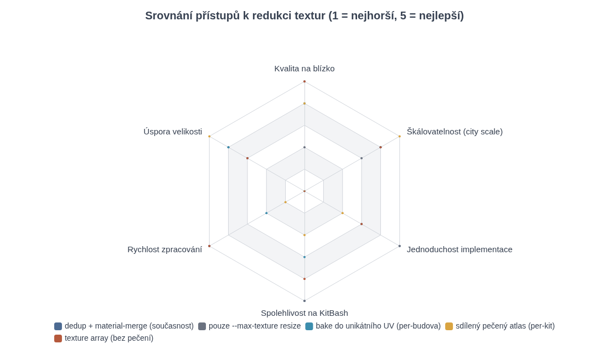
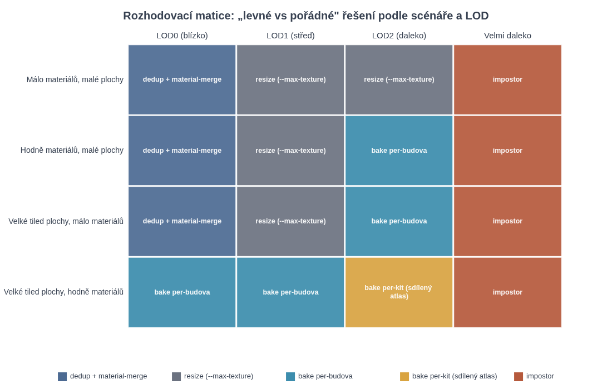
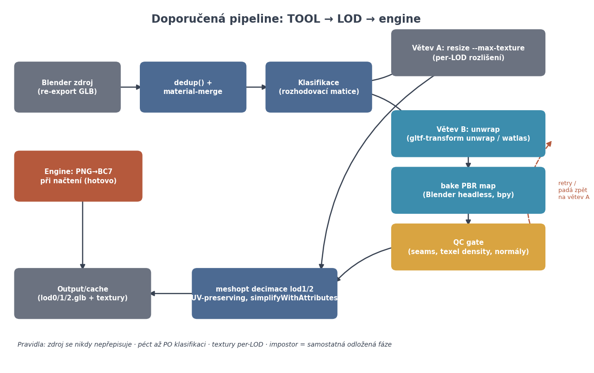

# Research: Texture baking pro KitBash budovy (offline pipeline)

> **Vstup:** RESEARCH_BRIEF_texture_baking.md. **Cíl:** zmenšit velikost zdrojových textur KitBash budov (disk + texel efektivita) v offline pipeline bez ztráty kvality na blízko. GPU komprese (BC7), mipmapy, anizotropie a geometrické LOD jsou vyřešené — research se soustředí na zdrojovou velikost a texel budget. Výstup je koncipován jako podklad pro revizi a exekuční plán (Claude/Cursor split).

---

## Shrnutí pro rozhodnutí (TL;DR)

**Hlavní zjištění:** problém „atlas rozbíjí tiling UV" má čtyři reálné odpovědi a jen jedna z nich je plný rebake. Pro vaši konkrétní situaci (KitBash s wrapping UV, desítky hi-res map na budovu, dynamické osvětlení, solo offline pipeline) vychází z výzkumu toto pořadí:

1. **Primární pákou zůstává to, co už máte:** `dedup()` + material-merge bez přepečení + chytrý per-LOD resize. Je to jediný přístup, který je plně spolehlivý na tiling UV, protože tiling zachovává. Výzkum potvrzuje, že pro LOD0 většiny budov je to správná odpověď — atlas bake se na blízko nevyplácí tam, kde tiling textury už dnes drží konzistentní texel density napříč kitem.
2. **Bake do unikátního UV je platný, ale jen jako cílená zbraň pro LOD1/LOD2**, ne pro LOD0. Výsledek bake nahradí N map jedním atlasem na budovu a tiling se „zapeče" do texelů. Je to technologicky dobře pokryté: `gltf-transform unwrap` (od v4.2, interně watlas = WebAssembly port xatlas) + Blender headless `bpy.ops.object.bake`. Největší rizika: exploze rozlišení na velkých tiled plochách a **rekapitulace normal map přes rebake** (tangent space se musí dopočítat, ne slepě kopírovat).
3. **Texture arrays (Texture2DArray) jsou nejčistší „nepečená" alternativa k atlasu**: každá vrstva se chová jako samostatná textura s `REPEAT`, žádné mip bleeding, žádné UV triky — cena je uniformní rozlišení všech vrstev a změna v loaderu enginu. Pro sdílené materiály napříč budovami je to často lepší než sdílený pečený atlas.
4. **Sdílený pečený atlas napříč celým městem (per-kit) je nejrizikovější varianta** — největší úspora, ale křehká alokace, nutný globální rebake při změně kteréhokoliv dílu, a QC náklad neslučitelný se solo pipeline. Doporučení: nechat jako pozdější fázi, ne teď.
5. **Péct se mají jen PBR vlastnosti** (baseColor, normal, ORM: occlusion=R / roughness=G / metallic=B dle glTF spec), **nikdy světlo ani AO do albeda** — u dynamicky nasvíceného enginu to porušuje energetickou konzistenci a láme PBR.
6. **Pořadí v pipeline:** textury řešit **před** meshopt decimací pro LOD0 (zdroj pravdy), ale pro LOD1/2 péct **až z decimované geometrie** nebo decimovat s UV-preserving (`simplifyWithAttributes`, váhy UV ~10–100) — obě cesty jsou legitimní, research doporučuje variantu „bake per-LOD z LOD meshe" pro korektnost texel alokace.

---

## 1. Fundament: proč atlas rozbíjí tiling a jaké jsou východiska

### 1.1 Mechanismus problému

KitBash díl používá UV souřadnice mimo rozsah 0–1 (wrapping/tiling): textura se přes plochu opakuje. Klasický texture atlas ale funguje opačně — mapuje každý UV ostrov na diskrétní obdélník v jedné velké textuře. Buňka atlasu se „neumí opakovat": jakmile UV překročí hranici buňky, sampluje sousední buňku. Toto je dlouhodobě známé omezení — dotazy „jak opakovat texturu z atlasu" se v engine fórech objevují pravidelně po desetiletí a odpověď je vždy stejná: nativně to nejde, buňka atlasu není tilovatelná. [(jvm-gaming.org)](https://jvm-gaming.org/t/looking-for-a-solution-to-the-un-repeatable-texture-atlas-problem/45843)  Prakticky to potvrzuje i dokumentace Unreal Enginu k nástroji Merge Actors: při generování atlasu se tiling „rozsype", protože slučovací algoritmus přemapovává UV do unikátního prostoru. [(Epic Developer Community Forums)](https://forums.unrealengine.com/t/tiling-texture-atlas/104822) 

Kromě samotného opakování atlas přináší druhý problém: **mip bleeding**. Při downsamplingu do mipmap se barvy sousedních buněk prolínají přes hrany UV ostrovů, což se projeví jako švy a přelévání textur (typicky „beton v dřevě"). Praktická zkušenost z Unity uvádí, že atlas vyžaduje padding/gutter kolem každého ostrova, pečlivý texel/pixel ratio a že AAA produkce počítají s využitím atlasu řádově 70–85 % (15–30 % prostoru je mrtvá váha v paddingu a nevyužitých plochách). [(Unity Discussions)](https://discussions.unity.com/t/my-texture-atlas-nightmare-with-tips/803954)  To je důležité číslo pro kalkulaci: atlas bake **nikdy** není „1:1 nahrazení plochy zdrojových textur", vždy s sebou nese overhead.

### 1.2 Čtyři východiska (a jejich hrubá klasifikace)

Z výzkumu vypadávají čtyři obecné cesty, jak tiling UV a kompaktní textury sloučit:

| Východisko | Princip | Tiling zachován? | Klíčové omezení |
|---|---|---|---|
| **Nepochovat tiling, nepekout** | dedup + merge materiálů se stejnou sadou textur, resize | ✅ ano | velikost klesá jen o dedup + resize, ne o sloučení |
| **Shader trick `fract()`** | UV se ve shaderu „zalomí" do buňky atlasu: `atlasPos + fract(uv)*atlasSize` | ✅ ano (logicky) | vyžaduje `textureGrad`/`tex2Dgrad` pro korektní mipy; švy; padding; engine změna |
| **Texture arrays** | každý materiál = vrstva pole textur, per-vrstva `REPEAT` | ✅ ano | všechny vrstvy stejné rozlišení/formát/mipy |
| **Rebake do unikátního UV** | tiling se dosampluje do nové, unikátní textury | ❌ ne (zapeče se) | tiling exploze rozlišení, tangent-space normal past, bake čas |

Shader varianta pomocí `fract()` je funkční, ale má známé důsledky: implicitní deriváty pro výběr mipmap jsou po zalomení UV neplatné, takže je nutné počítat deriváty z původních UV a samplovat přes `textureGrad()` — jinak vznikají švy a špatný mip výběr na hranách opakování. [(Khronos Forums)](https://community.khronos.org/t/repeat-tile-from-texture-atlas/104500)  Pro engine, který už má BC7 pipeline hotovou, je to zásah do všech materiálových shaderů za relativně malý zisk — research to hodnotí jako **niche řešení**, ne hlavní cestu. Texture arrays jsou nadřazená varianta téže myšlenky bez shaderových triků a bez bleeding artefaktů. [(Medium)](https://medium.com/@yves.albuquerque/texture-arrays-the-gpus-favorite-stack-of-pancakes-62b0646a10f2) 

Zajímavá je i cesta z DCC světa: SpeedTree řeší stejný problém „0–1 patche" — geometrie se rozseká na kusy, jejichž UV nikdy neopustí 0–1, a jedna dlaždice textury v atlasu pak slouží všem opakováním. Cena je více vertexů (šev textury musí padnout na vertexy). [(unity3d.com)](https://docs.unity3d.com/speedtree-modeler/manual/uv-tiling.html?q=uv%20patch)  Pro KitBash budovy s dlouhými tiled fasádami je to použitelné jen selektivně (malé opakující se elementy), protože počet vertexů roste s počtem opakování.

## 2. Přístup A (levná páka): ponechat tiling — dedup, merge, per-LOD resize

### 2.1 Co tato cesta reálně ušetří

Současný stav vašeho TOOLu — `dedup()` + material-merge bez přepečení — je přesně ta varianta, kterou používají všechny glTF pipeline nástroje jako první krok. glTF-Transform poskytuje `dedup` (deduplikace accessorů a textur), `prune` (odstranění nereferencovaných dat), `palette` (paleta + merge materiálů), `join`/`flatten` (redukce draw callů) a `resize`/`textureCompress` (změna rozlišení a formátu přes Sharp). [(gltf-transform.dev)](https://gltf-transform.dev/cli)  Příkaz `optimize` je jen orchestrace těchto kroků v pevném pořadí: dedup → instance → palette → flatten → join → weld → simplify → resample → prune → sparse → textureCompress → draco. [(Khronos Forums)](https://community.khronos.org/t/gltf-multiple-bin/111141)  Z pohledu velikosti na disku: PNG je na zdrojové textury špatný kodek. Přepnutí zdrojů na lossless WebP nebo AVIF (glTF-Transform `webp`/`avif`/`png` příkazy, v `textureCompress` volba `resize` + formát) ušetří typicky významnou část diskové stopy ještě před tím, než se cokoliv peče — a engine i nadále dostane plnou kvalitu pro svůj PNG→BC7 krok, pokud dekódování podporuje. [(gltf-transform.dev)](https://gltf-transform.dev/) 

Kritické pozorování z výzkumu: **tato cesta nijak nesníží počet textur** (jen jejich bajty a duplicity). Ale to je pro KitBash vlastně OK, protože desítky map na budovu jsou do značné míry sdílené mapy KitBash dílů — skutečná duplicita je mezi budovami, ne uvnitř nich. Tady `dedup()` na úrovni cache/output adresáře (globální dedup hash-em obsahu, ne jen per-GLB) řeší víc než jakýkoliv bake. To je levné, deterministické a bez QC.

### 2.2 Kdy resize stačí a jak ho dimenzovat

`--max-texture N` jako globální páka je hrubá, ale legitimní — problém je, že je **slepá k využití textury**. Výzkum texel density ukazuje správný rámec: texel density = rozlišení textury / světová velikost plochy, kterou pokrývá, a konzistentní hustota napříč assety je to, co oko vnímá jako „stejnou kvalitu". [(RebusFarm)](https://rebusfarm.net/blog/texel-density-basics-every-artist-should-know)  Praktická doporučení z produkce: kolem **10.24 px/cm (1024 px/m) pro hero assety** a **5.12 px/cm (512 px/m) pro background props**, s metodikou „screen relation" — rozlišení se odvozuje od typické velikosti objektu na obrazovce. [(RebusFarm)](https://rebusfarm.net/blog/texel-density-basics-every-artist-should-know)  Z toho plyne, že resize má být **per-LOD a ideálně per-materiál dle efektivní pokryvné plochy**, ne jediná globální konstanta: textura, která se tiluje přes 20 m fasádu, snese menší rozlišení na texel než ta, co kryje 2 m výklenek. Pro tiling materiály navíc platí příjemná vlastnost: zmenšení tiling textury z 2K na 1K **nezmenší její pokryvnou plochu** (tilingu je jedno, kolikrát se opakuje), jen sníží detail jednoho opakování — u vzdálenějších LOD je to přesně ta degradace, kterou chceme.

Praktický závěr pro TOOL: vylepšit `--max-texture` z „globální N" na **tabulku N per LOD** (např. LOD0 2048, LOD1 1024, LOD2 512 jako startovní hodnoty) a doplnit `--max-texture-density px/m` jako alternativní, chytřejší páku, která resize počítá z UV plochy a světové plochy primitiv. Oba režimy jsou deterministické, levné a plně automatizovatelné v glTF-Transform (resize + textureCompress). [(gltf-transform.dev)](https://gltf-transform.dev/) 

## 3. Přístup B (pořádná páka): bake do unikátního UV

### 3.1 Mechanismus a nástroje

Bake-to-unique-UV má tři kroky: (1) vygenerovat nové, nepřekrývající se UV rozbalení meshe, (2) do tohoto rozbalení zapéct *výsledný vzhled* včetně tilingu — tedy dosamplovat albedo/normal/ORM z původních tiled materiálů, (3) nahradit N materiálů jedním s atlasem. Pro krok 1 je standardem **xatlas** — malá C++ knihovna bez závislostí, fork thekla_atlas použitého u The Witness, určená přímo k generování unikátních UV pro baking lightmap a texture painting; používají ji Godot, Filament, UNIGINE, Wicked Engine a další. [(Github)](https://github.com/jpcy/xatlas)  Prakticky pro vaši Node stack je klíčové, že **glTF-Transform od v4.2 obsahuje `unwrap()`/`unwrapPrimitives()`**, postavené na watlas — WebAssembly portu xatlas od Brandona Jonese. [(Github)](https://github.com/donmccurdy/glTF-Transform/blob/main/CHANGELOG.md)  Unwrap tedy nemusíte řešit v Blenderu vůbec; jde o nativní součást vašeho stávajícího toolchainu. Parametrizace je řiditelná přes ChartOptions (segmentace, `maxChartArea`, `maxBoundaryLength`) a PackOptions (`resolution`, `padding`, `texelsPerUnit`, rotace chartů, brute-force packing), přičemž padding je přímá obrana proti mip bleeding z kapitoly 1. [(CSDN博客)](https://blog.csdn.net/gitblog_01151/article/details/154222664)  Existují i C# bindings (xatlas.NET na NuGetu), takže by šlo volat i z enginu/toolu v .NET, ale pro offline TOOL je watlas v Node pohodlnější. [(Github)](https://github.com/EvergineTeam/xatlas.NET) 

Pro krok 2 (samotný bake) je nejschůdnější **Blender headless**: `blender --background scene.blend --python bake.py` — background režim je plně podporovaný, CLI argumenty se vykonávají v pořadí, v jakém jsou zadané (což je častá past: soubor se musí načíst před render příkazy). [(renderday.com)](https://renderday.com/blog/mastering-the-blender-cli)  Bake samotný se skriptuje přes `bpy`: vytvoří se cílový image, nastaví se jako aktivní image node ve všech materiálech, vybere se nová UV vrstva a zavolá `bpy.ops.object.bake(type=...)` — přesně tento pattern ukazují produkční skripty pro automatizované bake sekvence včetně kopírování výsledků do velkých atlas textur. [(Blender Artists Community)](https://blenderartists.org/t/b3-2-automatic-bake-sequence/1416420)  Blender umí péct všechny potřebné PBR kanály: Base Color, Normal, Metallic, Roughness, AO, Emission. [(Github)](https://github.com/Pauan/blender-bake-scene)  Alternativa je držet vše v Node a bake implementovat jako rasterizaci/raycast sám — to je zbytečně velká práce; Blender je dnes pro bake nejjednodušší spolehlivý backend.

### 3.2 Tiling exploze rozlišení — hlavní ekonomická rovnice

Klíčový tradeoff, kolem kterého se točí celý brief: velká tiled zeď (řekněme 20 m × 10 m pokrytá 1K tiling texturou) má dnes texel budget **1K × 1K bez ohledu na velikost zdi**. Po přepečení do unikátního UV potřebuje stejná zeď pro zachování texel density plochu atlasu úměrnou její světové ploše — při 1024 px/m to je nereálných ~20 480 × 10 240 px jen pro tuto zeď. **Bake tiling textur vždy konvertuje „opakování zdarma" na „jedinečné texely draze".** Z toho plyne přímé pravidlo: bake se vyplácí tam, kde je poměr (světová plocha × cílová texel density) malý vůči součtu ploch zdrojových textur — tedy u **vysokých LODů** (kde texel density klesá o faktory 4–16×) a u **materiálově fragmentovaných, ale plošně malých dílů** (okenní rámy, konektory, dekorativní prvky, kde se desítky 2K map použije na pár m²). Naopak pro LOD0 fasády s velkými tiled plochami je bake zhoršení: buď kvalita padne, nebo velikost exploduje.

Texel alokace uvnitř atlasu není uniformní a nemá být. Unrealův HLOD/Merge Actors systém to řeší dvěma mechanismy, které stojí za zkopírování: **Gutter Size** (padding mezi UV ostrovy v pixelech proti mip bleeding) a **Use Texture Binning** — výpočet různých výstupních rozlišení podle důležitosti materiálu při balení do finálního atlasu. [(Epic Dev)](https://dev.epicgames.com/documentation/unreal-engine/hierarchical-level-of-detail-outliner-in-unreal-engine)  Prakticky: v PackOptions xatlas nastavit `texelsPerUnit` (world-space texel density) jako jediný globální cíl a nechat packer alokovat; ruční korekce pak jen přes váhu kategorie primitiv (hero vs. background). Systémová reference za celý tento přístup je Unreal HLOD + Simplygon: HLOD clustery slučují aktory, pečou materiály do atlasu a aplikují na proxy mesh; Simplygon Remeshing pipeline produkuje „single mesh, single UV, single material" aproximaci s material castery pro BaseColor, Normal, Roughness. [(Epic Dev)](https://dev.epicgames.com/documentation/unreal-engine/hierarchical-level-of-detail-outliner-in-unreal-engine)  To je přesně „bake per-budova pro LOD2" — jen automatizované v komerčním nástroji.

### 3.3 Kdy bake prohrává proti ponechanému tiling

Shrnuto do rozhodovacích pravidel (detaily v rozhodovací matici v kapitole 9): bake **ne**nasazovat, když (a) dominují velké plochy kryté málo tiling materiály — dedup+resize je levnější a kvalitnější; (b) jde o LOD0 budov v přímém dosahu hráče — riziko švů a tangent-space chyb za nulový užitek; (c) materiály obsahují cokoliv pozičně závislého (world-space triplanar, dirt masky) — UE dokumentace explicitně varuje, že merge/bake ekvivalentních materiálů produkuje artefakty, pokud materiál odvozuje barvu z world/actor pozice, protože peče se do UV prostoru konkrétního meshe. [(Epic Dev)](https://dev.epicgames.com/documentation/unreal-engine/hierarchical-level-of-detail-outliner-in-unreal-engine)  Bake **ano**, když: LOD1/2, hodně materiálů na malé ploše, potřeba snížit počet textur (a tím texcache stopy) pro celé čtvrti najednou.

## 4. Co přesně péct (a co ne) pro dynamicky nasvícený engine

### 4.1 Jen PBR vlastnosti, nikdy světlo

Pro dynamicky osvětlený engine se pečou výhradně **materiálové vlastnosti**: baseColor (albedo), normal, metallic, roughness, occlusion (jako samostatný kanál, ne v albedu), případně emissive. Světlo, stíny ani AO do albeda **nepatří** — zapečené světlo v base color porušuje energetickou konzistenci PBR: renderer nemůže „odsvětlit" pixely, které už světlo obsahují, a materiál se pak chová špatně při jakékoliv změně osvětlení. [(Second Life Community)](https://community.secondlife.com/forums/topic/529433-please-dont-do-this-because-it-will-break-your-pbr/)  Praktická reference, co péct, dává UE HLOD Material Settings: BaseColor, Normal, Metallic, Roughness, Specular, Emissive, AO — každá mapa volitelně, s možností konstanty místo textury. [(Epic Dev)](https://dev.epicgames.com/documentation/unreal-engine/hierarchical-level-of-detail-outliner-in-unreal-engine)  Všimněte si: AO je tam **samostatná mapa**, ne součást albeda. Pro váš engine (dynamické světlo) doporučení: péct BaseColor + Normal + ORM; AO kanál péct jen pokud z něj engine skutečně čte (jako ambient occlusion term), jinak ho vynechat a ušetřit třetinu ORM textury za plný bílý kanál.

### 4.2 ORM packing a colorspace pravidla

Kanálové balení je dané glTF specifikací a research ho jen potvrzuje: `metallicRoughnessTexture` nese **roughness v G a metalness v B**, `occlusionTexture` čte **occlusion z R** — tedy ORM = R:occlusion / G:roughness / B:metallic do jedné RGB textury. [(Khronos Registry)](https://registry.khronos.org/glTF/specs/2.0/glTF-2.0.html)  Kritické jsou colorspace pravidla: baseColor a emissive jsou **sRGB**, metallicRoughness a normal jsou **lineární** (žádná sRGB korekce), a normal textury nemají mít alfa kanál. [(Khronos Registry)](https://registry.khronos.org/glTF/specs/2.0/glTF-2.0.html)  Při bake v Blenderu to znamená: cílové image pro normal/ORM vytvořit s color space „Non-Color", pro albedo sRGB — jinak vznikne dvojitá gamma korekce, což je jedna z nejčastějších příčin „bake vypadá špatně". Ještě jedna praktická poznámka k packing: roughness patří do G i z důvodu, že zelený kanál má v block kompresích 6 bitů oproti 5 bitům R/B — nejkřičenlivější kanál dostane nejvíc přesnosti; do alfa kanálu se nic nedává, protože alfa zvedá paměť textury. [(Epic Developer Community Forums)](https://forums.unrealengine.com/t/texture-packing-question-rmah/122894) 

### 4.3 Normal mapy přes rebake — největší technická past

Jednoduché „překopírování" normal mapy do nového UV **nefunguje**: tangent-space normal mapa kóduje směry vzhledem k tangent frame, který je odvozen z UV layoutu. Nové rozbalení (xatlas) má jiné tangenty — pixely normal mapy musí být **přepočteny**, ne přesunuty. Praktické zkušenosti jsou jednoznačné: pokud se UV shells rotují, barvy normal mapy přestanou odpovídat světovým směrům a výsledek má špatné stínování a švy; doporučení z praxe zní „raději péct znovu ze zdroje/high-poly do nového layoutu, není důvod si to komplikovat a potenciálně normal mapu rozbít". [(Polycount)](https://polycount.com/discussion/89099/baking-maps-from-one-uv-to-another-reoganized-uv)  Blender-specific problém: bake normal mapy mezi dvěma UV sadami na stejném objektu dává chybné výsledky, protože tangent space se počítá podle aktivní UV sady; workaround je bake model→model (duplikát s malým inflate jako „high", raycast bake) nebo pečení přes Normal socket Principled BSDF (což tangent space přepočítá korektně, protože jde o shadingový výstup, ne o kopii textury). [(Blender Artists Community)](https://blenderartists.org/t/baking-normal-map-from-one-uv-to-another/1554291) 

**Správný recept pro váš případ (KitBash, žádný high-poly, normal mapy už existují):** péct normal mapu jako **shadingový výstup** (Cycles bake typu Normal z materiálu, kde je původní normal mapa zapojená do Normal socketu) — tím se původní tangent-space normaly aplikují na geometrii a výsledek se zaznamená v tangent frame **nového** UV. Toto je funkční a hlavně plně automatizovatelné v bpy. Alternativa přes xNormal („base texture is a tangent space normal map" workflow) existuje, ale znamená další nástroj a import/export krok navíc. [(Polycount)](https://polycount.com/discussion/89099/baking-maps-from-one-uv-to-another-reoganized-uv)  Pozor na green-channel konvenci (OpenGL +Y vs DirectX −Y): glTF používá OpenGL konvenci; pokud bake projde Blenderem (OpenGL), držet +Y konzistentně celou cestu a nekombinovat −Y zdroje. [(Khronos Registry)](https://registry.khronos.org/glTF/specs/2.0/glTF-2.0.html) 

## 5. Alternativy k jedinému atlasu

### 5.1 Texture arrays — nejčistší nepečená varianta

Texture array (Texture2DArray) je GPU feature od DirectX 10 / OpenGL 3, plně podporovaná ve Vulkánu: N 2D textur v jednom GPU objektu, všechny se **stejným rozlišením, formátem a mipmap řetězcem**, každá vrstva se chová jako samostatná textura — včetně `REPEAT` wrap módu a vlastního mip řetězce bez bleeding mezi vrstvami. [(Medium)](https://medium.com/@yves.albuquerque/texture-arrays-the-gpus-favorite-stack-of-pancakes-62b0646a10f2)  Pro KitBash to řeší přesně jádro briefu: tiling zůstává (per-vrstva REPEAT), materiály se sloučí na jeden shader s indexem vrstvy, draw cally a bindy klesají. Praktická data: v Godot testu dal Texture2DArray o 10–20 % víc FPS než shader-hack s atlasem, se stabilnějším frametimem. [(godotengine.org)](https://forum.godotengine.org/t/alternative-repeating-texture-from-texture-atlas-for-3d/103525)  Omezení jsou reálná: uniformní rozlišení všech vrstev (2K vrstva donutí všechny na 2K, nebo se 2K zdroje downgradují), pole je jeden formát (takže albedo-array a ORM-array jsou dvě pole), a v neposlední řadě **redukují draw cally, ne VRAM** — velikost na disku se nesníží, naopak malé textury v arrayi „nafoukne" na uniformní rozlišení. [(Medium)](https://medium.com/@yves.albuquerque/texture-arrays-the-gpus-favorite-stack-of-pancakes-62b0646a10f2)  Pro váš use-case: ideální pro **sdílené tiling materiály kitu** (ty se opakují ve všech budovách) — jedno albedo-array + jedno ORM-array + jedno normal-array pro celý kit, per-budova jen indexy vrstev. Disková velikost se řeší dedupem na úrovni vrstev. Je to engine změna (loader + shader), ale malá a jednorázová; glTF to vyjádříte přes KHR_texture_transform nebo custom extras + vlastní loader logiku.

### 5.2 UDIM a virtual texturing — pro vás spíš ne

UDIM je konvence mapování více obrazů na UV regiony mimo 0–1; v Unrealu se UDIM sada importuje jako Virtual Texture asset. [(Epic Dev)](https://dev.epicgames.com/community/learning/tutorials/GxWX/unreal-engine-look-development)  Pro vás je to slepá větev: (a) vyžaduje runtime virtual texturing infrastrukturu (streaming tile cache), což je per-frame systém mimo váš „offline / load-time only" rámec; (b) řeší opačný problém, než máte — UDIM dává víc rozlišení hero assetům, ne méně bajtů KitBash budovám; (c) dokumentace sama varuje, že UDIM se mají používat střídmě a s rozpočtem na texture memory. [(Epic Dev)](https://dev.epicgames.com/community/learning/tutorials/GxWX/unreal-engine-look-development)  Zmínka pro úplnost: virtuální texturing jako koncept (sparse residency) by řešil city-scale streaming, ale je to redesign rendereru, ne pipeline krok.

### 5.3 Sdílené atlasy napříč budovami a trim-sheet organizace

Produkce to řeší dvojí cestou. První je **trim/tile organizace zdroje**: trim sheet je atlas, který tiluje jen podél jedné osy, kombinovaný s tileable materiály přes material IDs na stejném meshi — velké plochy (podlahy, fasádní pole) jdou do tileables, detaily (římsy, rámy, lišty) do trimu. [(beyondextent.com)](https://www.beyondextent.com/articles/balancing-modularity-and-uniqueness-in-environment-art)  To je autorinková organizace, kterou váš KitBash už de facto používá; důležité je, že **trim sheety jsou navržené pro tiling od začátku** — pokud byste někdy zdrojový kit reorganizovali, směrem k trim sheetům (jedna osa tiling) se snižuje počet materiálů bez pečení a bez rozbití opakování. Druhá cesta je **bake per-cluster**: UE HLOD/Simplygon pečou materiály clusteru budov do sdíleného atlasu pro vzdálené pohledy; Simplygon navíc umí výsledek vložit do nevyužitého prostoru původní textury nebo péct material ID masky pro pozdější přebarvení. [(Epic Dev)](https://dev.epicgames.com/documentation/unreal-engine/hierarchical-level-of-detail-outliner-in-unreal-engine)  Pro váš city scale (6–8 km², stovky budov) je sdílený atlas per-kit/neighborhood logicky nejúspornější, ale nese: globální rebake při změně jednoho dílu, složitou invalidaci cache, alokační dilemata (budovy různých velikostí v jednom atlasu) a nejtěžší QC. Research doporučuje odložit — viz rozhodovací matice.

Ještě jedna produkční zkušenost k ceně atlasu: autorování proti atlasu má režim „textura napřed, UV potom" (mapujete UV na hotový atlas), což je pro kit iterace nepohodlné; u bake přístupu „UV napřed, textura potom" zase každá změna kitu = rebake všech dotčených budov. [(Unity Discussions)](https://discussions.unity.com/t/texture-atlas-in-pc-games/627439)  Toto je strukturální důvod, proč research tlačí bake až na LOD1/2: tam je podíl „ručně sledované kvality" nízký a automatický rebake přijatelný.

## 6. Texel density a rozlišení budgeting napříč LOD

### 6.1 Rámec pro dimenzování

Texel density (px/cm nebo px/m) je jediná metrika, která dává smysl napříč celým městem: konzistentní hustota = konzistentní vnímaná kvalita; rozhozená hustota = jedna budova ostrá, sousední rozmazaná. [(beyondextent.com)](https://www.beyondextent.com/deep-dives/deepdive-texeldensity)  Baseline hodnoty z produkce: ~2.56 px/cm (256 px/m) jako obecný game-wide standard, 5.12 px/cm background, 10.24 px/cm hero; metoda odvození je „screen relation" — jak blízko se k objektu kamera reálně dostane. [(RebusFarm)](https://rebusfarm.net/blog/texel-density-basics-every-artist-should-know)  Pro KitBash kit je kritické, že tiling materiály drží texel density automaticky (UV se škálují se světovou plochou) — to je další argument, proč LOD0 tiling nerozbíjet: máte zdarma to, co by atlas bake musel pracně alokovat. Prakticky to znamená, že cílové hodnoty texel density nastavujete **per LOD**, ne per textura: LOD0 = plná (např. 512–1024 px/m dle významu čtvrti), LOD1 = polovina, LOD2 = čtvrtina, impostor = jednotky px/m.

### 6.2 Převod na rozlišení atlasu a per-LOD textury

Pro bake větev platí přímý převod: požadované rozlišení atlasu = √(celková světová plocha meshe × cílová texel density² / využití packingu), s korekcí na packing efektivitu 70–85 % (padding + mrtvý prostor). [(Unity Discussions)](https://discussions.unity.com/t/my-texture-atlas-nightmare-with-tips/803954)  xatlas to zjednodušuje přes PackOptions `texelsPerUnit` + `resolution`: packer sám škáluje a balí do zadaného rozlišení a LOD varianty atlase získáte opakovaným `PackCharts` s jiným rozlišením na stejných chartách — xatlas API toto přímo podporuje (re-pack bez přepočtu chartů). [(Github)](https://github.com/jpcy/xatlas)  Pro tiling větev (LOD0) se budgeting převádí na per-materiál resize: efektivní texel density tiling materiálu = rozlišení textury / velikost jednoho opakování ve světě — TOOL to spočítá z UV rozsahu primitiv a podle něj volí 2K/1K/512 variantu. Takto se `--max-texture` mění z hrubé páky na **budget enforcement mechanismus** s měřitelným cílem.

Praktická tabulka výchozích hodnot (k revizi Claudem do exekučního plánu):

| LOD | Režim | Cílová texel density | Textura / atlas | Poznámka |
|---|---|---|---|---|
| LOD0 | tiling (nebake) | 512–1024 px/m per materiál | zdrojové tiling mapy, resize per-materiál | dedup napříč cache |
| LOD1 | tiling resize nebo bake | 256–512 px/m | 1K tiling, nebo 2K atlas/budova | bake jen při ≥ N materiálů |
| LOD2 | bake per-budova | 128–256 px/m | 1K–2K atlas/budova (albedo+ORM+normal) | jeden materiál na budovu |
| Velmi daleko | impostor | jednotky px/m | octahedral/billboard atlas | odložená fáze |

## 7. Tooling a spolehlivost: co je zadarmo, co je křehké

### 7.1 Inventář nástrojů s hodnocením na tiling-UV KitBash

| Nástroj / funkce | Co dělá | Tiling UV safe? | Spolehlivost na KitBash | Poznámka |
|---|---|---|---|---|
| glTF-Transform `dedup()` + `prune()` | deduplikace textur/accessorů, úklid | ✅ zachovává | vysoká, deterministické | už máte; rozšířit na globální dedup v cache |
| glTF-Transform `resize` / `textureCompress` | resize + WebP/AVIF/PNG reenkód (Sharp) | ✅ zachovává | vysoká | per-LOD a per-slot varianta (`--slots`)  [(gltf-transform.dev)](https://gltf-transform.dev/)  |
| glTF-Transform `palette()` | palette textury + merge materiálů | ⚠️ částečně | střední | hodí se na low-color materiály, ne na hi-res PBR sady  [(gltf-transform.dev)](https://gltf-transform.dev/cli)  |
| glTF-Transform `unwrap()` (watlas) | generuje unikátní UV přes WASM xatlas | ❌ (přebaluje) | vysoká jako unwrap; kvalita chartů na hard-surface dobrá | nové od v4.2; killer feature pro vás  [(Github)](https://github.com/donmccurdy/glTF-Transform/blob/main/CHANGELOG.md)  |
| xatlas (C++/Python/.NET) | totéž nativně, plné Chart/PackOptions | ❌ | vysoká | když watlas nestačí: texelsPerUnit, multi-mesh atlas  [(PyPI)](https://pypi.org/project/xatlas/)  |
| Blender headless `bpy` bake | bake PBR kanálů do nového UV | ❌ (peče) | střední — vyžaduje disciplínu (viz 7.2) | jediný rozumný bake backend zdarma  [(Blender Documentation)](https://docs.blender.org/manual/en/latest/advanced/command_line/arguments.html)  |
| Blender Smart UV Project | rychlý unwrap v DCC | ❌ | střední | horší packing než xatlas; spíš ne |
| meshopt `simplify` (UV-preserving) | decimace s ochranou UV švů | ✅ | vysoká | `simplifyWithAttributes`, váhy, vertex_lock  [(Github)](https://github.com/zeux/meshoptimizer)  |
| Simplygon / UE HLOD (reference) | kompletní bake pipeline | ❌ (peče) | vysoká, ale komerční/UE-only | benchmark, co má vlastní pipeline umět  [(Simplygon)](https://documentation.simplygon.com/SimplygonSDK_10.3.500.0/ue5/concepts/hlod.html)  |
| Texture2DArray | engine-side sloučení bez pečení | ✅ | vysoká (GPU nativní) | engine změna, uniformní rozlišení vrstev  [(Medium)](https://medium.com/@yves.albuquerque/texture-arrays-the-gpus-favorite-stack-of-pancakes-62b0646a10f2)  |

### 7.2 Proč je dnešní `--atlas` nespolehlivý (diagnóza) a jak z toho ven

Experimentální join-all bake v Blenderu, který QC často odmítne, selhává z předvídatelných důvodů — všechny mají v researchu přímé opodstatnění: (a) **Smart UV / ad-hoc unwrap** na 300k-tri meshi produkuje špatnou segmentaci (moc chartů, švy uprostřed fasád, nízké využití atlasu pod 70 %) — xatlas s ChartOptions laděnými pro hard-surface (větší `maxChartArea`) to řeší systematicky; [(CSDN博客)](https://blog.csdn.net/gitblog_01151/article/details/154222664)  (b) **nulový nebo malý padding** → mip bleeding a „švy" (konzervativně 4–8 px gutter při 2K atlasu, UE HLOD má Gutter Size jako prvotřídní parametr přesně z tohoto důvodu); [(Epic Dev)](https://dev.epicgames.com/documentation/unreal-engine/hierarchical-level-of-detail-outliner-in-unreal-engine)  (c) **normal mapa pečená jako kopie textury** místo shadingového výstupu → tangent-space chyby (kapitola 4.3); (d) **colorspace chyby** (normal/ORM pečené do sRGB image); [(Khronos Registry)](https://registry.khronos.org/glTF/specs/2.0/glTF-2.0.html)  (e) **žádný retry/QC gate** — bake je blokující operace a chyby se projeví až v engine. Žádná z těchto příčin není „pečení nejde"; všechny jsou inženýrsky řešitelné.

Spolehlivostní recept z researchu: **batch s izolovanými procesy** (jeden Blender proces na budovu — crash jednoho nezabije dávku; Blender headless je na to přímo stavěný), [(renderday.com)](https://renderday.com/blog/mastering-the-blender-cli)  **deterministické vstupy** (unwrap počítá watlas z GLB, ne z .blend, takže re-export zdroje negeneruje nové UV layouty náhodou), **QC gate před zápisem do output** (automatické kontroly: počet chartů a využití atlasu z watlas statistik; texel density report; detekce prázdných/plochých kanálů v ORM; kontrola, že normal mapa není uniformní pastelová = podezřelá na tangent fail; vizuální diff render LOD0 vs LOD2 na 2–3 standardních úhlech) a **graceful fallback** — když QC selže, budova dostane větev A (dedup+resize) a zaloguje se. Tím se „nespolehlivý bake" mění na „bake s měřitelnou mírou úspěchu", což je pro solo pipeline jediný udržitelný model. Součástí gate má být i rozpočtová kontrola: výsledný atlas nesmí být větší než X % součtu zdrojů, které nahrazuje — jinak bake nedává smysl (kapitola 3.2).

### 7.3 Výkon a čas bake na 300k-tri meshích

Čísla z praxe: Cycles bake je citlivý na hardware a scénu — GPU bake je řádově 3–4× rychlejší než CPU (2m33s vs 9m42s v referenčním měření), [(habrador.com)](https://blog.habrador.com/2018/10/bake-textures-faster-blender-cycles.html)  scény s vysokou paměťovou náročností padají do swapu a bake se zpomalí katastroficky (13 GB peak na relativně malé scéně), [(Blender Stack Exchange)](https://blender.stackexchange.com/questions/101019/normal-baking-in-cycles-is-painfully-slow)  a na starším hardware se bake 2K–4K textur komplexních scén měří v hodinách. [(Blender Artists Community)](https://blenderartists.org/t/very-slow-baking-help/651980)  Známý trik: v Cycles nastavit tile size na rozlišení cílové textury — historický bug dělal bake zbytečně pomalým s defaultními tiles. [(Developer Forum)](https://devtalk.blender.org/t/why-is-texture-baking-so-mind-meltingly-slow/5653)  Pro váš případ je klíčové, že **pečete PBR vlastnosti, ne osvětlení**: diffuse/metallic/roughness/normal baky nepotřebují path tracing s vysokými samply — stačí nízké samply (jednotky až desítky), protože se neřeší GI šum, jen přenos hodnot. Tím se bake 2K atlasu na 300k-tri budově dostane do řádu minut na rozumném GPU. Dávkově: stovky budov × minuty = přes noc hotovo, což je pro offline pipeline akceptovatelné; paralelizace přes N Blender procesů (CPU jader) je triviální, protože baky jsou nezávislé.

## 8. Pořadí v pipeline: baking × LOD × impostor

### 8.1 Péct před nebo po decimaci?

Research dává dvě koherentní odpovědi podle toho, o který LOD jde. Pro **LOD0** se nepeče vůbec (zůstává tiling), takže decimace textur nedotkne. Pro **LOD1/2** je správné pořadí: **nejprve meshopt decimace s UV-preserving, potom bake z decimovaného meshe**. Důvody: (a) bake z LOD2 meshe je rychlejší (méně tri → méně raycastů/rasteru) a unwrap se počítá na finální geometrii, takže atlas alokuje texely přesně tam, kde LOD2 plochy jsou; (b) meshopt umí decimovat se zachováním UV švů — `meshopt_simplifyWithAttributes` bere vertex attributy (normály, UV) s váhami; pro UV se doporučuje váha ~10–100 dle UV density, případně automaticky jako 1/√(průměrná UV plocha trianglu); v permissive režimu lze UV švy chránit přes `vertex_lock` s `meshopt_SimplifyVertex_Protect`, detekované porovnáním UV na pozičně identických vrcholech. [(Github)](https://github.com/zeux/meshoptimizer)  Decimace tedy tiling UV nerozbije — a po ní se klidně peče. Inverzní pořadí (péct z LOD0 a decimovat až s pečeným atlasem) je horší: pečete 4–16× víc texelů, než LOD potřebuje, a unwrap z LOD0 meshe zbytečně fragmentuje.

### 8.2 Interakce s impostory

Impostor (dálková placka) je ve vašem briefu odložený, ale research potvrzuje jeho místo v řetězci: impostory nahrazují geometrii image-based proxy pro velké vzdálenosti; pre-generované (offline) impostory ukládají sprity z více úhlů do sprite mapy — cena je texture memory, výhoda nulový runtime náklad. [(diva-portal.org)](https://www.diva-portal.org/smash/get/diva2:1351755/FULLTEXT01.pdf)  Moderní výzkum (RiLoD, CGF 2025) ukazuje, že impostory pro dynamické osvětlení se pečou jako G-buffer sady (normály + materiálové atributy) a re-shadují se — tedy stejný princip „pečeme PBR, ne světlo" jako v kapitole 4. [(cuteloong.github.io)](https://cuteloong.github.io/assets/files/rilod25.pdf)  Praktické vazby: (a) impostor bake může **koncumovat výstup LOD2 atlas bake** — impostor sprity se renderují z LOD2 meshe s jeho atlasem, takže kvalita impostoru dědí kvalitu LOD2; (b) přechod LOD2→impostor je nejnápadnější pop v řetězci — literature doporučuje screen-door fading/geomorphing pro zmírnění LOD popu obecně; [(Simplygon)](https://documentation.simplygon.com/SimplygonSDK_10.3.500.0/ue5/concepts/hlod.html)  (c) komerční impostor systémy varují, že pečené (offline) impostory vyžadují rebake při každé změně modelu a nepodporují variace — další argument držet impostory na konci pipeline jako read-only derivát. [(Unity Discussions)](https://discussions.unity.com/t/released-impostors-runtime-optimization/761446?page=20) 

## 9. Rankované přístupy a rozhodovací matice

### 9.1 Celkové hodnocení pro solo offline pipeline

| # | Přístup | Kvalita na blízko | Velikost | Čas zpracování | Spolehlivost na KitBash | Verdikt |
|---|---|---|---|---|---|---|
| 1 | **dedup + merge + per-LOD resize** (vylepšený `--max-texture`) | plná (tiling zachován) | střední úspora | sekundy–minuty | velmi vysoká | **základ pro všechno; rozšířit o texel-density budget** |
| 2 | **bake per-budova pro LOD1/2** (watlas unwrap + bpy bake) | dobrá (podle texel budgetu) | velká úspora na počtu map | minuty/budova | střední→vysoká s QC gate | **hlavní nová investice; jen s fallback** |
| 3 | **texture arrays pro sdílené kit materiály** | plná | malá na disku, žádná nová data | okamžité | vysoká | **druhá vlna; vyžaduje malou engine změnu** |
| 4 | **sdílený pečený atlas per-kit/per-čtvrť** | dobrá | největší úspora | hodiny dávkově | nízká–střední (globální invalidace) | odložit; návrat až po 2+3 |
| 5 | **fract() shader atlas** | dobrá | střední | okamžité | střední (švy, mips) | niche; jen pokud 2+3 nelze |
| 6 | **UDIM / virtual texturing** | vysoká | roste | — | — | mimo scope (runtime VT) |

### 9.2 Rozhodovací matice „levné vs pořádné"

Matice vychází z ekonomiky tiling exploze (kap. 3.2): rozhodující osa není jen LOD, ale **poměr světové plochy k počtu materiálů**. Konkrétní prahy pro TOOL (výchozí, k doladění): `materials_count ≥ 8` **a** `součet texelů zdrojových map / světová plocha > 2× cílová texel density` → kandidát na bake; velké tiled plochy s ≤ 4 materiály → vždy tiling větev. LOD2 je bake skoro vždy výhodný, protože texel density klesla natolik, že i velké fasády vejdou do 1–2K atlasu s rezervou.

## 10. Pitfally — kontrolní seznam

Následující seznam agreguje všechna úskalí identifikovaná v předchozích kapitolách do jediného kontrolního seznamu, který lze použít jako specifikaci pro QC gate i jako review checklist při implementaci. Položky jsou seřazené přibližně podle frekvence výskytu v praxi a každá odkazuje na mechanismus, kterým vzniká — nejde o hypotetická rizika, ale o opakovaně dokumentované failure módy atlasových a bake pipeline.

1. **Mip bleeding / švy v atlasu:** nedostatečný gutter mezi UV ostrovy; držet 4–8 px při 2K, gutter jako prvotřídní parametr (UE HLOD Gutter Size). [(Epic Dev)](https://dev.epicgames.com/documentation/unreal-engine/hierarchical-level-of-detail-outliner-in-unreal-engine) 
2. **Tiling exploze rozlišení:** bake velkých tiled ploch pro LOD0 — velikost roste kvadraticky s texel density; řešit rozpočtovou kontrolou v QC gate.
3. **Normal mapy:** kopie do nového UV bez tangent přepočtu = rozbité stínování; rotace UV shells láme korespondenci barev; péct jako shadingový výstup, hlídat +Y (OpenGL) konvenci. [(Polycount)](https://polycount.com/discussion/89099/baking-maps-from-one-uv-to-another-reoganized-uv) 
4. **Colorspace:** normal/ORM pečené do sRGB image = dvojitá gamma; glTF vyžaduje lineární MR a normal, sRGB jen baseColor/emissive. [(Khronos Registry)](https://registry.khronos.org/glTF/specs/2.0/glTF-2.0.html) 
5. **AO/světlo v albedu:** u dynamického osvětlení porušuje PBR; AO jen do R kanálu ORM, nikdy do baseColor. [(Second Life Community)](https://community.secondlife.com/forums/topic/529433-please-dont-do-this-because-it-will-break-your-pbr/) 
6. **Pozičně závislé materiály:** world-space/triplanar efekty se při bake zapečou k danému meshi — u sdílených instancí budov to dává identické šmouhy na všech kopiích; bake takové materiály buď vynechat, nebo péct per-instance. [(Epic Dev)](https://dev.epicgames.com/documentation/unreal-engine/hierarchical-level-of-detail-outliner-in-unreal-engine) 
7. **Packing efficiency:** počítat s 70–85 % využitím atlasu; pod 70 % QC odmítnout a zkusit jiné PackOptions (rotace chartů, bruteForce). [(Unity Discussions)](https://discussions.unity.com/t/my-texture-atlas-nightmare-with-tips/803954) 
8. **Bake čas:** paměť → swap je killer; bake per-budova v izolovaném procesu; tile size = rozlišení textury; nízké samply pro PBR transfer. [(Blender Stack Exchange)](https://blender.stackexchange.com/questions/101019/normal-baking-in-cycles-is-painfully-slow) 
9. **Decimace po bake:** decimovat až po unwrapu znamená znehodnotit UV; držet pořadí simplify (UV-preserving) → unwrap → bake. [(Github)](https://github.com/zeux/meshoptimizer) 
10. **Změna zdroje = invalidace:** re-export z Blenderu mění mesh → atlas bake se musí přepočítat; cache klíčovat hashem vstupního GLB + parametrů, ne jménem souboru.

## 11. Doporučená fáze pipeline pro TOOL

1. **Ingest:** GLB z Blender exportu → `dedup()` + material-merge (současnost) → `prune()`.
2. **Klasifikace:** per-budova výpočet metrik (počet materiálů, světová plocha, součet texelů zdrojů, per-materiál tiling density) → přiřazení větve A/B podle matice v kap. 9.2.
3. **Větev A (default):** per-materiál resize dle texel-density budgetu per LOD; volitelně WebP/AVIF lossless pro disk; globální dedup v cache napříč budovami.
4. **Větev B (LOD1/2 kandidáti):** meshopt simplify s `simplifyWithAttributes` (UV-preserving) → `gltf-transform unwrap` (watlas, PackOptions: texelsPerUnit per LOD, padding ≥ 4 px) → export přípravné scény → Blender headless bake (BaseColor sRGB; Normal a ORM lineární; ORM packing R/G/B) → QC gate (využití atlasu, texel density report, kanálové sanity checky, rozpočtová kontrola, 3-úhlový vizuální diff) → retry 1× s jinými PackOptions → fallback na větev A při selhání.
5. **LOD1/2 geometry:** pokračuje stávající Node + glTF-Transform + meshopt větev; větev B ji konzumuje, nemění ji.
6. **Impostory (odloženo):** render sprite map z LOD2 výstupu větvě B; G-buffer kanály pro re-shading, ne pečené světlo. [(cuteloong.github.io)](https://cuteloong.github.io/assets/files/rilod25.pdf) 
7. **Engine:** beze změny pro větve A/B (PNG→BC7 při loadu); texture arrays (kap. 5.1) jako samostatný, pozdější krok vyžadující loader + shader úpravu.

**Co z researchu předat do exekučního plánu (Claude/Cursor split):** (a) Claude: formální specifikace QC gate metrik a rozhodovacích prahů, ORM/colorspace checklist, testovací sada budov (3 typické: málo materiálů / fragmentovaná / velké tiled plochy); (b) Cursor: implementace unwrap+bake orchestrace (Node → watlas → Blender subprocess → validátor), cache klíčování, `--max-texture-density` páka; (c) společné: benchmark bake času na 3 reprezentativních budovách před rozjezdem dávky.

---

 [(CSDN博客)](https://blog.csdn.net/gitblog_01151/article/details/154222664) : https://blog.csdn.net/gitblog_01151/article/details/154222664
 [(unity3d.com)](https://docs.unity3d.com/speedtree-modeler/manual/uv-tiling.html?q=uv%20patch) : https://docs.unity3d.com/speedtree-modeler/manual/uv-tiling.html
 [(PyPI)](https://pypi.org/project/xatlas/) : https://pypi.org/project/xatlas/
 [(Github)](https://github.com/jpcy/xatlas) : https://github.com/jpcy/xatlas
 [(jvm-gaming.org)](https://jvm-gaming.org/t/looking-for-a-solution-to-the-un-repeatable-texture-atlas-problem/45843) : https://jvm-gaming.org/t/looking-for-a-solution-to-the-un-repeatable-texture-atlas-problem/45843
 [(Epic Developer Community Forums)](https://forums.unrealengine.com/t/tiling-texture-atlas/104822) : https://forums.unrealengine.com/t/tiling-texture-atlas/104822
 [(Unity Discussions)](https://discussions.unity.com/t/my-texture-atlas-nightmare-with-tips/803954) : https://discussions.unity.com/t/my-texture-atlas-nightmare-with-tips/803954
 [(Github)](https://github.com/EvergineTeam/xatlas.NET) : https://github.com/EvergineTeam/xatlas.NET
 [(RebusFarm)](https://rebusfarm.net/blog/texel-density-basics-every-artist-should-know) : https://rebusfarm.net/blog/texel-density-basics-every-artist-should-know
 [(beyondextent.com)](https://www.beyondextent.com/deep-dives/deepdive-texeldensity) : https://www.beyondextent.com/deep-dives/deepdive-texeldensity
 [(Github)](https://github.com/zeux/meshoptimizer) : https://github.com/zeux/meshoptimizer
 [(npm)](https://www.npmjs.com/package/meshoptimizer) : https://www.npmjs.com/package/meshoptimizer
 [(renderday.com)](https://renderday.com/blog/mastering-the-blender-cli) : https://renderday.com/blog/mastering-the-blender-cli
 [(Blender Artists Community)](https://blenderartists.org/t/b3-2-automatic-bake-sequence/1416420) : https://blenderartists.org/t/b3-2-automatic-bake-sequence/1416420
 [(Blender Documentation)](https://docs.blender.org/manual/en/latest/advanced/command_line/arguments.html) : https://docs.blender.org/manual/en/latest/advanced/command_line/arguments.html
 [(Github)](https://github.com/Pauan/blender-bake-scene) : https://github.com/Pauan/blender-bake-scene
 [(Epic Dev)](https://dev.epicgames.com/documentation/unreal-engine/hierarchical-level-of-detail-outliner-in-unreal-engine) : https://dev.epicgames.com/documentation/unreal-engine/hierarchical-level-of-detail-outliner-in-unreal-engine
 [(Epic Dev)](https://dev.epicgames.com/documentation/unreal-engine/world-partition---hierarchical-level-of-detail-in-unreal-engine) : https://dev.epicgames.com/documentation/unreal-engine/world-partition---hierarchical-level-of-detail-in-unreal-engine
 [(Simplygon)](https://documentation.simplygon.com/SimplygonSDK_10.3.500.0/ue5/concepts/hlod.html) : https://documentation.simplygon.com/SimplygonSDK_10.3.500.0/ue5/concepts/hlod.html
 [(Microsoft Developer)](https://developer.microsoft.com/en-us/games/articles/2026/05/optimize-3d-models-for-strategy-games-with-simplygon/) : https://developer.microsoft.com/en-us/games/articles/2026/05/optimize-3d-models-for-strategy-games-with-simplygon/
 [(Epic Dev)](https://dev.epicgames.com/community/learning/tutorials/GxWX/unreal-engine-look-development) : https://dev.epicgames.com/community/learning/tutorials/GxWX/unreal-engine-look-development
 [(Unity Discussions)](https://discussions.unity.com/t/texture-atlas-in-pc-games/627439) : https://discussions.unity.com/t/texture-atlas-in-pc-games/627439
 [(Blender Artists Community)](https://blenderartists.org/t/baking-normal-map-from-one-uv-to-another/1554291) : https://blenderartists.org/t/baking-normal-map-from-one-uv-to-another/1554291
 [(godotengine.org)](https://forum.godotengine.org/t/alternative-repeating-texture-from-texture-atlas-for-3d/103525) : https://forum.godotengine.org/t/alternative-repeating-texture-from-texture-atlas-for-3d/103525
 [(Blender Stack Exchange)](https://blender.stackexchange.com/questions/247631/transfer-bake-existing-normal-texture-to-the-new-uv-map-incorrect-shading) : https://blender.stackexchange.com/questions/247631/transfer-bake-existing-normal-texture-to-the-new-uv-map-incorrect-shading
 [(jvm-gaming.org)](https://jvm-gaming.org/t/glsl-making-a-texture-atlas-repeat/40457) : https://jvm-gaming.org/t/glsl-making-a-texture-atlas-repeat/40457
 [(Polycount)](https://polycount.com/discussion/89099/baking-maps-from-one-uv-to-another-reoganized-uv) : https://polycount.com/discussion/89099/baking-maps-from-one-uv-to-another-reoganized-uv
 [(Khronos Forums)](https://community.khronos.org/t/repeat-tile-from-texture-atlas/104500) : https://community.khronos.org/t/repeat-tile-from-texture-atlas/104500
 [(Polycount)](https://polycount.com/discussion/197686/baking-a-normal-map-from-one-uv-set-to-another-but-preserving-the-originals-tangents) : https://polycount.com/discussion/197686/baking-a-normal-map-from-one-uv-set-to-another-but-preserving-the-originals-tangents
 [(Unity Discussions)](https://discussions.unity.com/t/wrapping-repeat-a-tile-in-a-texture-atlas/787017) : https://discussions.unity.com/t/wrapping-repeat-a-tile-in-a-texture-atlas/787017
 [(Medium)](https://medium.com/@yves.albuquerque/texture-arrays-the-gpus-favorite-stack-of-pancakes-62b0646a10f2) : https://medium.com/@yves.albuquerque/texture-arrays-the-gpus-favorite-stack-of-pancakes-62b0646a10f2
 [(gltf-transform.dev)](https://gltf-transform.dev/cli) : https://gltf-transform.dev/cli
 [(Github)](https://github.com/donmccurdy/glTF-Transform/blob/main/CHANGELOG.md) : https://github.com/donmccurdy/glTF-Transform/blob/main/CHANGELOG.md
 [(gltf-transform.dev)](https://gltf-transform.dev/) : https://gltf-transform.dev/
 [(Khronos Forums)](https://community.khronos.org/t/gltf-multiple-bin/111141) : https://community.khronos.org/t/gltf-multiple-bin/111141
 [(ShapeDiver Help Center)](https://help.shapediver.com/doc/gltf-2-0-material) : https://help.shapediver.com/doc/gltf-2-0-material
 [(Unity Discussions)](https://discussions.unity.com/t/released-impostors-runtime-optimization/761446?page=20) : https://discussions.unity.com/t/released-impostors-runtime-optimization/761446?page=20
 [(cuteloong.github.io)](https://cuteloong.github.io/assets/files/rilod25.pdf) : https://cuteloong.github.io/assets/files/rilod25.pdf
 [(Khronos Registry)](https://registry.khronos.org/glTF/specs/2.0/glTF-2.0.html) : https://registry.khronos.org/glTF/specs/2.0/glTF-2.0.html
 [(Second Life Community)](https://community.secondlife.com/forums/topic/529433-please-dont-do-this-because-it-will-break-your-pbr/) : https://community.secondlife.com/forums/topic/529433-please-dont-do-this-because-it-will-break-your-pbr/
 [(Epic Developer Community Forums)](https://forums.unrealengine.com/t/texture-packing-question-rmah/122894) : https://forums.unrealengine.com/t/texture-packing-question-rmah/122894
 [(Github)](https://github.com/KhronosGroup/glTF/issues/857) : https://github.com/KhronosGroup/glTF/issues/857
 [(ScienceDirect)](https://www.sciencedirect.com/science/article/abs/pii/S0097849304001979) : https://www.sciencedirect.com/science/article/abs/pii/S0097849304001979
 [(diva-portal.org)](https://www.diva-portal.org/smash/get/diva2:1351755/FULLTEXT01.pdf) : https://www.diva-portal.org/smash/get/diva2:1351755/FULLTEXT01.pdf
 [(habrador.com)](https://blog.habrador.com/2018/10/bake-textures-faster-blender-cycles.html) : https://blog.habrador.com/2018/10/bake-textures-faster-blender-cycles.html
 [(Blender Stack Exchange)](https://blender.stackexchange.com/questions/101019/normal-baking-in-cycles-is-painfully-slow) : https://blender.stackexchange.com/questions/101019/normal-baking-in-cycles-is-painfully-slow
 [(Blender Artists Community)](https://blenderartists.org/t/very-slow-baking-help/651980) : https://blenderartists.org/t/very-slow-baking-help/651980
 [(Developer Forum)](https://devtalk.blender.org/t/why-is-texture-baking-so-mind-meltingly-slow/5653) : https://devtalk.blender.org/t/why-is-texture-baking-so-mind-meltingly-slow/5653
 [(worldofleveldesign.com)](https://www.worldofleveldesign.com/categories/game_environments_design/modular-environment-design-101.php) : https://www.worldofleveldesign.com/categories/game_environments_design/modular-environment-design-101.php
 [(beyondextent.com)](https://www.beyondextent.com/articles/balancing-modularity-and-uniqueness-in-environment-art) : https://www.beyondextent.com/articles/balancing-modularity-and-uniqueness-in-environment-art
 [(80 Level)](https://80.lv/articles/the-workflow-behind-an-abandoned-bar-modular-environment) : https://80.lv/articles/the-workflow-behind-an-abandoned-bar-modular-environment
